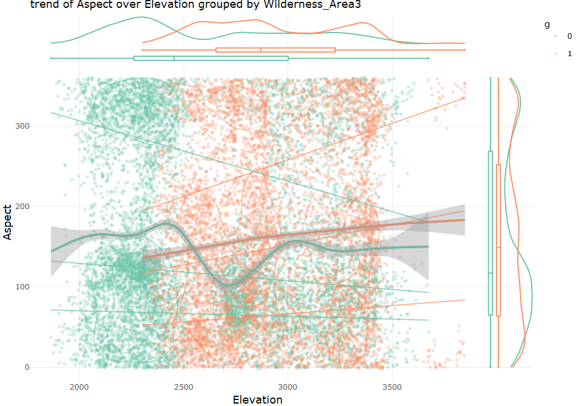
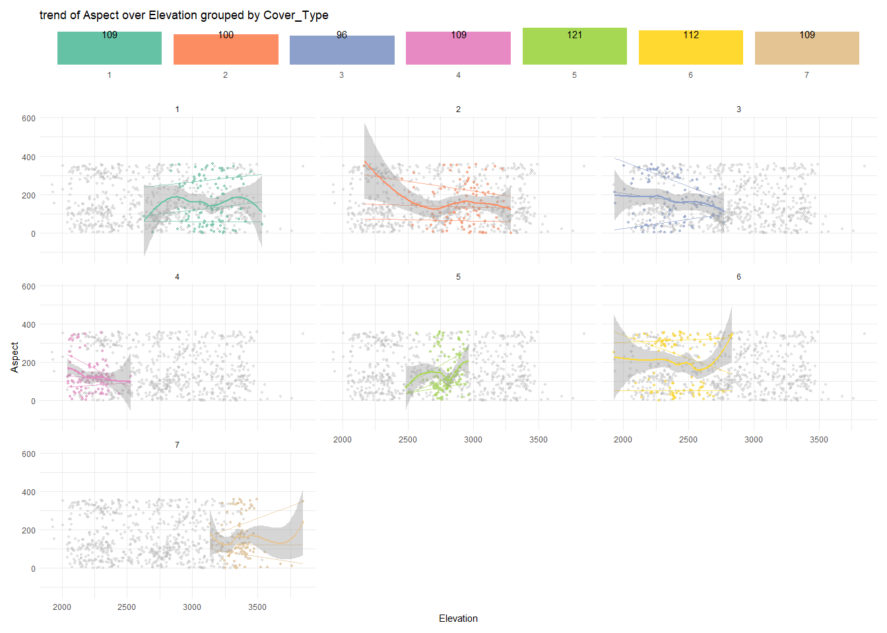

describe grouped data for template data
================
Sascha Siegmund
2022-01-15

## purpose of notebook

-   [ ] describe & visualize relationship between grouped data (eg
    target, cluster, subpopulation)
-   [ ] provide statistical tests to see significance

## insights

-   

## load packages

``` r
library(tidyverse) # tidy data frame
library(plotly) # make ggplots interactive
library(ggmosaic) # for mosaic plots 
library(ggridges) # for ridgeline plots
library(GGally) # for parallel coordinate plots
```

## import data

``` r
df <- read_csv('../data/forest_type_classification/train.csv')
df2 <- read_csv('../data/forest_type_classification/train.csv') %>% sample_frac(0.05)
```

## overview

``` r
head(df)
```

    ## # A tibble: 6 x 56
    ##      Id Elevation Aspect Slope Horizontal_Distance_To_Hydrology Vertical_Distan~
    ##   <dbl>     <dbl>  <dbl> <dbl>                            <dbl>            <dbl>
    ## 1     1      2596     51     3                              258                0
    ## 2     2      2590     56     2                              212               -6
    ## 3     3      2804    139     9                              268               65
    ## 4     4      2785    155    18                              242              118
    ## 5     5      2595     45     2                              153               -1
    ## 6     6      2579    132     6                              300              -15
    ## # ... with 50 more variables: Horizontal_Distance_To_Roadways <dbl>,
    ## #   Hillshade_9am <dbl>, Hillshade_Noon <dbl>, Hillshade_3pm <dbl>,
    ## #   Horizontal_Distance_To_Fire_Points <dbl>, Wilderness_Area1 <dbl>,
    ## #   Wilderness_Area2 <dbl>, Wilderness_Area3 <dbl>, Wilderness_Area4 <dbl>,
    ## #   Soil_Type1 <dbl>, Soil_Type2 <dbl>, Soil_Type3 <dbl>, Soil_Type4 <dbl>,
    ## #   Soil_Type5 <dbl>, Soil_Type6 <dbl>, Soil_Type7 <dbl>, Soil_Type8 <dbl>,
    ## #   Soil_Type9 <dbl>, Soil_Type10 <dbl>, Soil_Type11 <dbl>, ...

``` r
summary(df)
```

    ##        Id          Elevation        Aspect          Slope     
    ##  Min.   :    1   Min.   :1863   Min.   :  0.0   Min.   : 0.0  
    ##  1st Qu.: 3781   1st Qu.:2376   1st Qu.: 65.0   1st Qu.:10.0  
    ##  Median : 7560   Median :2752   Median :126.0   Median :15.0  
    ##  Mean   : 7560   Mean   :2749   Mean   :156.7   Mean   :16.5  
    ##  3rd Qu.:11340   3rd Qu.:3104   3rd Qu.:261.0   3rd Qu.:22.0  
    ##  Max.   :15120   Max.   :3849   Max.   :360.0   Max.   :52.0  
    ##  Horizontal_Distance_To_Hydrology Vertical_Distance_To_Hydrology
    ##  Min.   :   0.0                   Min.   :-146.00               
    ##  1st Qu.:  67.0                   1st Qu.:   5.00               
    ##  Median : 180.0                   Median :  32.00               
    ##  Mean   : 227.2                   Mean   :  51.08               
    ##  3rd Qu.: 330.0                   3rd Qu.:  79.00               
    ##  Max.   :1343.0                   Max.   : 554.00               
    ##  Horizontal_Distance_To_Roadways Hillshade_9am   Hillshade_Noon Hillshade_3pm  
    ##  Min.   :   0                    Min.   :  0.0   Min.   : 99    Min.   :  0.0  
    ##  1st Qu.: 764                    1st Qu.:196.0   1st Qu.:207    1st Qu.:106.0  
    ##  Median :1316                    Median :220.0   Median :223    Median :138.0  
    ##  Mean   :1714                    Mean   :212.7   Mean   :219    Mean   :135.1  
    ##  3rd Qu.:2270                    3rd Qu.:235.0   3rd Qu.:235    3rd Qu.:167.0  
    ##  Max.   :6890                    Max.   :254.0   Max.   :254    Max.   :248.0  
    ##  Horizontal_Distance_To_Fire_Points Wilderness_Area1 Wilderness_Area2
    ##  Min.   :   0                       Min.   :0.0000   Min.   :0.000   
    ##  1st Qu.: 730                       1st Qu.:0.0000   1st Qu.:0.000   
    ##  Median :1256                       Median :0.0000   Median :0.000   
    ##  Mean   :1511                       Mean   :0.2379   Mean   :0.033   
    ##  3rd Qu.:1988                       3rd Qu.:0.0000   3rd Qu.:0.000   
    ##  Max.   :6993                       Max.   :1.0000   Max.   :1.000   
    ##  Wilderness_Area3 Wilderness_Area4   Soil_Type1        Soil_Type2    
    ##  Min.   :0.0000   Min.   :0.0000   Min.   :0.00000   Min.   :0.0000  
    ##  1st Qu.:0.0000   1st Qu.:0.0000   1st Qu.:0.00000   1st Qu.:0.0000  
    ##  Median :0.0000   Median :0.0000   Median :0.00000   Median :0.0000  
    ##  Mean   :0.4199   Mean   :0.3092   Mean   :0.02348   Mean   :0.0412  
    ##  3rd Qu.:1.0000   3rd Qu.:1.0000   3rd Qu.:0.00000   3rd Qu.:0.0000  
    ##  Max.   :1.0000   Max.   :1.0000   Max.   :1.00000   Max.   :1.0000  
    ##    Soil_Type3        Soil_Type4        Soil_Type5        Soil_Type6     
    ##  Min.   :0.00000   Min.   :0.00000   Min.   :0.00000   Min.   :0.00000  
    ##  1st Qu.:0.00000   1st Qu.:0.00000   1st Qu.:0.00000   1st Qu.:0.00000  
    ##  Median :0.00000   Median :0.00000   Median :0.00000   Median :0.00000  
    ##  Mean   :0.06362   Mean   :0.05575   Mean   :0.01091   Mean   :0.04299  
    ##  3rd Qu.:0.00000   3rd Qu.:0.00000   3rd Qu.:0.00000   3rd Qu.:0.00000  
    ##  Max.   :1.00000   Max.   :1.00000   Max.   :1.00000   Max.   :1.00000  
    ##    Soil_Type7   Soil_Type8         Soil_Type9         Soil_Type10    
    ##  Min.   :0    Min.   :0.00e+00   Min.   :0.0000000   Min.   :0.0000  
    ##  1st Qu.:0    1st Qu.:0.00e+00   1st Qu.:0.0000000   1st Qu.:0.0000  
    ##  Median :0    Median :0.00e+00   Median :0.0000000   Median :0.0000  
    ##  Mean   :0    Mean   :6.61e-05   Mean   :0.0006614   Mean   :0.1417  
    ##  3rd Qu.:0    3rd Qu.:0.00e+00   3rd Qu.:0.0000000   3rd Qu.:0.0000  
    ##  Max.   :0    Max.   :1.00e+00   Max.   :1.0000000   Max.   :1.0000  
    ##   Soil_Type11       Soil_Type12       Soil_Type13       Soil_Type14     
    ##  Min.   :0.00000   Min.   :0.00000   Min.   :0.00000   Min.   :0.00000  
    ##  1st Qu.:0.00000   1st Qu.:0.00000   1st Qu.:0.00000   1st Qu.:0.00000  
    ##  Median :0.00000   Median :0.00000   Median :0.00000   Median :0.00000  
    ##  Mean   :0.02685   Mean   :0.01501   Mean   :0.03148   Mean   :0.01118  
    ##  3rd Qu.:0.00000   3rd Qu.:0.00000   3rd Qu.:0.00000   3rd Qu.:0.00000  
    ##  Max.   :1.00000   Max.   :1.00000   Max.   :1.00000   Max.   :1.00000  
    ##   Soil_Type15  Soil_Type16       Soil_Type17       Soil_Type18      
    ##  Min.   :0    Min.   :0.00000   Min.   :0.00000   Min.   :0.000000  
    ##  1st Qu.:0    1st Qu.:0.00000   1st Qu.:0.00000   1st Qu.:0.000000  
    ##  Median :0    Median :0.00000   Median :0.00000   Median :0.000000  
    ##  Mean   :0    Mean   :0.00754   Mean   :0.04048   Mean   :0.003968  
    ##  3rd Qu.:0    3rd Qu.:0.00000   3rd Qu.:0.00000   3rd Qu.:0.000000  
    ##  Max.   :0    Max.   :1.00000   Max.   :1.00000   Max.   :1.000000  
    ##   Soil_Type19        Soil_Type20        Soil_Type21        Soil_Type22     
    ##  Min.   :0.000000   Min.   :0.000000   Min.   :0.000000   Min.   :0.00000  
    ##  1st Qu.:0.000000   1st Qu.:0.000000   1st Qu.:0.000000   1st Qu.:0.00000  
    ##  Median :0.000000   Median :0.000000   Median :0.000000   Median :0.00000  
    ##  Mean   :0.003042   Mean   :0.009193   Mean   :0.001058   Mean   :0.02282  
    ##  3rd Qu.:0.000000   3rd Qu.:0.000000   3rd Qu.:0.000000   3rd Qu.:0.00000  
    ##  Max.   :1.000000   Max.   :1.000000   Max.   :1.000000   Max.   :1.00000  
    ##   Soil_Type23       Soil_Type24     Soil_Type25        Soil_Type26      
    ##  Min.   :0.00000   Min.   :0.000   Min.   :0.00e+00   Min.   :0.000000  
    ##  1st Qu.:0.00000   1st Qu.:0.000   1st Qu.:0.00e+00   1st Qu.:0.000000  
    ##  Median :0.00000   Median :0.000   Median :0.00e+00   Median :0.000000  
    ##  Mean   :0.05007   Mean   :0.017   Mean   :6.61e-05   Mean   :0.003571  
    ##  3rd Qu.:0.00000   3rd Qu.:0.000   3rd Qu.:0.00e+00   3rd Qu.:0.000000  
    ##  Max.   :1.00000   Max.   :1.000   Max.   :1.00e+00   Max.   :1.000000  
    ##   Soil_Type27         Soil_Type28         Soil_Type29       Soil_Type30     
    ##  Min.   :0.0000000   Min.   :0.0000000   Min.   :0.00000   Min.   :0.00000  
    ##  1st Qu.:0.0000000   1st Qu.:0.0000000   1st Qu.:0.00000   1st Qu.:0.00000  
    ##  Median :0.0000000   Median :0.0000000   Median :0.00000   Median :0.00000  
    ##  Mean   :0.0009921   Mean   :0.0005952   Mean   :0.08538   Mean   :0.04795  
    ##  3rd Qu.:0.0000000   3rd Qu.:0.0000000   3rd Qu.:0.00000   3rd Qu.:0.00000  
    ##  Max.   :1.0000000   Max.   :1.0000000   Max.   :1.00000   Max.   :1.00000  
    ##   Soil_Type31       Soil_Type32       Soil_Type33       Soil_Type34      
    ##  Min.   :0.00000   Min.   :0.00000   Min.   :0.00000   Min.   :0.000000  
    ##  1st Qu.:0.00000   1st Qu.:0.00000   1st Qu.:0.00000   1st Qu.:0.000000  
    ##  Median :0.00000   Median :0.00000   Median :0.00000   Median :0.000000  
    ##  Mean   :0.02196   Mean   :0.04563   Mean   :0.04074   Mean   :0.001455  
    ##  3rd Qu.:0.00000   3rd Qu.:0.00000   3rd Qu.:0.00000   3rd Qu.:0.000000  
    ##  Max.   :1.00000   Max.   :1.00000   Max.   :1.00000   Max.   :1.000000  
    ##   Soil_Type35        Soil_Type36         Soil_Type37        Soil_Type38     
    ##  Min.   :0.000000   Min.   :0.0000000   Min.   :0.000000   Min.   :0.00000  
    ##  1st Qu.:0.000000   1st Qu.:0.0000000   1st Qu.:0.000000   1st Qu.:0.00000  
    ##  Median :0.000000   Median :0.0000000   Median :0.000000   Median :0.00000  
    ##  Mean   :0.006746   Mean   :0.0006614   Mean   :0.002249   Mean   :0.04815  
    ##  3rd Qu.:0.000000   3rd Qu.:0.0000000   3rd Qu.:0.000000   3rd Qu.:0.00000  
    ##  Max.   :1.000000   Max.   :1.0000000   Max.   :1.000000   Max.   :1.00000  
    ##   Soil_Type39       Soil_Type40        Cover_Type
    ##  Min.   :0.00000   Min.   :0.00000   Min.   :1   
    ##  1st Qu.:0.00000   1st Qu.:0.00000   1st Qu.:2   
    ##  Median :0.00000   Median :0.00000   Median :4   
    ##  Mean   :0.04345   Mean   :0.03036   Mean   :4   
    ##  3rd Qu.:0.00000   3rd Qu.:0.00000   3rd Qu.:6   
    ##  Max.   :1.00000   Max.   :1.00000   Max.   :7

## overview variables grouped by factor (max 3 groups)

-   

``` r
name = c('Wilderness_Area2')
tmp_df <- df %>% rename(g = name[1]) %>% select(-Id, -contains('Soil_Type')) %>% 
  select_if(function(col) is.numeric(col) | all(col == .$g)) %>% 
  mutate(g = as.character(factor(g))) %>% mutate(across(!g, scale)) %>% 
  as_tibble() %>% pivot_longer(cols = -g) 

#https://cran.r-project.org/web/packages/ggridges/vignettes/introduction.html
p1 <- tmp_df %>%
  ggplot(aes(x = value, y = name, color = g, fill = g)) +
    geom_density_ridges(jittered_points = TRUE, position = "raincloud",
      alpha = 0.3, scale = 0.95, rel_min_height = .005) +
    scale_y_discrete(expand = c(0, 0)) +
    scale_x_continuous(expand = c(0, 0)) +
    scale_fill_brewer(name = name[1], palette = "Set2") +
    scale_color_brewer(guide = "none", palette = "Set2") +
    coord_cartesian(clip = "off") +
    theme_ridges(font_size = 12) +
    guides(fill = guide_legend(override.aes = list(color = NA))) +
    ggtitle(paste("scaled density of all numeric variables grouped by", name[1], sep=" "))
p1
```

<!-- -->

## overview variables grouped by factor (3+ groups)

-   

``` r
name = c('Cover_Type')
tmp_df <- df %>% rename(g = name[1]) %>% select(-Id, -contains('Soil_Type')) %>% 
  select_if(function(col) is.numeric(col) | all(col == .$g)) %>% 
  mutate(g = as.character(factor(g))) %>% pivot_longer(cols = !g) %>% 
  group_by(name) %>% mutate(q2 = quantile(value, na.rm = TRUE)[2]) %>% 
  mutate(q3 = quantile(value, na.rm = TRUE)[3]) %>% 
  mutate(q4 = quantile(value, na.rm = TRUE)[4]) %>% ungroup()

p1 <- tmp_df %>%
  ggplot(aes(x = g, y = value)) +
    geom_boxplot(fill=NA, lwd = 0.4, outlier.alpha = 0.3, width =0.1) +
    geom_violin(aes(color = g), scale = "area", fill = NA) +
    geom_hline(aes(yintercept = q2), color = 'darkorange', alpha = 0.7, lty=2) +
    geom_hline(aes(yintercept = q3), color = 'darkred', alpha = 0.7, lty=2) +
    geom_hline(aes(yintercept = q4), color = 'darkorange', alpha = 0.7, lty=2) +
    scale_color_brewer(guide = "none", palette = "Set2") +
    facet_wrap(vars(name), scales = 'free') +
    theme_minimal() +
    ggtitle(paste("distribution of all variables over", name[1], sep=" ")) 
p1 <- ggplotly(p1) %>% layout(xaxis = list(title = ''))

p5 <- tmp_df %>%
  ggplot() +
    geom_mosaic(aes(x=product(g), fill = g)) +
    geom_text(data = layer_data(ggplot2::last_plot(), 1) %>%  filter(.wt > 0),
               aes(x = (xmax + xmin)/2, y = (ymax + ymin)/2, 
                   label = paste0(.wt,"\n",scales::percent(.wt/nrow(tmp_df), accuracy = 1))),
              size = 3.5) +
    scale_fill_brewer(guide = "none", palette = "Set2") +
    theme_minimal()
p5 <- ggplotly(p5) %>% layout(yaxis = list(showticklabels = FALSE, showgrid = FALSE, title = ''), 
                              xaxis = list(showticklabels = FALSE, showgrid = FALSE, title = ''))

fig <- subplot(p5, 
               p1, 
               nrows = 2,  heights = c(0.1, 0.9)) %>% layout() %>% hide_legend()

fig
```

<!-- -->

## overview parallel coordinate plot for groups

-   

``` r
name = c('Cover_Type')
tmp_df <- df2 %>%  select(-Id, -contains('Soil_Type')) %>% 
  rename(g = name[1]) %>% select(g, everything()) %>% mutate(g = factor(g)) %>% 
  na.omit()

# https://r-charts.com/ranking/parallel-coordinates-ggplot2/
p1 <- ggparcoord(tmp_df,
           columns = 2:ncol(tmp_df), groupColumn = 1,
           scale='center', # scaling: standardize and center variables
           showPoints = FALSE,
           order = 'allClass', # order by their F-statistic from an ANOVA
           alphaLines = 0.2) +
      scale_color_brewer(guide = "none", palette = "Set2") +
      theme_minimal() +
      facet_wrap(~g) +
      ggtitle(paste("all variables grouped by", name[1], sep=" "))
fig <- ggplotly(p1) %>% layout(autosize=T) # drop if too many lines

fig
```

<!-- -->

## bivariate parallel coordinate plot over groups (max 1000 rows)

-   

``` r
name = c('Elevation', 'Cover_Type')
tmp_df <- df2 %>% rename(x = name[1], y = name[2]) %>% mutate(g = factor(y)) %>% 
  mutate(y = as.numeric(y)) %>% select(g, x, y) %>% na.omit() %>% mutate(across(!g, scale))

# https://r-charts.com/ranking/parallel-coordinates-ggplot2/
p1 <- ggparcoord(tmp_df,
           columns = 2:ncol(tmp_df), groupColumn = 1,
           scale='globalminmax', # data already scaled
           showPoints = FALSE,
           splineFactor = TRUE, # drop if too many rows
           alphaLines = 0.2) +
    scale_color_brewer(guide = "none", palette = "Set2") +
    theme_minimal() +
    ggtitle(paste("correlation of", name[1], "and", name[2], sep=" "))
p1 <- ggplotly(p1) %>% layout(yaxis = list(title = ''), xaxis = list(title = '')) %>%
  add_annotations(text = name[1], align = 'left', yref='paper', yref = 'paper', x = 1, y = 0, showarrow=FALSE) %>%
  add_annotations(text = name[2], align = 'left', yref='paper', yref = 'paper', x = 2, y = 0, showarrow=FALSE)

p2 <- tmp_df %>%
  ggplot(aes(x = y)) +
    stat_density(geom="line", trim = TRUE) + 
    scale_x_continuous(limits = c(min(tmp_df$x, tmp_df$y), max(tmp_df$x, tmp_df$y))) +
    coord_flip() +
    theme_minimal()
p2 <- ggplotly(p2) %>% layout(yaxis = list(showticklabels = FALSE, showgrid = FALSE, title = ''), 
                              xaxis = list(showticklabels = FALSE, showgrid = FALSE, title = ''))

p3 <- tmp_df %>%
  ggplot(aes(x = 1, y = y)) +
    geom_boxplot() +
    theme_minimal() 
p3 <- ggplotly(p3) %>% layout(yaxis = list(showticklabels = FALSE, showgrid = FALSE, title = ''), 
                              xaxis = list(showticklabels = FALSE, showgrid = FALSE, title = ''))

p4 <- tmp_df %>%
  ggplot(aes(x = x)) +
    stat_density(geom="line", trim = TRUE) + 
    scale_x_continuous(limits = c(min(tmp_df$x, tmp_df$y), max(tmp_df$x, tmp_df$y))) +
    coord_flip() +
    theme_minimal()
p4 <- ggplotly(p4) %>% layout(yaxis = list(showticklabels = TRUE, showgrid = TRUE, title = ''),
                              xaxis = list(showticklabels = FALSE, showgrid = FALSE, title = '', 
                                           autorange = "reversed"))

p5 <- tmp_df %>%
  ggplot(aes(x = 1, y = x)) +
    geom_boxplot() +
    theme_minimal() 
p5 <- ggplotly(p5) %>% layout(yaxis = list(showticklabels = FALSE, showgrid = FALSE, title = ''), 
                              xaxis = list(showticklabels = FALSE, showgrid = FALSE, title = ''))

# merge figures into one plot, via subplots, https://plotly-r.com/arranging-views.html
fig <- subplot(p4, p5, p1, p3, p2,  
               margin = 0, widths = c(0.05, 0.02, 0.86, 0.02, 0.05), 
               shareX = TRUE, shareY = TRUE, titleX = TRUE, titleY = TRUE) %>% layout()

fig
```

<!-- -->

## scatter matrix for groups (max 3 groups, few variables)

-   

``` r
name = c('Wilderness_Area4')
tmp_df <- df %>% rename(g = name[1]) %>% 
  select(Elevation, Aspect, Slope, Horizontal_Distance_To_Hydrology, Cover_Type, g) %>% 
  mutate(g = factor(g))

fig <- ggpairs(tmp_df, 1:ncol(tmp_df), mapping = ggplot2::aes(color = g, alpha = 0.5),
        diag = list(continuous = wrap("densityDiag")),
        lower = list(continuous = wrap("points", alpha = 0.3)),
        progress = FALSE) +
  theme_minimal() +
  ggtitle(paste("some variables grouped by", name[1], sep=" ")) 

fig
```

<!-- -->

## univariate numeric grouped by factor

-   

``` r
# two variables, continuous/discrete y, categorical x, show trend and distribution
name = c('Elevation', 'Cover_Type')
tmp_df <- df %>% rename(y = name[1], g = name[2]) %>% select(g, y) %>% mutate(g = factor(g)) %>% 
  add_count(g, y)

so.q2 <- function(y){ quantile(y, na.rm = TRUE)[2] }
so.q4 <- function(y){ quantile(y, na.rm = TRUE)[4] }

p1 <- tmp_df %>%
  ggplot(aes(x = g, y = y)) +
    geom_violin(aes(color = g), scale = "area", fill = NA) +
    geom_spoke(aes(x = as.numeric(g), radius = n/max(tmp_df$n)/2, angle = 2*pi, color = g),
               alpha = I(0.5), stat = "unique") +  # x-offset= n/2, radius= n, angle= pi for two-sided spoke plot
    geom_boxplot(fill = NA, lwd = 0.4, outlier.alpha = 0.3, width =0.1) +
    geom_hline(aes(yintercept = quantile(tmp_df$y, na.rm = TRUE)[2]), color = 'darkorange', alpha = 0.5, lty=2) + 
    geom_hline(aes(yintercept = quantile(tmp_df$y, na.rm = TRUE)[3]), color = 'darkred', alpha = 0.5, lty=2) +
    geom_hline(aes(yintercept = quantile(tmp_df$y, na.rm = TRUE)[4]), color = 'darkorange', alpha = 0.5, lty=2) +
    stat_summary(aes(x = as.numeric(g)), fun = so.q2, geom = 'line', size = 0.5, color = 'darkorange') + 
    stat_summary(aes(x = as.numeric(g)), fun = 'median', geom = 'line', size = 0.5, color = 'darkred') +
    stat_summary(aes(x = as.numeric(g)), fun = so.q4, geom = 'line', size = 0.5, color = 'darkorange') + 
    scale_color_brewer(guide = "none", palette = "Set2") +
    theme_minimal() +
    ggtitle(paste("distribution of", name[1], "grouped by", name[2], sep=" ")) 
p1 <- ggplotly(p1) %>% layout(xaxis = list(title = name[2]), yaxis = list(title = name[1]))

p2 <- tmp_df %>%
  ggplot(aes(x = y)) +
    stat_density(geom="line") + 
    coord_flip() +
    theme_minimal()
p2 <- ggplotly(p2) %>% layout(yaxis = list(showticklabels = FALSE, showgrid = FALSE, title = ''), 
                              xaxis = list(showticklabels = FALSE, showgrid = FALSE, title = ''))

p3 <- tmp_df %>%
  ggplot(aes(x = 1, y = y)) +
    geom_boxplot() +
    theme_minimal()
p3 <- ggplotly(p3) %>% layout(yaxis = list(showticklabels = FALSE, showgrid = FALSE, title = ''), 
                              xaxis = list(showticklabels = FALSE, showgrid = FALSE, title = ''))

p5 <- tmp_df %>%
  ggplot() +
    geom_mosaic(aes(x=product(g), fill = g)) +
    geom_text(data = layer_data(ggplot2::last_plot(), 1) %>%  filter(.wt > 0),
               aes(x = (xmax + xmin)/2, y = (ymax + ymin)/2, 
                   label = paste0(.wt,"\n",scales::percent(.wt/nrow(tmp_df), accuracy = 1))),
              size = 3.5) +
    scale_fill_brewer(guide = "none", palette = "Set2") +
    theme_minimal()
p5 <- ggplotly(p5) %>% layout(yaxis = list(showticklabels = FALSE, showgrid = FALSE, title = ''), 
                              xaxis = list(showticklabels = FALSE, showgrid = FALSE, title = ''))

fig <- subplot(p5, plotly_empty(), plotly_empty(),
               p1, p3, p2,
               nrows = 2, margin = 0, heights = c(0.1, 0.9), widths = c(0.92, 0.02, 0.06), 
               shareY = TRUE, titleX = TRUE, titleY = TRUE) %>% layout() %>% hide_legend()

fig
```

<!-- -->

## univariate categorical grouped by factor

-   

``` r
name = c('Wilderness_Area1', 'Cover_Type')
tmp_df <- df %>% rename(c = name[1], g = name[2]) %>% select(c, g) %>% 
  mutate(across(c(c,g), factor))

# https://cran.r-project.org/web/packages/ggmosaic/vignettes/ggmosaic.html
p1 <- tmp_df %>%
  ggplot() +
    geom_mosaic(aes(x=product(c), fill = c, conds=product(g))) +
    geom_text(data = layer_data(ggplot2::last_plot(), 1) %>%  filter(.wt > 0),
               aes(x = (xmax + xmin)/2, y = (ymax + ymin)/2, 
                   label = paste0(scales::percent(.wt,  accuracy = 0.1))),
              size = 3.5) +
    scale_fill_brewer(guide = "none", palette = "Set2") +
    theme_minimal() +
    ggtitle(paste("distribution of", name[1], "grouped by", name[2], sep=" "))
p1 <- ggplotly(p1) %>% layout(xaxis = list(title = name[2]), yaxis = list(title = name[1]))

p3 <- tmp_df %>%
  ggplot() +
    geom_mosaic(aes(x=product(g))) +
    geom_text(data = layer_data(ggplot2::last_plot(), 1) %>%  filter(.wt > 0),
               aes(x = (xmax + xmin)/2, y = (ymax + ymin)/2, 
                   label = paste0(.wt,"\n",scales::percent(.wt/nrow(tmp_df),  accuracy = 1))),
              size = 3.5) +
    theme_minimal() 
p3 <- ggplotly(p3) %>% layout(yaxis = list(showticklabels = FALSE, showgrid = FALSE, title = ''), 
                              xaxis = list(showticklabels = FALSE, showgrid = FALSE, title = ''))

p5 <- tmp_df %>%
  ggplot() +
    geom_mosaic(aes(x=product(c))) +
    geom_text(data = layer_data(ggplot2::last_plot(), 1) %>%  filter(.wt > 0),
               aes(x = (xmax + xmin)/2, y = (ymax + ymin)/2, 
                   label = paste0(.wt,"\n",scales::percent(.wt/nrow(tmp_df),  accuracy = 1))),
              size = 3.5) +
    theme_minimal() +
    coord_flip()
p5 <- ggplotly(p5) %>% layout(yaxis = list(showticklabels = FALSE, showgrid = FALSE, title = ''), 
                              xaxis = list(showticklabels = FALSE, showgrid = FALSE, title = ''))

# merge figures into one plot, via subplots, https://plotly-r.com/arranging-views.html
fig <- subplot(p3, plotly_empty(),
               p1, p5, 
               nrows = 2, margin = 0, heights = c(0.1, 0.9), widths = c(0.93, 0.07), 
               shareX = TRUE, shareY = TRUE, titleX = TRUE, titleY = TRUE) %>% layout()

fig
```

<!-- -->

## bivarite categorical over categorical grouped by factor (mosaic plot)

-   

``` r
name = c('Wilderness_Area1', 'Wilderness_Area3', 'Cover_Type')
tmp_df <- df %>% rename(c = name[1], d = name[2], g = name[3]) %>% select(c, d, g) %>% 
  mutate(across(c(c,d,g), factor))

# https://cran.r-project.org/web/packages/ggmosaic/vignettes/ggmosaic.html
p1 <- tmp_df %>%
  ggplot() +
    geom_mosaic(aes(x=product(c, g, d), fill = c, alpha = g), divider = ddecker()) +
    geom_text(data = layer_data(ggplot2::last_plot(), 1) %>%  filter(.wt > 0),
               aes(x = (xmax + xmin)/2, y = (ymax + ymin)/2, 
                   label = paste0(.wt,"\n",scales::percent(.wt/nrow(tmp_df),  accuracy = 0.1))),
              size = 3.5) +
    scale_fill_brewer(guide = "none", palette = "Set2") +
    theme_minimal() +
    ggtitle(paste("distribution of", name[1], "over", name[2], "grouped by", name[3], sep=" "))
p1 <- ggplotly(p1) %>% layout(xaxis = list(title = name[2]), yaxis = list(title = name[1]))

p3 <- tmp_df %>%
  ggplot() +
    geom_mosaic(aes(x=product(d))) +
    geom_text(data = layer_data(ggplot2::last_plot(), 1) %>%  filter(.wt > 0),
               aes(x = (xmax + xmin)/2, y = (ymax + ymin)/2, 
                   label = paste0(.wt,"\n",scales::percent(.wt/nrow(tmp_df),  accuracy = 1))),
              size = 3.5) +
    theme_minimal() 
p3 <- ggplotly(p3) %>% layout(yaxis = list(showticklabels = FALSE, showgrid = FALSE, title = ''), 
                              xaxis = list(showticklabels = FALSE, showgrid = FALSE, title = ''))

p5 <- tmp_df %>%
  ggplot() +
    geom_mosaic(aes(x=product(c))) +
    geom_text(data = layer_data(ggplot2::last_plot(), 1) %>%  filter(.wt > 0),
               aes(x = (xmax + xmin)/2, y = (ymax + ymin)/2, 
                   label = paste0(.wt,"\n",scales::percent(.wt/nrow(tmp_df),  accuracy = 1))),
              size = 3.5) +
    theme_minimal() +
    coord_flip()
p5 <- ggplotly(p5) %>% layout(yaxis = list(showticklabels = FALSE, showgrid = FALSE, title = ''), 
                              xaxis = list(showticklabels = FALSE, showgrid = FALSE, title = ''))

# merge figures into one plot, via subplots, https://plotly-r.com/arranging-views.html
fig <- subplot(p3, plotly_empty(),
               p1, p5, 
               nrows = 2, margin = 0, heights = c(0.1, 0.9), widths = c(0.93, 0.07), 
               shareX = TRUE, shareY = TRUE, titleX = TRUE, titleY = TRUE) %>% layout()

fig
```

<!-- -->

## bivarite numeric over numeric grouped by factor (max 3 groups)

-   

``` r
# two variables, continuous x, continuous y, show trend and distribution
name = c('Elevation', 'Aspect', 'Wilderness_Area3')
tmp_df <- df %>% rename(x = name[1], y = name[2], g = name[3]) %>% select(x, y, g) %>% 
  mutate(g = factor(g)) %>% add_count(x, y, g)

p1 <- tmp_df %>%
  ggplot(aes(x = x, y = y, color = g)) +
    geom_point(aes(size = n), alpha = 0.3, stat = "unique") + 
    scale_size(range = c(1, max(tmp_df$n))) +
    geom_density2d(alpha = 0.5, bins = 3) +
    geom_quantile(alpha = 0.7) +
    geom_smooth() +
    scale_color_brewer(guide = "none", palette = "Set2") +
    theme_minimal() +
    ggtitle(paste("trend of", name[2], "over", name[1], "grouped by", name[3], sep=" "))
p1 <- ggplotly(p1) %>% layout(xaxis = list(title = name[1]), yaxis = list(title = name[2]))

p2 <- tmp_df %>%
  ggplot(aes(x = x, color = g)) +
    stat_density(geom="line", position = "identity", trim = TRUE) + 
    scale_color_brewer(guide = "none", palette = "Set2") +
    theme_minimal()
p2 <- ggplotly(p2) %>% layout(yaxis = list(showticklabels = FALSE, showgrid = FALSE, title = ''), 
                              xaxis = list(showticklabels = FALSE, showgrid = FALSE, title = ''))

p3 <- tmp_df %>%
  ggplot(aes(x = g, y = x, color = g)) +
    geom_boxplot() +
    scale_color_brewer(guide = "none", palette = "Set2") +
    theme_minimal() +
    coord_flip() 
p3 <- ggplotly(p3) %>% layout(yaxis = list(showticklabels = FALSE, showgrid = FALSE, title = ''), 
                              xaxis = list(showticklabels = FALSE, showgrid = FALSE, title = ''))

p4 <- tmp_df %>%
  ggplot(aes(x = y, color = g)) +
    stat_density(geom="line", position = "identity", trim = TRUE) + 
    scale_color_brewer(palette = "Set2") +
    coord_flip() +
    theme_minimal()
p4 <- ggplotly(p4) %>% layout(yaxis = list(showticklabels = FALSE, showgrid = FALSE, title = ''), 
                              xaxis = list(showticklabels = FALSE, showgrid = FALSE, title = ''))

p5 <- tmp_df %>%
  ggplot(aes(x = g, y = y, color = g)) +
    geom_boxplot() +
    scale_color_brewer(guide = "none", palette = "Set2") +
    theme_minimal() 
p5 <- ggplotly(p5) %>% layout(yaxis = list(showticklabels = FALSE, showgrid = FALSE, title = ''), 
                              xaxis = list(showticklabels = FALSE, showgrid = FALSE, title = ''))

# merge figures into one plot, via subplots, https://plotly-r.com/arranging-views.html
fig <- subplot(style(p2, showlegend = FALSE), plotly_empty(), plotly_empty(),
               style(p3, showlegend = FALSE), plotly_empty(), plotly_empty(),
               p1, style(p5, showlegend = FALSE), style(p4, showlegend = FALSE), 
               nrows = 3, margin = 0, heights = c(0.08, 0.05, 0.87), widths = c(0.905, 0.035, 0.06), 
               shareX = TRUE, shareY = TRUE, titleX = TRUE, titleY = TRUE) %>% layout()

fig
```

<!-- -->

## bivarite numeric over numeric grouped by factor (3+ groups)

-   

``` r
# two variables, continuous x, continuous y, show trend and distribution
name = c('Elevation', 'Aspect', 'Cover_Type')
tmp_df <- df2 %>% rename(x = name[1], y = name[2], g = name[3]) %>% select(x, y, g) %>% 
  mutate(g = factor(g)) %>% add_count(x, y, g)

p1 <- tmp_df %>%
  ggplot(aes(x = x, y = y, color = g)) +
    geom_point(data = select(tmp_df, -g), aes(size = n), alpha = 0.2, stat = "unique", color = 'grey70') + 
    geom_point(aes(size = n), alpha = 0.4, stat = "unique") +
    scale_size(range = c(1, max(tmp_df$n))) +
    geom_quantile(alpha = 0.7) +
    geom_smooth() +
    facet_wrap(vars(g)) +
    scale_color_brewer(guide = "none", palette = "Set2") +
    theme_minimal() +
    ggtitle(paste("trend of", name[2], "over", name[1], "grouped by", name[3], sep=" "))
p1 <- ggplotly(p1) %>% layout(xaxis = list(title = name[1]), yaxis = list(title = name[2]))

p5 <- tmp_df %>%
  ggplot() +
    geom_mosaic(aes(x=product(g), fill = g)) +
    geom_text(data = layer_data(ggplot2::last_plot(), 1) %>%  filter(.wt > 0),
               aes(x = (xmax + xmin)/2, y = (ymax + ymin)/2, 
                   label = paste0(.wt,"\n",scales::percent(.wt/nrow(tmp_df), accuracy = 1))),
              size = 3.5) +
    scale_fill_brewer(guide = "none", palette = "Set2") +
    theme_minimal()
p5 <- ggplotly(p5) %>% layout(yaxis = list(showticklabels = FALSE, showgrid = FALSE, title = ''), 
                              xaxis = list(showticklabels = FALSE, showgrid = FALSE, title = ''))

# drop plotly (intercativity and chart merge) if you have performance issues
fig <- subplot(style(p5, title = FALSE), 
               p1, 
               nrows = 2,  heights = c(0.1, 0.9), 
               titleX = TRUE, titleY = TRUE) %>% layout() %>% hide_legend()

fig
```

<!-- -->

## bivariate numeric over categorical grouped by factor (dichtome group)

-   TODO: plot not really useful, due to plotly not aligning violin and
    boxplot, better would be split violin plot, but facet version below
    is also sufficient

``` r
# two variables, continuous/discrete y, categorical x, show trend and distribution
name = c('Elevation', 'Wilderness_Area4', 'Wilderness_Area3')
tmp_df <- df %>% rename(y = name[1], c = name[2], g = name[3]) %>% select(c, y, g) %>% 
  mutate(across(c(c,g), factor)) %>% add_count(c, y, g) %>% 
    group_by(g) %>% mutate(q3 = quantile(y, na.rm = TRUE)[3]) %>% ungroup()

p1 <- tmp_df %>%
  ggplot(aes(x = c, y = y, color = g)) +
    geom_violin(scale = "area", fill = NA) +
    geom_boxplot(fill = NA, lwd = 0.4, outlier.alpha = 0.3, width =0.1) +
    geom_hline(aes(yintercept = q3, color = g), alpha = 0.5, lty=2) +
    scale_color_brewer(guide = "none", palette = "Set2") +
    coord_flip() +
    theme_minimal() +
    ggtitle(paste("distribution of", name[1], "over", name[2], "grouped by", name[3], sep=" ")) 
p1 <- ggplotly(p1) %>% layout(xaxis = list(title = name[1]), yaxis = list(title = name[2]))

p2 <- tmp_df %>%
  ggplot(aes(x = y, color = g)) +
    stat_density(geom="line", position = "identity", trim = TRUE) + 
    scale_color_brewer(guide = "none", palette = "Set2") +
    theme_minimal()
p2 <- ggplotly(p2) %>% layout(yaxis = list(showticklabels = FALSE, showgrid = FALSE, title = ''), 
                              xaxis = list(showticklabels = FALSE, showgrid = FALSE, title = ''))

p3 <- tmp_df %>%
  ggplot(aes(x = g, y = y, color = g)) +
    geom_boxplot() +
    scale_color_brewer(guide = "none", palette = "Set2") +
    theme_minimal() +
    coord_flip() 
p3 <- ggplotly(p3) %>% layout(yaxis = list(showticklabels = FALSE, showgrid = FALSE, title = ''), 
                              xaxis = list(showticklabels = FALSE, showgrid = FALSE, title = ''))

p5 <- tmp_df %>%
  ggplot(aes(x = g, fill = c)) +
    geom_bar() +
    scale_fill_brewer(guide = "none", palette = "Set2") +
    theme_minimal() +
    coord_flip()
p5 <- ggplotly(p5) %>% layout(yaxis = list(showticklabels = FALSE, showgrid = FALSE, title = ''), 
                              xaxis = list(showticklabels = FALSE, showgrid = FALSE, title = ''))

# merge figures into one plot, via subplots, https://plotly-r.com/arranging-views.html
fig <- subplot(style(p2, showlegend = FALSE), plotly_empty(),
               style(p3, showlegend = FALSE), plotly_empty(),
               style(p1, showlegend = FALSE), p5,
               nrows = 3, margin = 0, heights = c(0.08, 0.05, 0.87), widths = c(0.95, 0.05), 
               shareX = TRUE, titleX = TRUE, titleY = TRUE) %>% layout()

fig
```

<!-- -->

## bivariate numeric over categorical grouped by factor (2+ groups)

-   

``` r
name = c('Elevation', 'Wilderness_Area4', 'Cover_Type')
tmp_df <- df %>% rename(y = name[1], c = name[2], g = name[3]) %>% select(c, y, g) %>% 
  mutate(across(c(c,g), factor)) %>% 
  group_by(g) %>% mutate(q2 = quantile(y, na.rm = TRUE)[2]) %>% 
  mutate(q3 = quantile(y, na.rm = TRUE)[3]) %>% 
  mutate(q4 = quantile(y, na.rm = TRUE)[4]) %>% ungroup()

p1 <- tmp_df %>%
  ggplot(aes(x = c, y = y)) +
    geom_boxplot(fill=NA, lwd = 0.4, outlier.alpha = 0.3, width =0.1) +
    geom_violin(aes(color = c), scale = "area", fill = NA) +
    geom_hline(aes(yintercept = q2), color = 'darkorange', alpha = 0.7, lty=2) +
    geom_hline(aes(yintercept = q3), color = 'darkred', alpha = 0.7, lty=2) +
    geom_hline(aes(yintercept = q4), color = 'darkorange', alpha = 0.7, lty=2) +
    scale_color_brewer(guide = "none", palette = "Set2") +
    facet_wrap(vars(g)) +
    theme_minimal() +
    ggtitle(paste("distribution of", name[1], "over", name[2], "grouped by", name[3], sep=" ")) 
p1 <- ggplotly(p1) %>% layout(xaxis = list(title = name[2]), yaxis = list(title = name[1]))

p5 <- tmp_df %>%
  ggplot() +
    geom_mosaic(aes(x=product(g))) +
    geom_text(data = layer_data(ggplot2::last_plot(), 1) %>%  filter(.wt > 0),
               aes(x = (xmax + xmin)/2, y = (ymax + ymin)/2, 
                   label = paste0(.wt,"\n",scales::percent(.wt/nrow(tmp_df), accuracy = 1))),
              size = 3.5) +
    theme_minimal()
p5 <- ggplotly(p5) %>% layout(yaxis = list(showticklabels = FALSE, showgrid = FALSE, title = ''), 
                              xaxis = list(showticklabels = FALSE, showgrid = FALSE, title = ''))

fig <- subplot(p5, 
               p1, 
               nrows = 2,  heights = c(0.1, 0.9), 
               titleX = TRUE, titleY = TRUE) %>% layout() %>% hide_legend()

fig
```

<!-- -->
