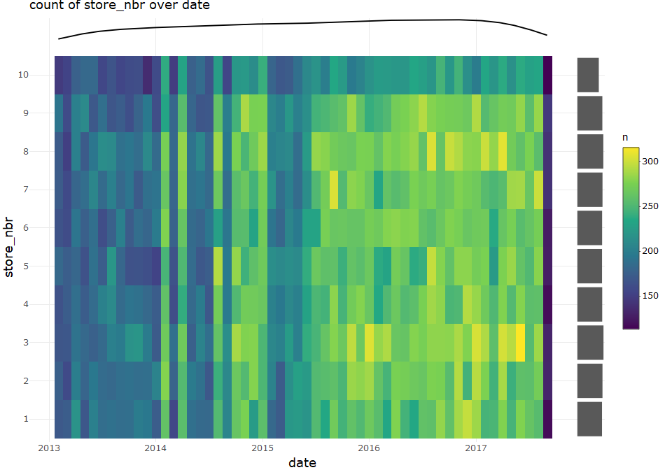
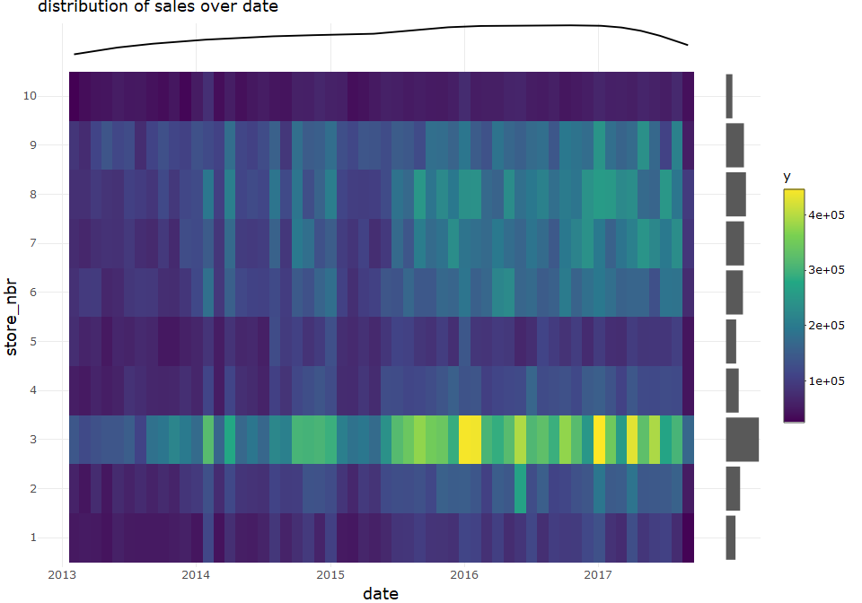

describe bivariate with time for template data
================
Sascha Siegmund
2022-02-10

## purpose of notebook

-   [ ] describe & visualize relationship between variables, one of them
    time-like
-   [ ] gather interesting observations for further investigation
-   [ ] gather possible new features for extraction

## insights

-   

## load packages

``` r
library(tidyverse) # tidy data frame and so much more
library(plotly) # make ggplots interactive
library(lubridate) # for time and date 
library(ggmosaic) # for mosaic plots 
library(GGally) # for parallel coordinate plots
```

## import data

``` r
df <- read_csv(file = '../data/store_sales_time_series/train.csv') %>% filter((family == 'BEAUTY') | (family == 'EGGS') | (family == 'LIQUOR,WINE,BEER')) %>% filter((store_nbr == 1)) %>% filter((sales > 0) & (sales < 300))
df2 <- read_csv(file = '../data/store_sales_time_series/train.csv') %>% filter(sales > 0) %>% filter(store_nbr %in% seq(1,10)) %>% mutate(date = ceiling_date(date, 'month')) %>% sample_frac(0.3)
df3 <- read_csv(file = '../data/store_sales_time_series/train.csv') %>% filter(store_nbr %in% seq(1,3)) %>% mutate(date = ceiling_date(date, 'month')) %>% group_by(store_nbr, date) %>% top_n(1, sales) %>% ungroup() %>% mutate(onpromotion_bin = cut_interval(onpromotion, n = 5))
```

## overview

``` r
head(df)
```

    ## # A tibble: 6 x 6
    ##      id date       store_nbr family           sales onpromotion
    ##   <dbl> <date>         <dbl> <chr>            <dbl>       <dbl>
    ## 1  1784 2013-01-02         1 BEAUTY               2           0
    ## 2  1792 2013-01-02         1 EGGS               246           0
    ## 3  1804 2013-01-02         1 LIQUOR,WINE,BEER    67           0
    ## 4  3574 2013-01-03         1 EGGS               203           0
    ## 5  3586 2013-01-03         1 LIQUOR,WINE,BEER    66           0
    ## 6  5348 2013-01-04         1 BEAUTY               3           0

``` r
summary(df)
```

    ##        id               date              store_nbr    family         
    ##  Min.   :   1784   Min.   :2013-01-02   Min.   :1   Length:4585       
    ##  1st Qu.: 776962   1st Qu.:2014-03-14   1st Qu.:1   Class :character  
    ##  Median :1546786   Median :2015-05-21   Median :1   Mode  :character  
    ##  Mean   :1531486   Mean   :2015-05-12   Mean   :1                     
    ##  3rd Qu.:2297000   3rd Qu.:2016-07-16   3rd Qu.:1                     
    ##  Max.   :2999128   Max.   :2017-08-15   Max.   :1                     
    ##      sales         onpromotion    
    ##  Min.   :  1.00   Min.   : 0.000  
    ##  1st Qu.:  4.00   1st Qu.: 0.000  
    ##  Median : 90.00   Median : 0.000  
    ##  Mean   : 87.81   Mean   : 1.314  
    ##  3rd Qu.:149.00   3rd Qu.: 0.000  
    ##  Max.   :297.00   Max.   :31.000

## explore numerical univariate time

-   

``` r
# one variable, continuous x, show distribution
name = 'date'
tmp_df <- df %>% rename(value = name) %>% select(value) %>% add_count(value) %>% 
  mutate(fn = factor(n))

p1 <- tmp_df %>%
  ggplot(aes(x = value)) +
    stat_density(geom = 'line', position = 'identity') +
    theme_minimal()  
p1 <- ggplotly(p1) %>% layout(yaxis = list(showticklabels = FALSE, showgrid = FALSE))

p2 <- tmp_df %>%
  ggplot(aes(x = value)) +
    geom_spoke(aes(y = -n, radius = 2*n, angle = pi/2, text = paste0("value: ", value, "\ncount: ", n)),
               alpha = 0.5, stat = "unique") +  # y = 0, radius = n for one-sided spoke plot
    theme_minimal()  
p2 <- ggplotly(p2, tooltip = 'text') %>% layout()

p3 <- tmp_df %>%
  ggplot(aes(x = 1, y = value)) +
    geom_boxplot() +
    theme_minimal() +
    coord_flip() +
    ggtitle(paste("distribution of", name, sep=" ")) 
p3 <- ggplotly(p3) %>% layout(yaxis = list(showticklabels = FALSE, showgrid = FALSE))

p5 <- tmp_df %>%
  ggplot() +
    geom_mosaic(aes(x=product(fn))) +
    theme_minimal() +
    coord_flip()
p5 <- ggplotly(p5) %>% layout(yaxis = list(showticklabels = FALSE, showgrid = FALSE, title = ''), 
                              xaxis = list(showticklabels = FALSE, showgrid = FALSE, title = ''))

# https://plotly.com/r/subplots/
fig <- subplot(p2, p5,
               p1, plotly_empty(),
               p3, plotly_empty(), 
               nrows = 3, margin = 0, heights = c(0.8, 0.1, 0.1), 
               widths = c(0.95, 0.05), shareX = TRUE) %>% 
  layout(xaxis = list(title = name))

fig
```

<!-- -->

## explore categorical or grouped univariate time

-   you can pull out individual parts of the date with the accessor
    functions year(), month(, label = TRUE), mday() (day of the month),
    yday() (day of the year), wday(, label = TRUE) (day of the week),
    hour(), minute(), and second()

``` r
# one variable, categorical x, show distribution
name = 'date'
tmp_df <- df %>% rename(value = name) %>% select(value) %>% 
  mutate(value = month(value, label = TRUE)) %>% mutate(value = factor(value)) %>% 
  add_count(value) %>% mutate(percent = n / nrow(.))

p1 <- tmp_df %>%
  ggplot(aes(x = value)) +
    geom_bar() +
    geom_text(aes(label = paste0(n, "\n", scales::percent(percent,  accuracy = 0.1)),
                  y = max(tmp_df$n)*0.94), stat = "unique", size = 3.5) +
    theme_minimal() +
    theme(axis.text.x = element_text(angle=45, vjust=0.7, size=10))
p1 <- ggplotly(p1) %>% layout()

p2 <- tmp_df %>%
  ggplot(aes(x = 1, y = value)) +
    geom_boxplot(fill = 'lightgrey') +
    theme_minimal() +
    coord_flip() +
    ggtitle(paste("distribution of", name, sep=" ")) +
    theme(axis.text.x = element_text(angle=45, vjust=0.7, size=10))
p2 <- ggplotly(p2) %>% layout(yaxis = list(showticklabels = FALSE, showgrid = FALSE))

p5 <- tmp_df %>%
  ggplot() +
    geom_mosaic(aes(x=product(value))) +
    theme_minimal() +
    coord_flip()
p5 <- ggplotly(p5) %>% layout(yaxis = list(showticklabels = FALSE, showgrid = FALSE, title = ''), 
                              xaxis = list(showticklabels = FALSE, showgrid = FALSE, title = ''))

# https://plotly.com/r/subplots/
fig <- subplot(p1, p5, p2, plotly_empty(), nrows = 2, margin = 0, 
               heights = c(0.9, 0.1), widths = c(0.95, 0.05), shareX = TRUE) %>% 
  layout(xaxis = list(title = name))

fig
```

<!-- -->

## explore bivariate numeric over grouped time

-   you can pull out individual parts of the date with the accessor
    functions year(), month(, label = TRUE), mday() (day of the month),
    yday() (day of the year), wday(, label = TRUE) (day of the week),
    hour(), minute(), and second()

``` r
# two variables, continuous/discrete x, time t, show trend and distribution
name = c('sales', 'date')
tmp_df <- df %>% rename(t = name[2], y = name[1]) %>% select(t, y) %>% 
  mutate(t = wday(t, label = TRUE)) %>% add_count(t, y) %>% mutate(t = factor(t))

so.q2 <- function(y){ quantile(y, na.rm = TRUE)[2] }
so.q4 <- function(y){ quantile(y, na.rm = TRUE)[4] }

p1 <- tmp_df %>%
  ggplot(aes(x = t, y = y)) +
    geom_boxplot(fill=NA, lwd = 0.4, outlier.alpha = 0.3, width =0.1) +
    geom_violin(aes(color = t), scale = "area", fill = NA) +
    geom_spoke(aes(x = as.numeric(t), radius = n/max(tmp_df$n)/2, angle = 2*pi, color = t),
               alpha = I(0.5), stat = 'unique') + 
    geom_hline(aes(yintercept = quantile(tmp_df$y, na.rm = TRUE)[2]), color = 'darkorange', alpha = 0.5, lty=2) + 
    geom_hline(aes(yintercept = quantile(tmp_df$y, na.rm = TRUE)[3]), color = 'darkred', alpha = 0.5, lty=2) +
    geom_hline(aes(yintercept = quantile(tmp_df$y, na.rm = TRUE)[4]), color = 'darkorange', alpha = 0.5, lty=2) +
    stat_summary(aes(x = as.numeric(t)), fun = so.q2, geom = 'line', size = 0.5, color = 'darkorange') + 
    stat_summary(aes(x = as.numeric(t)), fun = 'median', geom = 'line', size = 0.5, color = 'darkred') +
    stat_summary(aes(x = as.numeric(t)), fun = so.q4, geom = 'line', size = 0.5, color = 'darkorange') + 
    scale_color_hue(h = c(130, 230)) +
    theme_minimal() +
    ggtitle(paste("distribution of", name[1], "over ", name[2], sep=" ")) 
p1 <- ggplotly(p1) %>% layout(xaxis = list(title = name[2]), yaxis = list(title = name[1]))

p2 <- tmp_df %>%
  ggplot(aes(x = y)) +
    stat_density(geom="line") + 
    coord_flip() +
    theme_minimal()
p2 <- ggplotly(p2) %>% layout(yaxis = list(showticklabels = FALSE, showgrid = FALSE, title = ''), 
                              xaxis = list(showticklabels = FALSE, showgrid = FALSE, title = ''))

p3 <- tmp_df %>%
  ggplot(aes(x = 1, y = y)) +
    geom_boxplot() +
    theme_minimal()
p3 <- ggplotly(p3) %>% layout(yaxis = list(showticklabels = FALSE, showgrid = FALSE, title = ''), 
                              xaxis = list(showticklabels = FALSE, showgrid = FALSE, title = ''))

p5 <- tmp_df %>%
  ggplot() +
    geom_mosaic(aes(x=product(t), fill = t)) +
    geom_text(data = layer_data(ggplot2::last_plot(), 1) %>%  filter(.wt > 0),
               aes(x = (xmax + xmin)/2, y = (ymax + ymin)/2, 
                   label = paste0(.wt,"\n",scales::percent(.wt/nrow(tmp_df), accuracy = 1))),
              size = 3.5) +
    scale_fill_hue(h = c(130, 230)) +
    theme_minimal()
p5 <- ggplotly(p5) %>% layout(yaxis = list(showticklabels = FALSE, showgrid = FALSE, title = ''), 
                              xaxis = list(showticklabels = FALSE, showgrid = FALSE, title = ''))

fig <- subplot(p5, plotly_empty(), plotly_empty(),
               p1, p3, p2,
               nrows = 2, margin = 0, heights = c(0.1, 0.9), widths = c(0.92, 0.02, 0.06), 
               shareY = TRUE, titleX = TRUE, titleY = TRUE) %>% layout() %>% hide_legend()

fig
```

<!-- -->

## explore bivarite categorical over grouped time (conditioned mosaic plot)

-   you can pull out individual parts of the date with the accessor
    functions year(), month(, label = TRUE), mday() (day of the month),
    yday() (day of the year), wday(, label = TRUE) (day of the week),
    hour(), minute(), and second()

``` r
name = c('family', 'date')
tmp_df <- df %>% rename(c = name[1], d = name[2]) %>% select(c, d) %>% 
  mutate(d = year(d)) %>% mutate(across(c(c,d), as_factor))

# https://cran.r-project.org/web/packages/ggmosaic/vignettes/ggmosaic.html
p1 <- tmp_df %>%
  ggplot() +
    geom_mosaic(aes(x=product(c), conds=product(d), fill = c)) +
    scale_fill_brewer(guide = "none", palette = "Set2") +
    geom_text(data = layer_data(ggplot2::last_plot(), 1) %>%  filter(.wt > 0),
               aes(x = (xmax + xmin)/2, y = (ymax + ymin)/2, 
                   label = paste0(scales::percent(.wt,  accuracy = 0.1))),
              size = 3.5) +
    theme_minimal() +
    ggtitle(paste("distribution of", name[1], "over", name[2], sep=" "))
p1 <- ggplotly(p1) %>% layout(xaxis = list(title = name[2]), yaxis = list(title = name[1]))

p3 <- tmp_df %>%
  ggplot() +
    geom_mosaic(aes(x=product(d))) +
    geom_text(data = layer_data(ggplot2::last_plot(), 1) %>%  filter(.wt > 0),
               aes(x = (xmax + xmin)/2, y = (ymax + ymin)/2, 
                   label = paste0(.wt,"\n",scales::percent(.wt/nrow(tmp_df),  accuracy = 1))),
              size = 3.5) +
    theme_minimal() 
p3 <- ggplotly(p3) %>% layout(yaxis = list(showticklabels = FALSE, showgrid = FALSE, title = ''), 
                              xaxis = list(showticklabels = FALSE, showgrid = FALSE, title = ''))

p5 <- tmp_df %>%
  ggplot() +
    geom_mosaic(aes(x=product(c))) +
    geom_text(data = layer_data(ggplot2::last_plot(), 1) %>%  filter(.wt > 0),
               aes(x = (xmax + xmin)/2, y = (ymax + ymin)/2, 
                   label = paste0(.wt,"\n",scales::percent(.wt/nrow(tmp_df),  accuracy = 1))),
              size = 3.5) +
    theme_minimal() +
    coord_flip()
p5 <- ggplotly(p5) %>% layout(yaxis = list(showticklabels = FALSE, showgrid = FALSE, title = ''), 
                              xaxis = list(showticklabels = FALSE, showgrid = FALSE, title = ''))

# merge figures into one plot, via subplots, https://plotly-r.com/arranging-views.html
fig <- subplot(p3, plotly_empty(),
               p1, p5, 
               nrows = 2, margin = 0, heights = c(0.1, 0.9), widths = c(0.93, 0.07), 
               shareX = TRUE, shareY = TRUE, titleX = TRUE, titleY = TRUE) %>% layout()

fig
```

<!-- -->

## explore bivariate numeric over time (one observation per timestamp and group)

-   

``` r
# two variables, continuous/discrete x, time t, show trend and distribution
name = c('sales', 'date', 'family')
tmp_df <- df %>% rename(t = name[2], y = name[1], g = name[3]) %>% select(t, y, g) %>% 
  mutate(g = factor(g))

p1 <- tmp_df %>%
  ggplot(aes(x = t, y = y, color = g)) +
    geom_line(alpha = 0.6) +
    geom_smooth() +
    geom_smooth(data = tmp_df, aes(x = t, y = y), color = 'darkred', lty=2, se=FALSE) +
    geom_hline(aes(yintercept = quantile(tmp_df$y, na.rm = TRUE)[2]), color = 'darkorange', alpha = 0.5, lty=2) + 
    geom_hline(aes(yintercept = quantile(tmp_df$y, na.rm = TRUE)[3]), color = 'darkred', alpha = 0.5, lty=2) +
    geom_hline(aes(yintercept = quantile(tmp_df$y, na.rm = TRUE)[4]), color = 'darkorange', alpha = 0.5, lty=2) +
    scale_color_brewer(guide = "none", palette = "Set2") +
    theme_minimal() +
    ggtitle(paste("distribution of", name[1], "over ", name[2], sep=" ")) 
p1 <- ggplotly(p1) %>% layout(xaxis = list(title = name[2]), yaxis = list(title = name[1]))

p2 <- tmp_df %>%
  ggplot(aes(x = y)) +
    stat_density(geom="line") + 
    coord_flip() +
    theme_minimal()
p2 <- ggplotly(p2) %>% layout(yaxis = list(showticklabels = FALSE, showgrid = FALSE, title = ''), 
                              xaxis = list(showticklabels = FALSE, showgrid = FALSE, title = ''))

p3 <- tmp_df %>%
  ggplot(aes(x = 1, y = y)) +
    geom_boxplot() +
    theme_minimal()
p3 <- ggplotly(p3) %>% layout(yaxis = list(showticklabels = FALSE, showgrid = FALSE, title = ''), 
                              xaxis = list(showticklabels = FALSE, showgrid = FALSE, title = ''))

fig <- subplot(p1, p3, p2,
               nrows = 1, margin = 0, widths = c(0.92, 0.02, 0.06), 
               shareY = TRUE, titleX = TRUE, titleY = TRUE) %>% layout()

fig
```

<!-- -->

## explore bivariate categoric over time (one observation per timestamp and group)

-   

``` r
# two variables, continuous/discrete x, time t, show trend and distribution
name = c('onpromotion_bin', 'date', 'store_nbr')
tmp_df <- df3 %>% rename(t = name[2], y = name[1], g = name[3]) %>% select(t, y, g) %>% 
  mutate(across(c(y,g), factor))

p1 <- tmp_df %>%
  ggplot(aes(x = t, y = y, color = g, group = g)) +
    geom_line(alpha = 0.7) +
    geom_point(alpha = 0.7) +
    geom_smooth() +
    scale_color_brewer(guide = "none", palette = "Set2") +
    theme_minimal() +
    ggtitle(paste("distribution of", name[1], "over ", name[2], sep=" ")) 
p1 <- ggplotly(p1) %>% layout(xaxis = list(title = name[2]), yaxis = list(title = name[1]))

p5 <- tmp_df %>%
  ggplot(aes(x = y)) +
    geom_bar() +
    theme_minimal() +
    coord_flip()
p5 <- ggplotly(p5) %>% layout(yaxis = list(showticklabels = FALSE, showgrid = FALSE, title = ''), 
                              xaxis = list(showticklabels = FALSE, showgrid = FALSE, title = ''))

fig <- subplot(p1, p5,
               nrows = 1, margin = 0, widths = c(0.95, 0.05), 
               shareY = TRUE, titleX = TRUE, titleY = TRUE) %>% layout()

fig
```

<!-- -->

## explore bivariate count over time per group (heatmap)

-   

``` r
name = c('store_nbr', 'date')
tmp_df <- df2 %>% rename(t = name[2], y = name[1]) %>% select(t, y) %>% 
  count(t, y) %>% mutate(y = factor(y))

p1 <- tmp_df %>% 
  ggplot(aes(x = t, y = y, fill = n)) +
    geom_raster() +
    scale_fill_viridis_c() +
    theme_minimal() +
    ggtitle(paste("count of", name[1], "over", name[2], sep=" "))
p1 <- ggplotly(p1) %>% layout(xaxis = list(title = name[2]), yaxis = list(title = name[1]))

p2 <- tmp_df %>%
  ggplot(aes(x = t, weight = n)) +
    stat_density(geom="line") + 
    theme_minimal()
p2 <- ggplotly(p2) %>% layout(yaxis = list(showticklabels = FALSE, showgrid = FALSE, title = ''), 
                              xaxis = list(showticklabels = FALSE, showgrid = FALSE, title = ''))

p5 <- tmp_df %>%
  ggplot(aes(x = y, weight = n)) +
    geom_bar() +
    theme_minimal() +
    coord_flip()
p5 <- ggplotly(p5) %>% layout(yaxis = list(showticklabels = FALSE, showgrid = FALSE, title = ''), 
                              xaxis = list(showticklabels = FALSE, showgrid = FALSE, title = ''))

fig <- subplot(p2, plotly_empty(),
               p1, p5,
               nrows = 2, margin = 0, heights = c(0.08, 0.92), widths = c(0.95, 0.05), 
               shareX = TRUE, shareY = TRUE, titleX = TRUE, titleY = TRUE) %>% layout()

fig
```

<!-- -->

## explore bivariate numerical over time per group (heatmap)

-   

``` r
name = c('sales', 'store_nbr', 'date')
tmp_df <- df2 %>% rename(t = name[3], g = name[2], y = name[1]) %>% select(t, g, y) %>% 
  mutate(g = factor(g)) %>% group_by(t,g) %>%  summarise(y = sum(y))

p1 <- tmp_df %>% 
  ggplot(aes(x = t, y = g, fill = y)) +
    geom_tile() +
    scale_fill_viridis_c() +
    theme_minimal() +
    ggtitle(paste("distribution of", name[1], "over", name[3], sep=" "))
p1 <- ggplotly(p1) %>% layout(xaxis = list(title = name[3]), yaxis = list(title = name[2]))

p2 <- tmp_df %>%
  ggplot(aes(x = t, weight = y)) +
    stat_density(geom="line") + 
    theme_minimal()
p2 <- ggplotly(p2) %>% layout(yaxis = list(showticklabels = FALSE, showgrid = FALSE, title = ''), 
                              xaxis = list(showticklabels = FALSE, showgrid = FALSE, title = ''))

p5 <- tmp_df %>%
  ggplot(aes(x = g, weight = y)) +
    geom_bar() +
    theme_minimal() +
    coord_flip()
p5 <- ggplotly(p5) %>% layout(yaxis = list(showticklabels = FALSE, showgrid = FALSE, title = ''), 
                              xaxis = list(showticklabels = FALSE, showgrid = FALSE, title = ''))

fig <- subplot(p2, plotly_empty(),
               p1, p5,
               nrows = 2, margin = 0, heights = c(0.08, 0.92), widths = c(0.95, 0.05), 
               shareX = TRUE, shareY = TRUE, titleX = TRUE, titleY = TRUE) %>% layout()

fig
```

<!-- -->

## explore bivariate categorical over time per group (heatmap)

-   

``` r
name = c('family', 'store_nbr', 'date')
tmp_df <- df3 %>% rename(t = name[3], g = name[2], y = name[1]) %>% select(t, g, y) %>% 
  mutate(across(c(g,y), factor))

p1 <- tmp_df %>% 
  ggplot(aes(x = t, y = g, fill = y)) +
    geom_tile() +
    scale_fill_brewer(palette = "Set2") +
    theme_minimal() +
    ggtitle(paste("distribution of", name[1], "over", name[3], sep=" "))
p1 <- ggplotly(p1) %>% layout(xaxis = list(title = name[3]), yaxis = list(title = name[2]))

p2 <- tmp_df %>%
  ggplot(aes(x = t, fill = y)) +
    geom_bar() +
    scale_fill_brewer(guide = "none", palette = "Set2") +
    theme_minimal()
p2 <- ggplotly(p2) %>% layout(yaxis = list(showticklabels = FALSE, showgrid = FALSE, title = ''), 
                              xaxis = list(showticklabels = FALSE, showgrid = FALSE, title = ''))

p5 <- tmp_df %>%
  ggplot(aes(x = g, fill = y)) +
    geom_bar() +
    scale_fill_brewer(guide = "none", palette = "Set2") +
    theme_minimal() +
    coord_flip()
p5 <- ggplotly(p5) %>% layout(yaxis = list(showticklabels = FALSE, showgrid = FALSE, title = ''), 
                              xaxis = list(showticklabels = FALSE, showgrid = FALSE, title = ''))

fig <- subplot(p2, plotly_empty(),
               style(p1, showlegend = FALSE), style(p5, showlegend = FALSE),
               nrows = 2, margin = 0, heights = c(0.08, 0.92), widths = c(0.95, 0.05), 
               shareX = TRUE, shareY = TRUE, titleX = TRUE, titleY = TRUE) %>% layout()

fig
```

<!-- -->

## explore association of numeric over numeric over time

-   

``` r
# two variables, continuous x, continuous y, show trend and distribution
name = c('sales', 'onpromotion', 'date')
tmp_df <- df %>% rename(t = name[3], x = name[1], y = name[2]) %>% select(t, x, y) %>%  
  add_count(x, y) %>% arrange(t)


p1 <- tmp_df %>%
  ggplot(aes(x = x, y = y)) +
    geom_segment(aes(xend = c(tail(x, n=-1), NA), yend = c(tail(y, n=-1), NA), color = t), lwd=0.4, alpha=0.7) +
    viridis::scale_color_viridis(name = name[3], option = 'H') +
    geom_point(aes(size = n), alpha = 0.3, stat = "unique") + 
    theme_minimal() +
    ggtitle(paste("trend of", name[2], "over", name[1], sep=" "))
p1 <- ggplotly(p1) %>% layout(xaxis = list(title = name[1]), yaxis = list(title = name[2]))

p2 <- tmp_df %>%
  ggplot(aes(x = x)) +
    stat_density(geom="line") + 
    theme_minimal()
p2 <- ggplotly(p2) %>% layout(yaxis = list(showticklabels = FALSE, showgrid = FALSE, title = ''), 
                              xaxis = list(showticklabels = FALSE, showgrid = FALSE, title = ''))

p3 <- tmp_df %>%
  ggplot(aes(x = 1, y = x)) +
    geom_boxplot() +
    theme_minimal() +
    coord_flip() 
p3 <- ggplotly(p3) %>% layout(yaxis = list(showticklabels = FALSE, showgrid = FALSE, title = ''), 
                              xaxis = list(showticklabels = FALSE, showgrid = FALSE, title = ''))

p4 <- tmp_df %>%
  ggplot(aes(x = y)) +
    stat_density(geom="line") + 
    coord_flip() +
    theme_minimal()
p4 <- ggplotly(p4) %>% layout(yaxis = list(showticklabels = FALSE, showgrid = FALSE, title = ''), 
                              xaxis = list(showticklabels = FALSE, showgrid = FALSE, title = ''))

p5 <- tmp_df %>%
  ggplot(aes(x = 1, y = y)) +
    geom_boxplot() +
    theme_minimal() 
p5 <- ggplotly(p5) %>% layout(yaxis = list(showticklabels = FALSE, showgrid = FALSE, title = ''), 
                              xaxis = list(showticklabels = FALSE, showgrid = FALSE, title = ''))

# merge figures into one plot, via subplots, https://plotly-r.com/arranging-views.html
fig <- subplot(p2, plotly_empty(), plotly_empty(),
               p3, plotly_empty(), plotly_empty(),
               p1, p5, p4, 
               nrows = 3, margin = 0, heights = c(0.1, 0.035, 0.865), widths = c(0.92, 0.02, 0.06), 
               shareX = TRUE, shareY = TRUE, titleX = TRUE, titleY = TRUE) %>% layout()

fig
```

<!-- -->

## explore bivariate correlation with time (max 1000 rows, slop plot)

-   

``` r
name = c('onpromotion', 'date')
tmp_df <- df3 %>% rename(x = name[1], t = name[2]) %>% select(t, x) %>% 
  mutate(across(c(x,t), as.numeric)) %>% na.omit() %>% mutate(across(c(x,t), scale))

# https://r-charts.com/ranking/parallel-coordinates-ggplot2/
p1 <- ggparcoord(tmp_df,
           columns = 1:ncol(tmp_df), groupColumn = 1,
           scale='globalminmax', # data already scaled
           showPoints = FALSE,
           splineFactor = TRUE, # drop if too many rows
           alphaLines = 0.3) +
    scale_color_viridis_c(option = "magma", guide = 'none') +
    theme_minimal() +
    coord_flip() +
    ggtitle(paste("correlation of", name[1], "and", name[2], sep=" "))
p1 <- ggplotly(p1) %>% layout(yaxis = list(title = ''), xaxis = list(title = '')) %>%
  add_annotations(text = name[1], align = 'left', yref='paper', yref = 'paper', x = 0, y = 1, showarrow=FALSE) %>%
  add_annotations(text = name[2], align = 'left', yref='paper', yref = 'paper', x = 0, y = 0, showarrow=FALSE)

p4 <- tmp_df %>%
  ggplot(aes(x = x)) +
    stat_density(geom="line", trim = TRUE) + 
    scale_x_continuous(limits = c(min(tmp_df$x, tmp_df$t), max(tmp_df$x, tmp_df$t))) +
    theme_minimal()
p4 <- ggplotly(p4) %>% layout(yaxis = list(showticklabels = FALSE, showgrid = FALSE, title = ''),
                              xaxis = list(showticklabels = FALSE, showgrid = FALSE, title = ''))

p5 <- tmp_df %>%
  ggplot(aes(x = 1, y = x)) +
    geom_boxplot() +
    theme_minimal() +
    coord_flip() 
p5 <- ggplotly(p5) %>% layout(yaxis = list(showticklabels = FALSE, showgrid = FALSE, title = ''), 
                              xaxis = list(showticklabels = FALSE, showgrid = FALSE, title = ''))

# merge figures into one plot, via subplots, https://plotly-r.com/arranging-views.html
fig <- subplot(p4, p5, p1, 
               nrows = 3, margin = 0, heights = c(0.05, 0.02, 0.93), 
               shareX = TRUE, shareY = TRUE, titleX = TRUE, titleY = TRUE) %>% layout()

fig
```

<!-- -->
