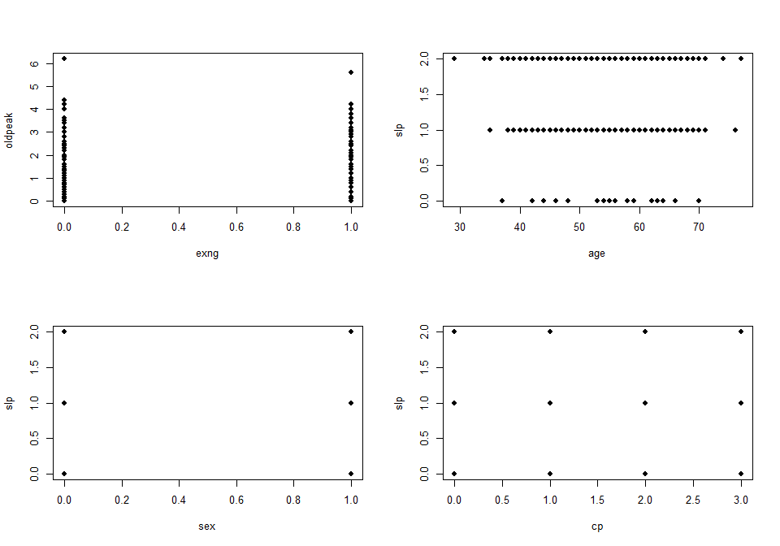
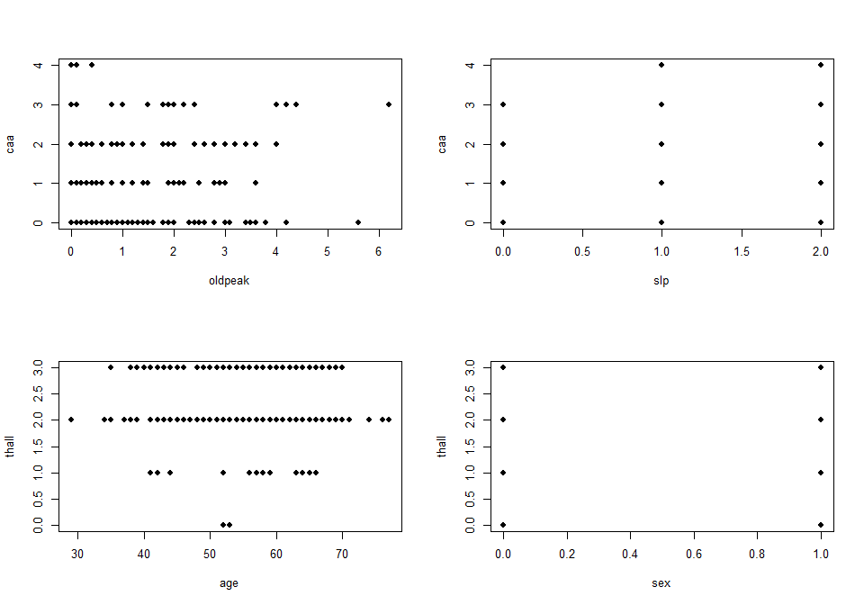
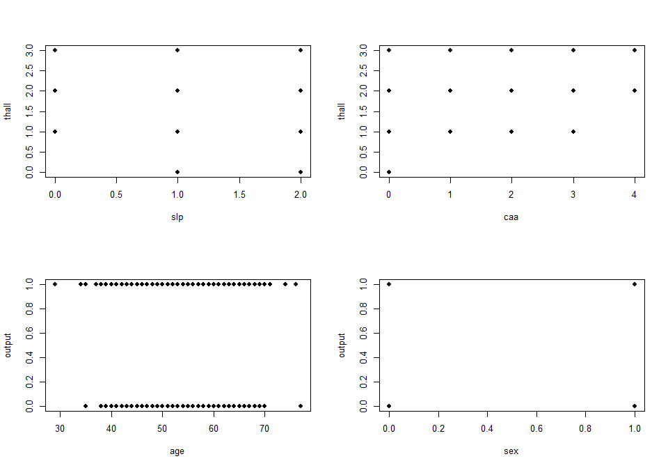

describe bivariate for template data
================
Sascha Siegmund
2022-01-15

## purpose of notebook

-   [ ] describe & visualize relationship between variables
    (multivariate)
-   [ ] gather interesting observations for further investigation
-   [ ] gather possible new features for extraction

## insights

-   

## load packages

``` r
library(tidyverse) # tidy data frame
library(plotly) # make ggplots interactive
library(ggmosaic) # for mosaic plots 
```

## import data

``` r
df <- read_csv('../data/heart_attack_classification/heart.csv') %>% mutate(trtbps_bin = cut_interval(trtbps, n = 15)) %>% mutate(chol_bin = cut_interval(chol, n = 15))
```

## overview

``` r
head(df)
```

    ## # A tibble: 6 x 16
    ##     age   sex    cp trtbps  chol   fbs restecg thalachh  exng oldpeak   slp
    ##   <dbl> <dbl> <dbl>  <dbl> <dbl> <dbl>   <dbl>    <dbl> <dbl>   <dbl> <dbl>
    ## 1    63     1     3    145   233     1       0      150     0     2.3     0
    ## 2    37     1     2    130   250     0       1      187     0     3.5     0
    ## 3    41     0     1    130   204     0       0      172     0     1.4     2
    ## 4    56     1     1    120   236     0       1      178     0     0.8     2
    ## 5    57     0     0    120   354     0       1      163     1     0.6     2
    ## 6    57     1     0    140   192     0       1      148     0     0.4     1
    ## # ... with 5 more variables: caa <dbl>, thall <dbl>, output <dbl>,
    ## #   trtbps_bin <fct>, chol_bin <fct>

``` r
summary(df)
```

    ##       age             sex               cp            trtbps     
    ##  Min.   :29.00   Min.   :0.0000   Min.   :0.000   Min.   : 94.0  
    ##  1st Qu.:47.50   1st Qu.:0.0000   1st Qu.:0.000   1st Qu.:120.0  
    ##  Median :55.00   Median :1.0000   Median :1.000   Median :130.0  
    ##  Mean   :54.37   Mean   :0.6832   Mean   :0.967   Mean   :131.6  
    ##  3rd Qu.:61.00   3rd Qu.:1.0000   3rd Qu.:2.000   3rd Qu.:140.0  
    ##  Max.   :77.00   Max.   :1.0000   Max.   :3.000   Max.   :200.0  
    ##                                                                  
    ##       chol            fbs            restecg          thalachh    
    ##  Min.   :126.0   Min.   :0.0000   Min.   :0.0000   Min.   : 71.0  
    ##  1st Qu.:211.0   1st Qu.:0.0000   1st Qu.:0.0000   1st Qu.:133.5  
    ##  Median :240.0   Median :0.0000   Median :1.0000   Median :153.0  
    ##  Mean   :246.3   Mean   :0.1485   Mean   :0.5281   Mean   :149.6  
    ##  3rd Qu.:274.5   3rd Qu.:0.0000   3rd Qu.:1.0000   3rd Qu.:166.0  
    ##  Max.   :564.0   Max.   :1.0000   Max.   :2.0000   Max.   :202.0  
    ##                                                                   
    ##       exng           oldpeak          slp             caa        
    ##  Min.   :0.0000   Min.   :0.00   Min.   :0.000   Min.   :0.0000  
    ##  1st Qu.:0.0000   1st Qu.:0.00   1st Qu.:1.000   1st Qu.:0.0000  
    ##  Median :0.0000   Median :0.80   Median :1.000   Median :0.0000  
    ##  Mean   :0.3267   Mean   :1.04   Mean   :1.399   Mean   :0.7294  
    ##  3rd Qu.:1.0000   3rd Qu.:1.60   3rd Qu.:2.000   3rd Qu.:1.0000  
    ##  Max.   :1.0000   Max.   :6.20   Max.   :2.000   Max.   :4.0000  
    ##                                                                  
    ##      thall           output           trtbps_bin      chol_bin 
    ##  Min.   :0.000   Min.   :0.0000   (129,136]:58   (214,243]:69  
    ##  1st Qu.:2.000   1st Qu.:0.0000   (115,122]:49   (243,272]:68  
    ##  Median :2.000   Median :1.0000   (136,143]:48   (184,214]:58  
    ##  Mean   :2.314   Mean   :0.5446   (122,129]:34   (272,301]:38  
    ##  3rd Qu.:3.000   3rd Qu.:1.0000   (108,115]:32   (301,330]:30  
    ##  Max.   :3.000   Max.   :1.0000   (143,151]:28   (155,184]:22  
    ##                                   (Other)  :54   (Other)  :18

## scagnostics

-   

``` r
# Scagnostics (scatterplot diagnostics) summarize potentially interesting patterns in 2d scatterplots
name = c('')
tmp_df <- df %>% 
  # select() %>%  # remove categorical and time
  na.omit() 

library(scagnostics)
# scagnostics_results[,1]
# scagnostics_results[1,]

scagnostics_results <- scagnostics(tmp_df)
head(scagnostics_results)
```

    ##             age * sex    age * cp  sex * cp age * trtbps sex * trtbps
    ## Outlying 0.1819986449 0.363326181 0.0000000   0.15245148 0.1232147433
    ## Skewed   0.8765387104 0.943420259 0.9876253   0.82977402 0.8168851759
    ## Clumpy   0.5245397144 0.527991062 0.4192415   0.02737869 0.5733962689
    ## Sparse   0.0377410754 0.077231346 0.9157597   0.05156139 0.0488073033
    ## Striated 0.8615384615 0.774193548 0.0000000   0.07456140 0.8965517241
    ## Convex   0.0002414875 0.001483441 0.0000000   0.61445421 0.0004052233
    ##          cp * trtbps age * chol   sex * chol  cp * chol trtbps * chol
    ## Outlying 0.235993359 0.33045726 0.2352837735 0.19639193    0.34949920
    ## Skewed   0.885838640 0.73874020 0.7520501765 0.82441254    0.77750312
    ## Clumpy   0.199283563 0.02593250 0.5168782039 0.28558777    0.02327382
    ## Sparse   0.080956031 0.04153707 0.0340682313 0.04417049    0.05333433
    ## Striated 0.728395062 0.07142857 0.8269230769 0.73493976    0.10994764
    ## Convex   0.001148713 0.59498525 0.0004747768 0.00161936    0.76144205
    ##             age * fbs   sex * fbs  cp * fbs trtbps * fbs   chol * fbs
    ## Outlying 0.1974303576 0.000000000 0.0000000 0.1304251226 0.2412950104
    ## Skewed   0.9320323695 0.263654013 0.9958772 0.8775476169 0.7792408863
    ## Clumpy   0.2347331352 0.001185118 0.1969224 0.2659183415 0.2759451291
    ## Sparse   0.0432225570 0.919420788 0.9139047 0.0634466965 0.0463008478
    ## Striated 0.8363636364 0.000000000 0.1666667 0.8518518519 0.8200000000
    ## Convex   0.0001474597 0.000000000 0.0000000 0.0007797331 0.0008445118
    ##          age * restecg sex * restecg cp * restecg trtbps * restecg
    ## Outlying  0.4201149153     0.0000000    0.0000000      0.489466881
    ## Skewed    0.9343862276     0.9816419    0.1081130      0.915918234
    ## Clumpy    0.9167941505     0.3130045    0.2125677      0.731866524
    ## Sparse    0.0560922038     0.9157597    0.4597104      0.103898617
    ## Striated  0.8695652174     0.0000000    0.0000000      0.842105263
    ## Convex    0.0009979434     0.0000000    0.0000000      0.002316055
    ##          chol * restecg fbs * restecg age * thalachh sex * thalachh
    ## Outlying   0.1660086527     0.0000000     0.14249039   0.1627280153
    ## Skewed     0.8240129863     0.9889058     0.75492913   0.7794439969
    ## Clumpy     0.7155944352     0.1461315     0.02533715   0.5979739098
    ## Sparse     0.0468994732     0.9157597     0.04567588   0.0377410754
    ## Striated   0.6981132075     0.0000000     0.04365079   0.8695652174
    ## Convex     0.0005988457     0.0000000     0.59618588   0.0007162937
    ##          cp * thalachh trtbps * thalachh chol * thalachh fbs * thalachh
    ## Outlying   0.163745258        0.19696839      0.19070810    0.234110789
    ## Skewed     0.844826940        0.68061945      0.63241572    0.843472473
    ## Clumpy     0.467391949        0.02272675      0.02489331    0.218807473
    ## Sparse     0.058907542        0.04688145      0.04021349    0.048763985
    ## Striated   0.757575758        0.10434783      0.06956522    0.870967742
    ## Convex     0.001948982        0.63373091      0.54305788    0.001321395
    ##          restecg * thalachh   age * exng sex * exng cp * exng trtbps * exng
    ## Outlying        0.390244510 0.2092733105  0.0000000 0.0000000  0.2284678621
    ## Skewed          0.821236169 0.9379788541  0.2636540 0.9958772  0.8096631914
    ## Clumpy          0.930325015 0.6069993716  0.0000000 0.4332292  0.5231724951
    ## Sparse          0.045089130 0.0563553195  0.9194208 0.9139047  0.0542458265
    ## Striated        0.876712329 0.8524590164  0.0000000 0.1666667  0.8421052632
    ## Convex          0.001931088 0.0005640471  0.0000000 0.0000000  0.0006604188
    ##          chol * exng  fbs * exng restecg * exng thalachh * exng age * oldpeak
    ## Outlying 0.250967967 0.000000000      0.0000000    0.1456529896    0.21517309
    ## Skewed   0.758915903 0.263654013      0.9944689    0.7046729043    0.79632299
    ## Clumpy   0.629093610 0.002607259      0.3260557    0.6319458043    0.02614988
    ## Sparse   0.043563473 0.919420788      0.9194208    0.0352391331    0.05707078
    ## Striated 0.785714286 0.000000000      0.0000000    0.8552631579    0.13917526
    ## Convex   0.001182865 0.000000000      0.0000000    0.0005498122    0.50685867
    ##          sex * oldpeak cp * oldpeak trtbps * oldpeak chol * oldpeak
    ## Outlying  0.2117487764  0.173137449       0.28076474     0.30874853
    ## Skewed    0.7665181280  0.760735717       0.74831960     0.79125448
    ## Clumpy    0.5563443773  0.296802948       0.02681740     0.03247673
    ## Sparse    0.0560846680  0.064464446       0.06016413     0.05599416
    ## Striated  0.8600000000  0.689189189       0.17751479     0.05232558
    ## Convex    0.0004916855  0.001133245       0.62661943     0.62847393
    ##          fbs * oldpeak restecg * oldpeak thalachh * oldpeak exng * oldpeak
    ## Outlying  0.1467633611       0.476170429         0.17768645   0.1764179854
    ## Skewed    0.6803439989       0.901512428         0.65966475   0.4364689588
    ## Clumpy    0.2756558243       0.855214677         0.06191722   0.6249653026
    ## Sparse    0.0516187428       0.153543272         0.05314379   0.0367883225
    ## Striated  0.8163265306       0.857142857         0.08500000   0.8363636364
    ## Convex    0.0007980618       0.001668541         0.53285455   0.0001051685
    ##            age * slp sex * slp  cp * slp trtbps * slp chol * slp fbs * slp
    ## Outlying 0.433718807 0.0000000 0.0000000  0.272276824 0.17662250 0.0000000
    ## Skewed   0.941635620 0.9816419 0.9888657  0.908169201 0.74144829 0.9816419
    ## Clumpy   0.898599111 0.3130045 0.3023327  0.832587566 0.75017817 0.1461315
    ## Sparse   0.058842930 0.9157597 0.4597104  0.087349814 0.04049628 0.9157597
    ## Striated 0.822784810 0.0000000 0.1000000  0.761194030 0.72839506 0.0000000
    ## Convex   0.001065379 0.0000000 0.0000000  0.001639907 0.00162620 0.0000000
    ##          restecg * slp thalachh * slp exng * slp oldpeak * slp   age * caa
    ## Outlying  0.0000000000    0.318738286  0.0000000   0.237992718 0.393395278
    ## Skewed    0.4749710088    0.831083411  0.9816419   0.841623762 0.958552546
    ## Clumpy    0.0007868261    0.867809520  0.3214893   0.872846227 0.146223747
    ## Sparse    0.4633917254    0.056114805  0.9157597   0.087349814 0.079118282
    ## Striated  0.0000000000    0.817073171  0.0000000   0.758064516 0.741176471
    ## Convex    0.0000000000    0.001221751  0.0000000   0.001285119 0.001621688
    ##          sex * caa   cp * caa trtbps * caa  chol * caa fbs * caa restecg * caa
    ## Outlying 0.0000000 0.00000000  0.108873213 0.402172509 0.0000000     0.2858353
    ## Skewed   0.9902119 0.93593971  0.869634070 0.917543983 0.9914393     0.9746617
    ## Clumpy   0.4720381 0.04844998  0.324591024 0.293844531 0.2206855     0.4756530
    ## Sparse   0.9157597 0.30525324  0.084606698 0.096696669 0.9157597     0.4606307
    ## Striated 0.1250000 0.06250000  0.681818182 0.694444444 0.2222222     0.2222222
    ## Convex   0.0000000 0.00000000  0.001249389 0.003294543 0.0000000     0.0000000
    ##          thalachh * caa exng * caa oldpeak * caa slp * caa  age * thall
    ## Outlying    0.251408896  0.0000000    0.14756827 0.0000000 0.2737602970
    ## Skewed      0.813883200  0.9914393    0.83637174 0.9780298 0.9144887840
    ## Clumpy      0.126110901  0.4855081    0.31600487 0.1662960 0.6707357019
    ## Sparse      0.058850113  0.9157597    0.09106444 0.4578799 0.0560922038
    ## Striated    0.737373737  0.2222222    0.66250000 0.1666667 0.7777777778
    ## Convex      0.001591508  0.0000000    0.00100085 0.0000000 0.0005656044
    ##          sex * thall  cp * thall trtbps * thall chol * thall fbs * thall
    ## Outlying   0.0000000 0.000000000    0.155318788  0.253058498   0.0000000
    ## Skewed     0.9876253 0.535096623    0.856869450  0.860199618   0.9876253
    ## Clumpy     0.4192415 0.003109805    0.586859949  0.590201147   0.1959336
    ## Sparse     0.9157597 0.308007336    0.071714821  0.071714821   0.9157597
    ## Striated   0.0000000 0.076923077    0.786666667  0.690140845   0.0000000
    ## Convex     0.0000000 0.000000000    0.001555562  0.003893178   0.0000000
    ##          restecg * thall thalachh * thall exng * thall oldpeak * thall
    ## Outlying       0.0000000       0.40604884    0.0000000     0.397180809
    ## Skewed         0.9835903       0.88341882    0.9876253     0.835121868
    ## Clumpy         0.3169593       0.56299453    0.4310540     0.699192714
    ## Sparse         0.4587947       0.06896269    0.9157597     0.084591709
    ## Striated       0.0000000       0.80000000    0.0000000     0.737704918
    ## Convex         0.0000000       0.00361979    0.0000000     0.001277068
    ##          slp * thall caa * thall age * output sex * output cp * output
    ## Outlying   0.0000000  0.08900860 0.1605113094    0.0000000   0.0000000
    ## Skewed     0.9835575  0.95621814 0.8613575493    0.2636540   0.9958772
    ## Clumpy     0.3042857  0.18552872 0.8824753857    0.0000000   0.2613489
    ## Sparse     0.4587947  0.30432967 0.0349863470    0.9194208   0.9139047
    ## Striated   0.0000000  0.07692308 0.8676470588    0.0000000   0.1666667
    ## Convex     0.0000000  0.00000000 0.0001035963    0.0000000   0.0000000
    ##          trtbps * output chol * output fbs * output restecg * output
    ## Outlying    0.1175148020   0.177221177    0.0000000        0.0000000
    ## Skewed      0.8419891520   0.728824040    0.2636540        0.9944689
    ## Clumpy      0.8533340313   0.796298771    0.0000000        0.4446535
    ## Sparse      0.0515203901   0.038615673    0.9194208        0.9194208
    ## Striated    0.8548387097   0.769230769    0.0000000        0.0000000
    ## Convex      0.0007913164   0.001075413    0.0000000        0.0000000
    ##          thalachh * output exng * output oldpeak * output slp * output
    ## Outlying       0.167994879     0.0000000      0.206245255    0.0000000
    ## Skewed         0.715689167     0.2636540      0.894011925    0.9944689
    ## Clumpy         0.872362338     0.0000000      0.843719697    0.3392541
    ## Sparse         0.036960258     0.9194208      0.059875404    0.9194208
    ## Striated       0.828947368     0.0000000      0.823529412    0.0000000
    ## Convex         0.001093228     0.0000000      0.001405757    0.0000000
    ##          caa * output thall * output age * trtbps_bin sex * trtbps_bin
    ## Outlying    0.0000000      0.0000000       0.03897887       0.04850962
    ## Skewed      0.9975351      0.9958772       0.90490678       0.54305247
    ## Clumpy      0.3520457      0.2221466       0.02610660       0.58165984
    ## Sparse      0.9148255      0.9139047       0.06809303       0.07080137
    ## Striated    0.1250000      0.1666667       0.40449438       0.73076923
    ## Convex      0.0000000      0.0000000       0.60441296       0.00000000
    ##          cp * trtbps_bin trtbps * trtbps_bin chol * trtbps_bin fbs * trtbps_bin
    ## Outlying      0.09816788          0.00000000        0.14900445       0.04817611
    ## Skewed        0.95161840          0.81707944        0.79195901       0.54305247
    ## Clumpy        0.18589469          0.25504623        0.16678881       0.26886204
    ## Sparse        0.13332870          0.07319075        0.06592318       0.07080137
    ## Striated      0.59523810          0.10526316        0.46478873       0.73076923
    ## Convex        0.00000000          0.56008652        0.61366966       0.00000000
    ##          restecg * trtbps_bin thalachh * trtbps_bin exng * trtbps_bin
    ## Outlying            0.3387737            0.12265404        0.09696633
    ## Skewed              0.9894696            0.73647735        0.92417536
    ## Clumpy              0.8326121            0.05452656        0.60081856
    ## Sparse              0.3889150            0.06459544        0.12788214
    ## Striated            0.7307692            0.43575419        0.70833333
    ## Convex              0.0000000            0.64469885        0.00000000
    ##          oldpeak * trtbps_bin slp * trtbps_bin caa * trtbps_bin
    ## Outlying           0.13644976       0.05893516        0.1057329
    ## Skewed             0.69075441       0.96296967        0.9741382
    ## Clumpy             0.09564490       0.78695571        0.2966009
    ## Sparse             0.06891364       0.13239979        0.2261775
    ## Striated           0.31297710       0.58823529        0.4318182
    ## Convex             0.59338826       0.00000000        0.0000000
    ##          thall * trtbps_bin output * trtbps_bin age * chol_bin sex * chol_bin
    ## Outlying         0.09705426          0.00000000     0.44083252      0.1432888
    ## Skewed           0.96246925          0.43924308     0.91170326      0.9749842
    ## Clumpy           0.59602797          0.84214888     0.21947491      0.5816598
    ## Sparse           0.13148039          0.06910963     0.06441853      0.3300772
    ## Striated         0.58823529          0.74074074     0.53237410      0.5882353
    ## Convex           0.00000000          0.00000000     0.60363252      0.0000000
    ##          cp * chol_bin trtbps * chol_bin chol * chol_bin fbs * chol_bin
    ## Outlying     0.1494154        0.06912991      0.29654710      0.1892438
    ## Skewed       0.9892953        0.65747113      0.83456383      0.9750690
    ## Clumpy       0.4448660        0.05435077      0.27251709      0.2697553
    ## Sparse       0.3025397        0.06727497      0.06803714      0.3309966
    ## Striated     0.4482759        0.39843750      0.25714286      0.5882353
    ## Convex       0.0000000        0.64241424      0.63125115      0.0000000
    ##          restecg * chol_bin thalachh * chol_bin exng * chol_bin
    ## Outlying          0.4090948          0.11339531       0.1892438
    ## Skewed            0.9934412          0.75531807       0.9750690
    ## Clumpy            0.8313826          0.14033993       0.6008186
    ## Sparse            0.4560661          0.06275005       0.3309966
    ## Striated          0.5882353          0.58974359       0.5882353
    ## Convex            0.0000000          0.66862730       0.0000000
    ##          oldpeak * chol_bin slp * chol_bin caa * chol_bin thall * chol_bin
    ## Outlying         0.17243485      0.1662032      0.2691002        0.1614998
    ## Skewed           0.74129425      0.9842253      0.9746494        0.9791061
    ## Clumpy           0.07465609      0.8028608      0.2988926        0.5860098
    ## Sparse           0.06907904      0.3300733      0.2280182        0.3043338
    ## Striated         0.44067797      0.4347826      0.2903226        0.3200000
    ## Convex           0.69740562      0.0000000      0.0000000        0.0000000
    ##          output * chol_bin trtbps_bin * chol_bin
    ## Outlying         0.1893125            0.10921354
    ## Skewed           0.9781125            0.54593098
    ## Clumpy           0.8382433            0.01306065
    ## Sparse           0.3300926            0.06804335
    ## Striated         0.5882353            0.01388889
    ## Convex           0.0000000            0.62578009

``` r
e <- scagnosticsExemplars(scagnostics_results)
o <- scagnosticsOutliers(scagnostics_results)
g <- scagnosticsGrid(scagnostics_results)

# look at outliers
# o[o]
# go <- g[o,]
# par(mfrow = c(1,1))
# plot(tmp_df[[go$x]], tmp_df[[go$y]], pch=19,
#      xlab=names(tmp_df)[go$x], ylab=names(tmp_df)[go$y])

# find and plot exemplars
e[e]
```

    ## trtbps * oldpeak     chol * thall 
    ##             TRUE             TRUE

``` r
ge <- g[e,]
par(mfrow = c(1,1))
for(i in 1:dim(ge)[1])
  plot(tmp_df[[ge$x[i]]], tmp_df[[ge$y[i]]], pch=19,
       xlab=names(tmp_df)[ge$x[i]], ylab=names(tmp_df)[ge$y[i]])
```

<!-- --><!-- -->

``` r
par(mfrow = c(2,2))
for(i in 1:dim(g)[1])
  plot(tmp_df[[g$x[i]]], tmp_df[[g$y[i]]], pch=19,
       xlab=names(tmp_df)[g$x[i]], ylab=names(tmp_df)[g$y[i]])
```

<!-- --><!-- --><!-- --><!-- --><!-- --><!-- --><!-- --><!-- --><!-- --><!-- --><!-- --><!-- --><!-- --><!-- --><!-- --><!-- --><!-- --><!-- --><!-- --><!-- --><!-- --><!-- --><!-- --><!-- --><!-- --><!-- --><!-- --><!-- --><!-- --><!-- -->

## bivariate numeric over numeric

-   

``` r
# two variables, continuous x, continuous y, show trend and distribution
name = c('trtbps', 'chol')
tmp_df <- df %>% rename(x = name[1], y = name[2]) %>% select(x, y) %>% add_count(x, y)

p1 <- tmp_df %>%
  ggplot(aes(x = x, y = y)) +
    geom_vline(aes(xintercept = quantile(tmp_df$x, na.rm = TRUE)[2]), color = 5, alpha = 0.25) + 
    geom_vline(aes(xintercept = quantile(tmp_df$x, na.rm = TRUE)[4]), color = 5, alpha = 0.25) +
    geom_hline(aes(yintercept = quantile(tmp_df$y, na.rm = TRUE)[2]), color = 5, alpha = 0.25) + 
    geom_hline(aes(yintercept = quantile(tmp_df$y, na.rm = TRUE)[4]), color = 5, alpha = 0.25) +
    geom_point(aes(size = n), alpha = 0.3, stat = "unique") + 
    scale_size(range = c(1, max(tmp_df$n))) +
    geom_density2d(alpha = 0.5, bins = 5, color = 'darkgreen') +
    geom_quantile(alpha = 0.7, color = 'darkorange') +
    geom_smooth() +
    theme_minimal() +
    ggtitle(paste("trend of", name[2], "over", name[1], sep=" "))
p1 <- ggplotly(p1) %>% layout(xaxis = list(title = name[1]), yaxis = list(title = name[2]))

p2 <- tmp_df %>%
  ggplot(aes(x = x)) +
    stat_density(geom="line") + 
    theme_minimal()
p2 <- ggplotly(p2) %>% layout(yaxis = list(showticklabels = FALSE, showgrid = FALSE, title = ''), 
                              xaxis = list(showticklabels = FALSE, showgrid = FALSE, title = ''))

p3 <- tmp_df %>%
  ggplot(aes(x = 1, y = x)) +
    geom_boxplot() +
    theme_minimal() +
    coord_flip() 
p3 <- ggplotly(p3) %>% layout(yaxis = list(showticklabels = FALSE, showgrid = FALSE, title = ''), 
                              xaxis = list(showticklabels = FALSE, showgrid = FALSE, title = ''))

p4 <- tmp_df %>%
  ggplot(aes(x = y)) +
    stat_density(geom="line") + 
    coord_flip() +
    theme_minimal()
p4 <- ggplotly(p4) %>% layout(yaxis = list(showticklabels = FALSE, showgrid = FALSE, title = ''), 
                              xaxis = list(showticklabels = FALSE, showgrid = FALSE, title = ''))

p5 <- tmp_df %>%
  ggplot(aes(x = 1, y = y)) +
    geom_boxplot() +
    theme_minimal() 
p5 <- ggplotly(p5) %>% layout(yaxis = list(showticklabels = FALSE, showgrid = FALSE, title = ''), 
                              xaxis = list(showticklabels = FALSE, showgrid = FALSE, title = ''))

# merge figures into one plot, via subplots, https://plotly-r.com/arranging-views.html
fig <- subplot(p2, plotly_empty(), plotly_empty(),
               p3, plotly_empty(), plotly_empty(),
               p1, p5, p4, 
               nrows = 3, margin = 0, heights = c(0.1, 0.035, 0.865), widths = c(0.92, 0.02, 0.06), 
               shareX = TRUE, shareY = TRUE, titleX = TRUE, titleY = TRUE) %>% layout()

fig
```

<!-- -->

## bivariate numeric over numeric, many observations

-   

``` r
# two variables, continuous x, continuous y, show trend and distribution
name = c('trtbps', 'chol')
tmp_df <- df %>% rename(x = name[1], y = name[2]) %>% select(x, y)

p1 <- tmp_df %>%
  ggplot(aes(x = x, y = y)) +
    stat_density_2d(aes(fill = after_stat(density)), 
                    geom = "raster", contour = FALSE, show.legend = FALSE) +
    scale_fill_viridis_c() +
    geom_quantile(alpha = 0.7, color = 'darkorange') +
    geom_smooth() +
    theme_minimal() +
    ggtitle(paste("trend of", name[2], "over", name[1], sep=" "))
p1 <- ggplotly(p1) %>% layout(xaxis = list(title = name[1]), yaxis = list(title = name[2]))

p2 <- tmp_df %>%
  ggplot(aes(x = x)) +
    stat_density(geom="line") + 
    theme_minimal()
p2 <- ggplotly(p2) %>% layout(yaxis = list(showticklabels = FALSE, showgrid = FALSE, title = ''), 
                              xaxis = list(showticklabels = FALSE, showgrid = FALSE, title = ''))

p3 <- tmp_df %>%
  ggplot(aes(x = 1, y = x)) +
    geom_boxplot() +
    theme_minimal() +
    coord_flip() 
p3 <- ggplotly(p3) %>% layout(yaxis = list(showticklabels = FALSE, showgrid = FALSE, title = ''), 
                              xaxis = list(showticklabels = FALSE, showgrid = FALSE, title = ''))

p4 <- tmp_df %>%
  ggplot(aes(x = y)) +
    stat_density(geom="line") + 
    coord_flip() +
    theme_minimal()
p4 <- ggplotly(p4) %>% layout(yaxis = list(showticklabels = FALSE, showgrid = FALSE, title = ''), 
                              xaxis = list(showticklabels = FALSE, showgrid = FALSE, title = ''))

p5 <- tmp_df %>%
  ggplot(aes(x = 1, y = y)) +
    geom_boxplot() +
    theme_minimal() 
p5 <- ggplotly(p5) %>% layout(yaxis = list(showticklabels = FALSE, showgrid = FALSE, title = ''), 
                              xaxis = list(showticklabels = FALSE, showgrid = FALSE, title = ''))

# merge figures into one plot, via subplots, https://plotly-r.com/arranging-views.html
fig <- subplot(p2, plotly_empty(), plotly_empty(),
               p3, plotly_empty(), plotly_empty(),
               p1, p5, p4, 
               nrows = 3, margin = 0, heights = c(0.1, 0.035, 0.865), widths = c(0.92, 0.02, 0.06), 
               shareX = TRUE, shareY = TRUE, titleX = TRUE, titleY = TRUE) %>% layout()

fig
```

<!-- -->

## bivariate numeric over categorical

-   

``` r
# two variables, continuous/discrete y, categorical x, show trend and distribution
name = c('sex', 'trtbps')
tmp_df <- df %>% rename(c = name[1], y = name[2]) %>% select(c, y) %>% mutate(c = fct_infreq(factor(c))) %>% 
  add_count(c, y)

so.q2 <- function(y){ quantile(y, na.rm = TRUE)[2] }
so.q4 <- function(y){ quantile(y, na.rm = TRUE)[4] }

p1 <- tmp_df %>%
  ggplot(aes(x = c, y = y)) +
    geom_violin(aes(color = c), scale = "area", fill = NA) +
    geom_boxplot(fill = NA, lwd = 0.4, outlier.alpha = 0.3, width =0.1) +
    geom_hline(aes(yintercept = quantile(tmp_df$y, na.rm = TRUE)[2]), color = 'darkorange', alpha = 0.5, lty=2) + 
    geom_hline(aes(yintercept = quantile(tmp_df$y, na.rm = TRUE)[3]), color = 'darkred', alpha = 0.5, lty=2) +
    geom_hline(aes(yintercept = quantile(tmp_df$y, na.rm = TRUE)[4]), color = 'darkorange', alpha = 0.5, lty=2) +
    stat_summary(aes(x = as.numeric(c)), fun = so.q2, geom = 'line', size = 0.5, color = 'darkorange') + 
    stat_summary(aes(x = as.numeric(c)), fun = 'median', geom = 'line', size = 0.5, color = 'darkred') +
    stat_summary(aes(x = as.numeric(c)), fun = so.q4, geom = 'line', size = 0.5, color = 'darkorange') + 
    geom_spoke(aes(x = as.numeric(c), radius = n/max(tmp_df$n)/2, angle = 2*pi, color = c),
               alpha = I(0.5), stat = "unique") + # x-offset= +n/2, radius= n, angle= pi for two-sided spoke plot
    scale_color_brewer(guide = "none", palette = "Set2") +
    coord_flip() +
    theme_minimal() +
    ggtitle(paste("distribution of", name[2], "grouped by", name[1], sep=" ")) 
p1 <- ggplotly(p1) %>% layout(xaxis = list(title = name[2]), yaxis = list(title = name[1]))

p2 <- tmp_df %>%
  ggplot(aes(x = y)) +
    stat_density(geom="line") + 
    theme_minimal()
p2 <- ggplotly(p2) %>% layout(yaxis = list(showticklabels = FALSE, showgrid = FALSE, title = ''), 
                              xaxis = list(showticklabels = FALSE, showgrid = FALSE, title = ''))

p3 <- tmp_df %>%
  ggplot(aes(x = 1, y = y)) +
    geom_boxplot() +
    theme_minimal() +
    coord_flip() 
p3 <- ggplotly(p3) %>% layout(yaxis = list(showticklabels = FALSE, showgrid = FALSE, title = ''), 
                              xaxis = list(showticklabels = FALSE, showgrid = FALSE, title = ''))

p5 <- tmp_df %>%
  ggplot() +
    geom_mosaic(aes(x=product(c), fill = c)) +
    geom_text(data = layer_data(ggplot2::last_plot(), 1) %>%  filter(.wt > 0),
               aes(x = (xmax + xmin)/2, y = (ymax + ymin)/2, 
                   label = paste0(.wt,"\n",scales::percent(.wt/nrow(tmp_df),  accuracy = 1))),
              size = 3.5) +
    scale_fill_brewer(guide = "none", palette = "Set2") +
    theme_minimal() +
    coord_flip()
p5 <- ggplotly(p5) %>% layout(yaxis = list(showticklabels = FALSE, showgrid = FALSE, title = ''), 
                              xaxis = list(showticklabels = FALSE, showgrid = FALSE, title = ''))

# merge figures into one plot, via subplots, https://plotly-r.com/arranging-views.html
fig <- subplot(p2, plotly_empty(),
               p3, plotly_empty(),
               p1, p5,
               nrows = 3, margin = 0, heights = c(0.07, 0.03, 0.9), widths = c(0.95, 0.05), 
               shareX = TRUE, titleX = TRUE, titleY = TRUE) %>% layout() %>% hide_legend()

fig
```

<!-- -->

## bivarite categorical over categorical (mosaic plot)

-   

``` r
name = c('sex', 'output')
tmp_df <- df %>% rename(c = name[1], d = name[2]) %>% select(c, d) %>% 
  mutate(across(c(c,d), factor))

chi <- chisq.test(xtabs(~c+d, data = tmp_df))
# https://cran.r-project.org/web/packages/ggmosaic/vignettes/ggmosaic.html
p1 <- tmp_df %>%
  ggplot() +
    geom_mosaic(aes(x=product(c, d), fill = c)) +
    # conditioning: x=product(c), conds=product(d)
    geom_text(data = layer_data(ggplot2::last_plot(), 1) %>%  filter(.wt > 0),
               aes(x = (xmax + xmin)/2, y = (ymax + ymin)/2, 
                   label = paste0(.wt,"\n",scales::percent(.wt/nrow(tmp_df),  accuracy = 0.1))),
              size = 3.5) +
    scale_fill_brewer(guide = "none", palette = "Set2") +
    theme_minimal() +
    ggtitle(paste("distribution of", name[1], "over", name[2], sep=" ")) +
    labs(subtitle = paste("Pearson's Chi-squared test:", round(chi[[1]],4)," p-value:", round(chi[[3]],4)))
p1 <- ggplotly(p1) %>% layout(xaxis = list(title = name[2]), yaxis = list(title = name[1]),
                              title = list(text = paste("distribution of", name[1], "over", name[2],
                                             '<br>', '<sup>',
                       "Pearson's Chi-squared test:", round(chi[[1]],4)," p-value:", round(chi[[3]],4),
                                             '</sup>', sep=" ")))

p3 <- tmp_df %>%
  ggplot() +
    geom_mosaic(aes(x=product(d))) +
    geom_text(data = layer_data(ggplot2::last_plot(), 1) %>%  filter(.wt > 0),
               aes(x = (xmax + xmin)/2, y = (ymax + ymin)/2, 
                   label = paste0(.wt,"\n",scales::percent(.wt/nrow(tmp_df),  accuracy = 1))),
              size = 3.5) +
    theme_minimal() 
p3 <- ggplotly(p3) %>% layout(yaxis = list(showticklabels = FALSE, showgrid = FALSE, title = ''), 
                              xaxis = list(showticklabels = FALSE, showgrid = FALSE, title = ''))

p5 <- tmp_df %>%
  ggplot() +
    geom_mosaic(aes(x=product(c))) +
    geom_text(data = layer_data(ggplot2::last_plot(), 1) %>%  filter(.wt > 0),
               aes(x = (xmax + xmin)/2, y = (ymax + ymin)/2, 
                   label = paste0(.wt,"\n",scales::percent(.wt/nrow(tmp_df),  accuracy = 1))),
              size = 3.5) +
    theme_minimal() +
    coord_flip()
p5 <- ggplotly(p5) %>% layout(yaxis = list(showticklabels = FALSE, showgrid = FALSE, title = ''), 
                              xaxis = list(showticklabels = FALSE, showgrid = FALSE, title = ''))

# merge figures into one plot, via subplots, https://plotly-r.com/arranging-views.html
fig <- subplot(p3, plotly_empty(),
               p1, p5, 
               nrows = 2, margin = 0, heights = c(0.1, 0.9), widths = c(0.93, 0.07), 
               shareX = TRUE, shareY = TRUE, titleX = TRUE, titleY = TRUE) %>% layout()

fig
```

<!-- -->

## bivarite categorical over categorical (many categories, heatmap)

-   

``` r
name = c('trtbps_bin', 'chol_bin')
tmp_df <- df %>% rename(c = name[1], d = name[2]) %>% select(c, d) %>% 
  mutate(across(c(c,d), factor)) %>% count(c, d)

p1 <- tmp_df %>% 
  ggplot(aes(x = c, y = d, fill = n)) +
    geom_tile() +
    scale_fill_viridis_c(guide = "none") +
    theme_minimal() +
    ggtitle(paste("count of", name[2], "over", name[1], sep=" "))
p1 <- ggplotly(p1) %>% layout(xaxis = list(title = name[1]), yaxis = list(title = name[2]))

p2 <- tmp_df %>%
  ggplot(aes(x = c, weight = n)) +
    geom_bar() +
    theme_minimal()
p2 <- ggplotly(p2) %>% layout(yaxis = list(showticklabels = FALSE, showgrid = FALSE, title = ''), 
                              xaxis = list(showticklabels = FALSE, showgrid = FALSE, title = ''))

p5 <- tmp_df %>%
  ggplot(aes(x = d, weight = n)) +
    geom_bar() +
    theme_minimal() +
    coord_flip()
p5 <- ggplotly(p5) %>% layout(yaxis = list(showticklabels = FALSE, showgrid = FALSE, title = ''), 
                              xaxis = list(showticklabels = FALSE, showgrid = FALSE, title = ''))

fig <- subplot(p2, plotly_empty(),
               p1, p5,
               nrows = 2, margin = 0, heights = c(0.08, 0.92), widths = c(0.95, 0.05), 
               shareX = TRUE, shareY = TRUE, titleX = TRUE, titleY = TRUE) %>% layout()

fig
```

<!-- -->

## bivariate numeric over categorical (many categories, density heatmap)

-   

``` r
name = c('trtbps', 'thall')
tmp_df <- df %>% rename(x = name[1], c = name[2]) %>% select(x, c) %>% 
  mutate(c = factor(c))

p1 <- tmp_df %>% 
  ggplot(aes(x = x, y = c, group = c, fill = after_stat(density))) +
    geom_tile(stat = "density", show.legend = FALSE) +
    scale_fill_viridis_c() +
    theme_minimal() +
    ggtitle(paste("distribution of", name[2], "over", name[1], sep=" "))
p1 <- ggplotly(p1) %>% layout(xaxis = list(title = name[1]), yaxis = list(title = name[2]))

p2 <- tmp_df %>%
  ggplot(aes(x = x)) +
    stat_density(geom="line") + 
    theme_minimal()
p2 <- ggplotly(p2) %>% layout(yaxis = list(showticklabels = FALSE, showgrid = FALSE, title = ''), 
                              xaxis = list(showticklabels = FALSE, showgrid = FALSE, title = ''))

p3 <- tmp_df %>%
  ggplot(aes(x = 1, y = x)) +
    geom_boxplot() +
    theme_minimal() +
    coord_flip() 
p3 <- ggplotly(p3) %>% layout(yaxis = list(showticklabels = FALSE, showgrid = FALSE, title = ''), 
                              xaxis = list(showticklabels = FALSE, showgrid = FALSE, title = ''))

p5 <- tmp_df %>%
  ggplot(aes(x = c)) +
    geom_bar() +
    theme_minimal() +
    coord_flip()
p5 <- ggplotly(p5) %>% layout(yaxis = list(showticklabels = FALSE, showgrid = FALSE, title = ''), 
                              xaxis = list(showticklabels = FALSE, showgrid = FALSE, title = ''))

fig <- subplot(p2, plotly_empty(),
               p3, plotly_empty(),
               p1, p5,
               nrows = 3, margin = 0, heights = c(0.07, 0.03, 0.9), widths = c(0.95, 0.05), 
               shareX = TRUE, shareY = TRUE, titleX = TRUE, titleY = TRUE) %>% layout()

fig
```

<!-- -->

## bivariate parallel coordinate plot (max 1000 rows)

-   max 1000 rows, correlation

``` r
name = c('age', 'thalachh')
tmp_df <- df %>% rename(x = name[1], y = name[2]) %>% select(x, y) %>% 
  mutate(across(c(x,y), as.numeric)) %>% na.omit() %>% mutate(across(c(x,y), scale))

# https://r-charts.com/ranking/parallel-coordinates-ggplot2/
p1 <- GGally::ggparcoord(tmp_df,
           columns = 1:ncol(tmp_df),
           scale='globalminmax', # data already scaled
           showPoints = FALSE,
           splineFactor = TRUE, # drop if too many rows
           alphaLines = 0.2) +
    theme_minimal() +
    ggtitle(paste("correlation of", name[1], "and", name[2], sep=" "))
p1 <- ggplotly(p1) %>% layout(yaxis = list(title = ''), xaxis = list(title = '')) %>%
  add_annotations(text = name[1], align = 'left', yref='paper', yref = 'paper', x = 1, y = 0, showarrow=FALSE) %>%
  add_annotations(text = name[2], align = 'left', yref='paper', yref = 'paper', x = 2, y = 0, showarrow=FALSE)

p2 <- tmp_df %>%
  ggplot(aes(x = y)) +
    stat_density(geom="line", trim = TRUE) + 
    scale_x_continuous(limits = c(min(tmp_df$x, tmp_df$y), max(tmp_df$x, tmp_df$y))) +
    coord_flip() +
    theme_minimal()
p2 <- ggplotly(p2) %>% layout(yaxis = list(showticklabels = FALSE, showgrid = FALSE, title = ''), 
                              xaxis = list(showticklabels = FALSE, showgrid = FALSE, title = ''))

p3 <- tmp_df %>%
  ggplot(aes(x = 1, y = y)) +
    geom_boxplot() +
    theme_minimal() 
p3 <- ggplotly(p3) %>% layout(yaxis = list(showticklabels = FALSE, showgrid = FALSE, title = ''), 
                              xaxis = list(showticklabels = FALSE, showgrid = FALSE, title = ''))

p4 <- tmp_df %>%
  ggplot(aes(x = x)) +
    stat_density(geom="line", trim = TRUE) + 
    scale_x_continuous(limits = c(min(tmp_df$x, tmp_df$y), max(tmp_df$x, tmp_df$y))) +
    coord_flip() +
    theme_minimal()
p4 <- ggplotly(p4) %>% layout(yaxis = list(showticklabels = TRUE, showgrid = TRUE, title = ''),
                              xaxis = list(showticklabels = FALSE, showgrid = FALSE, title = '', 
                                           autorange = "reversed"))

p5 <- tmp_df %>%
  ggplot(aes(x = 1, y = x)) +
    geom_boxplot() +
    theme_minimal() 
p5 <- ggplotly(p5) %>% layout(yaxis = list(showticklabels = FALSE, showgrid = FALSE, title = ''), 
                              xaxis = list(showticklabels = FALSE, showgrid = FALSE, title = ''))

# merge figures into one plot, via subplots, https://plotly-r.com/arranging-views.html
fig <- subplot(p4, p5, p1, p3, p2,  
               margin = 0, widths = c(0.05, 0.02, 0.86, 0.02, 0.05), 
               shareX = TRUE, shareY = TRUE, titleX = TRUE, titleY = TRUE) %>% layout()

fig
```

<!-- -->
