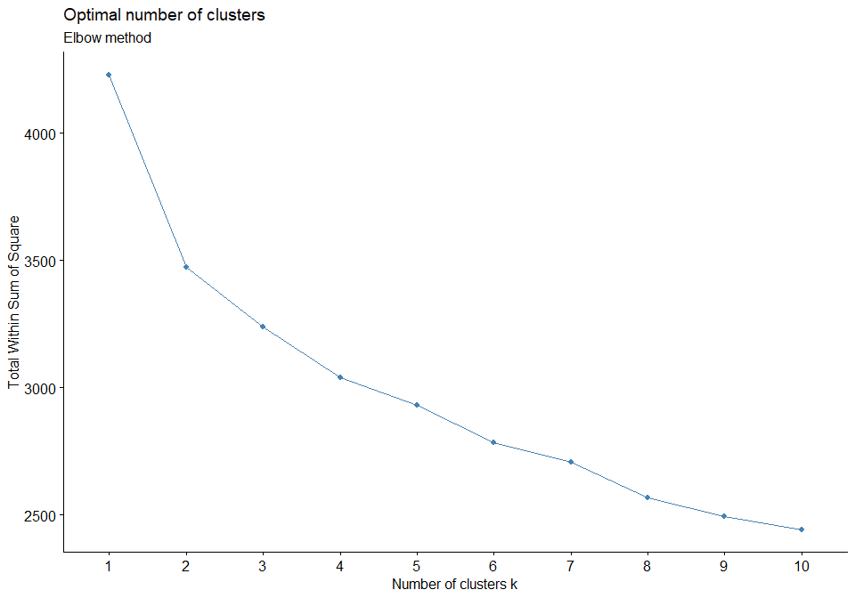
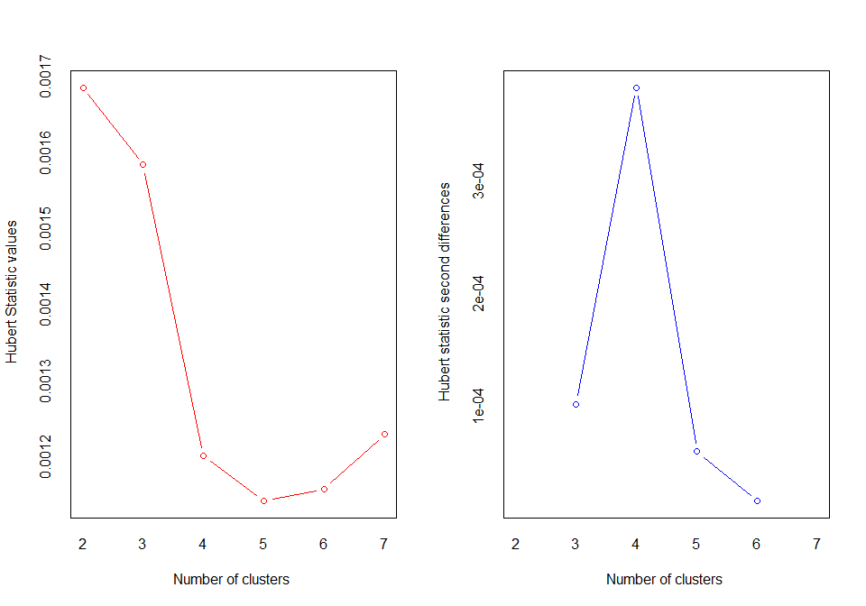
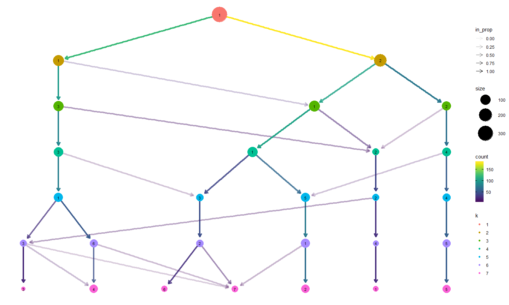
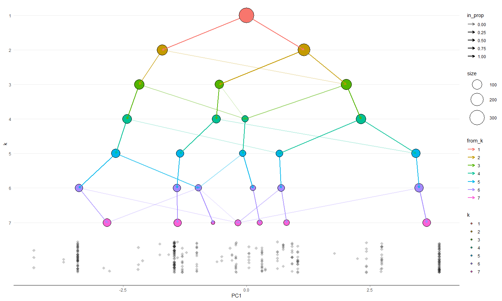
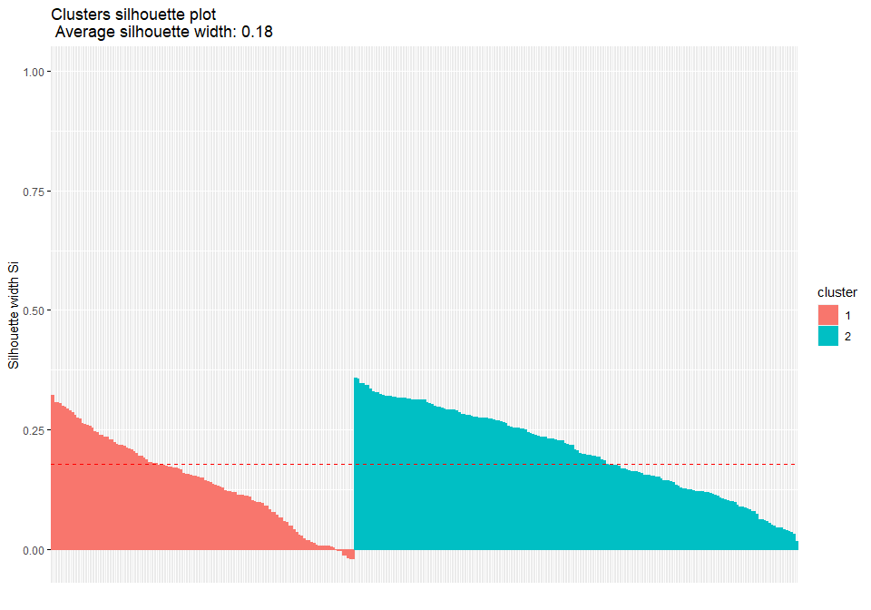

discover cluster for template data
================
Sascha Siegmund
2022-02-10

## purpose of notebook

-   \[ \]

## insights

-   

## load packages

## import data

``` r
df <- read_csv('../data/heart_attack_classification/heart.csv')
```

## overview

``` r
head(df)
```

    ## # A tibble: 6 x 14
    ##     age   sex    cp trtbps  chol   fbs restecg thalachh  exng oldpeak   slp
    ##   <dbl> <dbl> <dbl>  <dbl> <dbl> <dbl>   <dbl>    <dbl> <dbl>   <dbl> <dbl>
    ## 1    63     1     3    145   233     1       0      150     0     2.3     0
    ## 2    37     1     2    130   250     0       1      187     0     3.5     0
    ## 3    41     0     1    130   204     0       0      172     0     1.4     2
    ## 4    56     1     1    120   236     0       1      178     0     0.8     2
    ## 5    57     0     0    120   354     0       1      163     1     0.6     2
    ## 6    57     1     0    140   192     0       1      148     0     0.4     1
    ## # ... with 3 more variables: caa <dbl>, thall <dbl>, output <dbl>

``` r
summary(df)
```

    ##       age             sex               cp            trtbps     
    ##  Min.   :29.00   Min.   :0.0000   Min.   :0.000   Min.   : 94.0  
    ##  1st Qu.:47.50   1st Qu.:0.0000   1st Qu.:0.000   1st Qu.:120.0  
    ##  Median :55.00   Median :1.0000   Median :1.000   Median :130.0  
    ##  Mean   :54.37   Mean   :0.6832   Mean   :0.967   Mean   :131.6  
    ##  3rd Qu.:61.00   3rd Qu.:1.0000   3rd Qu.:2.000   3rd Qu.:140.0  
    ##  Max.   :77.00   Max.   :1.0000   Max.   :3.000   Max.   :200.0  
    ##       chol            fbs            restecg          thalachh    
    ##  Min.   :126.0   Min.   :0.0000   Min.   :0.0000   Min.   : 71.0  
    ##  1st Qu.:211.0   1st Qu.:0.0000   1st Qu.:0.0000   1st Qu.:133.5  
    ##  Median :240.0   Median :0.0000   Median :1.0000   Median :153.0  
    ##  Mean   :246.3   Mean   :0.1485   Mean   :0.5281   Mean   :149.6  
    ##  3rd Qu.:274.5   3rd Qu.:0.0000   3rd Qu.:1.0000   3rd Qu.:166.0  
    ##  Max.   :564.0   Max.   :1.0000   Max.   :2.0000   Max.   :202.0  
    ##       exng           oldpeak          slp             caa        
    ##  Min.   :0.0000   Min.   :0.00   Min.   :0.000   Min.   :0.0000  
    ##  1st Qu.:0.0000   1st Qu.:0.00   1st Qu.:1.000   1st Qu.:0.0000  
    ##  Median :0.0000   Median :0.80   Median :1.000   Median :0.0000  
    ##  Mean   :0.3267   Mean   :1.04   Mean   :1.399   Mean   :0.7294  
    ##  3rd Qu.:1.0000   3rd Qu.:1.60   3rd Qu.:2.000   3rd Qu.:1.0000  
    ##  Max.   :1.0000   Max.   :6.20   Max.   :2.000   Max.   :4.0000  
    ##      thall           output      
    ##  Min.   :0.000   Min.   :0.0000  
    ##  1st Qu.:2.000   1st Qu.:0.0000  
    ##  Median :2.000   Median :1.0000  
    ##  Mean   :2.314   Mean   :0.5446  
    ##  3rd Qu.:3.000   3rd Qu.:1.0000  
    ##  Max.   :3.000   Max.   :1.0000

## config: set number of cluster

``` r
no_k = 2 # number of clusters for clustering methods 
max_k = 7 # maximum clusters in scope 
min_k = 2 # minimum clusters in scope
```

## prepare data

``` r
# remove variables which are highly correlated or dichtome or not wanted in analysis
value_df <- df %>% select(everything()) %>% 
  na.omit()

# list with columns to exclude
var = c('Education', 'Marital_Status')

# replace data with scaled columns
 # scale_df <- as_tibble(scale(df[, !names(df) %in% cat]))
preObj <- caret::preProcess(value_df[, !names(value_df) %in% var], method=c("center", "scale"))
scale_df <- predict(preObj, value_df[, !names(value_df) %in% var])
head(scale_df)
```

    ## # A tibble: 6 x 14
    ##      age    sex      cp  trtbps    chol    fbs restecg thalachh   exng oldpeak
    ##    <dbl>  <dbl>   <dbl>   <dbl>   <dbl>  <dbl>   <dbl>    <dbl>  <dbl>   <dbl>
    ## 1  0.951  0.680  1.97    0.763  -0.256   2.39   -1.00    0.0154 -0.695   1.09 
    ## 2 -1.91   0.680  1.00   -0.0926  0.0721 -0.417   0.897   1.63   -0.695   2.12 
    ## 3 -1.47  -1.47   0.0320 -0.0926 -0.815  -0.417  -1.00    0.976  -0.695   0.310
    ## 4  0.180  0.680  0.0320 -0.663  -0.198  -0.417   0.897   1.24   -0.695  -0.206
    ## 5  0.290 -1.47  -0.937  -0.663   2.08   -0.417   0.897   0.583   1.43   -0.379
    ## 6  0.290  0.680 -0.937   0.478  -1.05   -0.417   0.897  -0.0719 -0.695  -0.551
    ## # ... with 4 more variables: slp <dbl>, caa <dbl>, thall <dbl>, output <dbl>

``` r
# find more methods here: https://stackoverflow.com/questions/15215457/standardize-data-columns-in-r
```

## identify best clustering approach and optimal number of clusters

-   

``` r
tmp_df <- scale_df %>% as.matrix()

library(clValid) # simultaneously compares multiple clustering algorithms, 
                 # to identify the best clustering approach and the optimal number of clusters
library(mclust) # BIC for parameterized Gaussian mixture models fitted by EM algorithm 

results <- clValid(tmp_df, nClust = min_k:max_k, 
                  clMethods = c("hierarchical", "kmeans", "diana", "fanny", "som", 
                                "model", "sota", "pam", "clara", "agnes"),
                  validation = c("internal", "stability"))

summary(results)
```

    ## 
    ## Clustering Methods:
    ##  hierarchical kmeans diana fanny som model sota pam clara agnes 
    ## 
    ## Cluster sizes:
    ##  2 3 4 5 6 7 
    ## 
    ## Validation Measures:
    ##                                   2        3        4        5        6        7
    ##                                                                                 
    ## hierarchical APN             0.0023   0.0149   0.0242   0.0443   0.0499   0.1254
    ##              AD              5.1094   5.0963   5.0635   5.0389   5.0190   5.0009
    ##              ADM             0.0180   0.0898   0.1257   0.2230   0.2315   0.4828
    ##              FOM             1.0002   0.9978   0.9971   0.9953   0.9957   0.9948
    ##              Connectivity    2.9290   6.2079  12.1659  22.5651  22.5651  31.3532
    ##              Dunn            0.4439   0.3799   0.3799   0.3588   0.3588   0.3411
    ##              Silhouette      0.3385   0.2610   0.2184   0.1713   0.1538   0.1013
    ## kmeans       APN             0.0756   0.2884   0.3009   0.3127   0.3647   0.4493
    ##              AD              4.7007   4.6332   4.5334   4.4338   4.3950   4.4030
    ##              ADM             0.3019   0.9759   1.0923   1.0745   1.2729   1.4518
    ##              FOM             0.9532   0.9382   0.9297   0.9289   0.9283   0.9260
    ##              Connectivity   70.4857 111.6179 116.2845 184.1687 218.3647 222.9167
    ##              Dunn            0.1880   0.2246   0.1904   0.1252   0.1124   0.1685
    ##              Silhouette      0.1782   0.1228   0.1169   0.1109   0.1038   0.1128
    ## diana        APN             0.1138   0.1984   0.2335   0.3097   0.3096   0.3619
    ##              AD              4.7517   4.6925   4.6667   4.6248   4.5220   4.4636
    ##              ADM             0.4401   0.6560   0.7617   0.9574   0.9855   1.2255
    ##              FOM             0.9560   0.9514   0.9503   0.9396   0.9389   0.9362
    ##              Connectivity   75.1317  83.2020  94.3845 114.8083 125.8694 174.9964
    ##              Dunn            0.2032   0.2456   0.2579   0.2599   0.2599   0.2472
    ##              Silhouette      0.1794   0.1598   0.1496   0.1441   0.1353   0.1260
    ## fanny        APN             0.0723       NA       NA       NA       NA       NA
    ##              AD              4.6893       NA       NA       NA       NA       NA
    ##              ADM             0.2463       NA       NA       NA       NA       NA
    ##              FOM             0.9466       NA       NA       NA       NA       NA
    ##              Connectivity   88.1198       NA       NA       NA       NA       NA
    ##              Dunn            0.1822       NA       NA       NA       NA       NA
    ##              Silhouette      0.1708       NA       NA       NA       NA       NA
    ## som          APN             0.0679   0.3351   0.2133   0.3089   0.3683   0.4067
    ##              AD              4.6832   4.7060   4.4477   4.4291   4.3693   4.3036
    ##              ADM             0.2550   1.1088   0.7112   1.0644   1.2307   1.2775
    ##              FOM             0.9410   0.9470   0.9301   0.9332   0.9312   0.9257
    ##              Connectivity   70.4857  90.6599 142.5063 168.0480 204.1341 213.5361
    ##              Dunn            0.1880   0.2124   0.0470   0.1744   0.1361   0.1123
    ##              Silhouette      0.1782   0.1707   0.1200   0.1193   0.1160   0.1152
    ## model        APN             0.3269   0.2557   0.3207   0.3928   0.3304   0.4529
    ##              AD              5.0521   4.7967   4.6776   4.5979   4.4478   4.4737
    ##              ADM             1.1755   0.8560   1.1113   1.2393   1.1224   1.3743
    ##              FOM             0.9702   0.9683   0.9547   0.9433   0.9456   0.9430
    ##              Connectivity   76.9810 122.3706 126.7575 205.7246 232.6060 222.5063
    ##              Dunn            0.1777   0.1614   0.1747   0.1747   0.1415   0.1487
    ##              Silhouette      0.1399   0.0204   0.0381   0.0310   0.0203   0.0204
    ## sota         APN             0.0683   0.1908   0.2225   0.2327   0.2485   0.2935
    ##              AD              4.6869   4.6504   4.6337   4.6220   4.6087   4.5526
    ##              ADM             0.2384   0.5915   0.7244   0.7725   0.8256   1.3068
    ##              FOM             0.9445   0.9427   0.9424   0.9402   0.9379   0.9321
    ##              Connectivity   68.8925 136.1909 148.3163 156.6476 156.7905 239.6131
    ##              Dunn            0.1924   0.1598   0.1598   0.1598   0.1598   0.1620
    ##              Silhouette      0.1804   0.1387   0.1291   0.1233   0.1102   0.0793
    ## pam          APN             0.0942   0.1644   0.2391   0.3174   0.3577   0.3192
    ##              AD              4.7174   4.6036   4.4934   4.4468   4.3948   4.2782
    ##              ADM             0.3226   0.4939   0.7281   0.9560   1.0944   0.9607
    ##              FOM             0.9492   0.9422   0.9368   0.9359   0.9386   0.9310
    ##              Connectivity   79.8631 170.4873 193.8560 196.8004 198.5944 237.8310
    ##              Dunn            0.1948   0.1554   0.1300   0.1248   0.1216   0.1345
    ##              Silhouette      0.1760   0.1105   0.1005   0.1031   0.0903   0.0884
    ## clara        APN             0.0812   0.2527   0.4096   0.3928   0.3715   0.4394
    ##              AD              4.7104   4.6520   4.6647   4.5475   4.4562   4.4670
    ##              ADM             0.2805   0.7958   1.2313   1.1663   1.1417   1.2744
    ##              FOM             0.9475   0.9472   0.9454   0.9390   0.9411   0.9342
    ##              Connectivity   76.9282 167.8500 190.7119 229.9377 228.2302 280.6135
    ##              Dunn            0.1638   0.1561   0.1554   0.1642   0.1216   0.1199
    ##              Silhouette      0.1793   0.1218   0.1136   0.0964   0.0650   0.0600
    ## agnes        APN             0.0023   0.0149   0.0242   0.0443   0.0499   0.1254
    ##              AD              5.1094   5.0963   5.0635   5.0389   5.0190   5.0009
    ##              ADM             0.0180   0.0898   0.1257   0.2230   0.2315   0.4828
    ##              FOM             1.0002   0.9978   0.9971   0.9953   0.9957   0.9948
    ##              Connectivity    2.9290   6.2079  12.1659  22.5651  22.5651  31.3532
    ##              Dunn            0.4439   0.3799   0.3799   0.3588   0.3588   0.3411
    ##              Silhouette      0.3385   0.2610   0.2184   0.1713   0.1538   0.1013
    ## 
    ## Optimal Scores:
    ## 
    ##              Score  Method       Clusters
    ## APN          0.0023 hierarchical 2       
    ## AD           4.2782 pam          7       
    ## ADM          0.0180 hierarchical 2       
    ## FOM          0.9257 som          7       
    ## Connectivity 2.9290 hierarchical 2       
    ## Dunn         0.4439 hierarchical 2       
    ## Silhouette   0.3385 hierarchical 2

``` r
library(NbClust) # determining the optimal number of clusters in a data set
library(cluster) # computes various cluster algorithms

fviz_nbclust(scale_df, kmeans, method = 'wss') + # Elbow method
  labs(subtitle = "Elbow method") # add subtitle
```

<!-- -->

``` r
fviz_nbclust(scale_df, kmeans, method = 'silhouette') + # Silhouette method
  labs(subtitle = "Silhouette method") # add subtitle
```

<!-- -->

``` r
fviz_nbclust(scale_df, kmeans, # Gap statistics
             nstart = 30,
             method = 'gap_stat',
             nboot = 100) + # reduce it for lower computation time, but less precise results
  labs(subtitle = "Gap statistics method")
```

<!-- -->

``` r
nbclust_out <- NbClust(data = scale_df,
                       distance = 'euclidean',
                       min.nc = min_k, # minimum number of clusters
                       max.nc = max_k, # maximum number of cluster
                       method = 'complete',
                       index = 'all')
```

<!-- -->

    ## *** : The Hubert index is a graphical method of determining the number of clusters.
    ##                 In the plot of Hubert index, we seek a significant knee that corresponds to a 
    ##                 significant increase of the value of the measure i.e the significant peak in Hubert
    ##                 index second differences plot. 
    ## 

<!-- -->

    ## *** : The D index is a graphical method of determining the number of clusters. 
    ##                 In the plot of D index, we seek a significant knee (the significant peak in Dindex
    ##                 second differences plot) that corresponds to a significant increase of the value of
    ##                 the measure. 
    ##  
    ## ******************************************************************* 
    ## * Among all indices:                                                
    ## * 10 proposed 2 as the best number of clusters 
    ## * 2 proposed 3 as the best number of clusters 
    ## * 11 proposed 5 as the best number of clusters 
    ## * 1 proposed 7 as the best number of clusters 
    ## 
    ##                    ***** Conclusion *****                            
    ##  
    ## * According to the majority rule, the best number of clusters is  5 
    ##  
    ##  
    ## *******************************************************************

``` r
fviz_nbclust(nbclust_out) + theme_minimal() + 
  labs(subtitle = "NbClust results")
```

    ## Among all indices: 
    ## ===================
    ## * 2 proposed  0 as the best number of clusters
    ## * 10 proposed  2 as the best number of clusters
    ## * 2 proposed  3 as the best number of clusters
    ## * 11 proposed  5 as the best number of clusters
    ## * 1 proposed  7 as the best number of clusters
    ## 
    ## Conclusion
    ## =========================
    ## * According to the majority rule, the best number of clusters is  5 .

<!-- -->

``` r
library(clustree) # produce clustering trees, a visualization to interrogate clusterings as resolution increase

tmp <- NULL
for (k in 1:max_k){
  tmp[k] <- kmeans(scale_df, k, nstart = 30) # kmeans used to produce clusters
}

tmp_df <- data.frame(tmp)
colnames(tmp_df) <- seq(1:max_k) # add prefix to the column names
colnames(tmp_df) <- paste0("k", colnames(tmp_df)) 

# get individual PCA
tmp_df.pca <- prcomp(tmp_df, center = TRUE, scale. = FALSE)

ind.coord <- tmp_df.pca$x
ind.coord <- ind.coord[,1:2]

tmp_df <- bind_cols(as.data.frame(tmp_df), as.data.frame(ind.coord))

clustree(tmp_df, prefix = "k") # produce clustering trees, a visualization for interrogating clustering 
```

<!-- -->

``` r
overlay_list <- clustree_overlay(tmp_df, prefix = "k", x_value = "PC1", y_value = "PC2", plot_sides = TRUE)
overlay_list$overlay
```

<!-- -->

``` r
overlay_list$x_side
```

<!-- -->

``` r
overlay_list$y_side
```

<!-- -->

## hierarchical clustering

-   

``` r
# Hierarchical clustering: single linkage
hclust_res <- hclust(dist(scale_df), method = 'single')
plot(hclust_res)
rect.hclust(hclust_res, k = no_k, border = 'blue')
```

<!-- -->

``` r
# fviz_dend(hclust_res, k = no_k, rect = TRUE) # can take some time for big data sets
 
# Hierarchical clustering: complete linkage
hclust_res <- hclust(dist(scale_df), method = 'complete')
plot(hclust_res)
rect.hclust(hclust_res, k = no_k, border = 'blue')
```

<!-- -->

``` r
# fviz_dend(hclust_res, k = no_k, rect = TRUE) 

# Hierarchical clustering: average linkage
hclust_res <- hclust(dist(scale_df), method = 'average')
plot(hclust_res)
rect.hclust(hclust_res, k = no_k, border = 'blue')
```

<!-- -->

``` r
# fviz_dend(hclust_res, k = no_k, rect = TRUE) 

# Hierarchical clustering: ward
hclust_res <- hclust(dist(scale_df), method = 'ward.D2')
# plot(hclust_res)
# rect.hclust(hclust_res, k = no_k, border = 'blue')
fviz_dend(hclust_res, k = no_k, rect = TRUE)
```

<!-- -->

``` r
# Hierarchical clustering: mcquitty
hclust_res <- hclust(dist(scale_df), method = 'mcquitty')
plot(hclust_res)
rect.hclust(hclust_res, k = no_k, border = 'blue')
```

<!-- -->

``` r
# fviz_dend(hclust_res, k = no_k, rect = TRUE) 

# Hierarchical clustering: centroid
hclust_res <- hclust(dist(scale_df), method = 'centroid')
plot(hclust_res)
rect.hclust(hclust_res, k = no_k, border = 'blue')
```

<!-- -->

``` r
# fviz_dend(hclust_res, k = no_k, rect = TRUE) 
```

## k-means clustering

-   

``` r
# k-means clustering, centers corresponds to the number of desired clusters
kmeans_model <- kmeans(scale_df, centers = no_k, nstart = 30) 

# store cluster in original data set as column
df_cluster <- tibble(value_df, cluster = as.factor(kmeans_model$cluster)) 

# check quality of a k-means partition
quality <- kmeans_model$betweenss / kmeans_model$totss 
print(paste("quality of kmeans is BSS/TSS: ", format(round(quality,2), nsmall = 2)))
```

    ## [1] "quality of kmeans is BSS/TSS:  0.18"

``` r
# check quality of clustering
#  if a large majority of the silhouette coefficients are positive, 
#  it indicates that the observations are placed in the correct group
sil <- silhouette(kmeans_model$cluster, dist(scale_df)) 
fviz_silhouette(sil)
```

    ##   cluster size ave.sil.width
    ## 1       1  123          0.14
    ## 2       2  180          0.20

<!-- -->

``` r
fviz_cluster(kmeans_model, scale_df, ellipse.type = 'norm') + theme_minimal()
```

<!-- -->

``` r
fviz_cluster(kmeans_model, scale_df) + theme_minimal()
```

<!-- -->

``` r
# trying multiple cluster numbers 
kmean_calc <- function(df, ...){
  kmeans(df, scaled = ..., nstart = 30)
}

km2 <- kmean_calc(scale_df, 2)
km3 <- kmean_calc(scale_df, 3)
km4 <- kmeans(scale_df, 4)
km5 <- kmeans(scale_df, 5)
km6 <- kmeans(scale_df, 6)
km7 <- kmeans(scale_df, 7)

p1 <- fviz_cluster(km2, data = scale_df, ellipse.type = "convex") + theme_minimal()
p1 <- ggplotly(p1) %>% layout(annotations = list(text = "k = 2", xref = "paper", yref = "paper", 
                                                 yanchor = "bottom", xanchor = "center", 
                                                 align = "center", x = 0.5, y = 1, showarrow = FALSE))
p2 <- fviz_cluster(km3, data = scale_df, ellipse.type = "convex") + theme_minimal()
p2 <- ggplotly(p2) %>% layout(annotations = list(text = "k = 3", xref = "paper", yref = "paper", 
                                                 yanchor = "bottom", xanchor = "center", 
                                                 align = "center", x = 0.5, y = 1, showarrow = FALSE))
p3 <- fviz_cluster(km4, data = scale_df, ellipse.type = "convex") + theme_minimal()
p3 <- ggplotly(p3) %>% layout(annotations = list(text = "k = 4", xref = "paper", yref = "paper", 
                                                 yanchor = "bottom", xanchor = "center", 
                                                 align = "center", x = 0.5, y = 1, showarrow = FALSE))
p4 <- fviz_cluster(km5, data = scale_df, ellipse.type = "convex") + theme_minimal()
p4 <- ggplotly(p4) %>% layout(annotations = list(text = "k = 5", xref = "paper", yref = "paper", 
                                                 yanchor = "bottom", xanchor = "center", 
                                                 align = "center", x = 0.5, y = 1, showarrow = FALSE))
p5 <- fviz_cluster(km6, data = scale_df, ellipse.type = "convex") + theme_minimal()
p5 <- ggplotly(p5) %>% layout(annotations = list(text = "k = 6", xref = "paper", yref = "paper", 
                                                 yanchor = "bottom", xanchor = "center", 
                                                 align = "center", x = 0.5, y = 1, showarrow = FALSE))
p6 <- fviz_cluster(km7, data = scale_df, ellipse.type = "convex") + theme_minimal()
p6 <- ggplotly(p6) %>% layout(annotations = list(text = "k = 7", xref = "paper", yref = "paper", 
                                                 yanchor = "bottom", xanchor = "center", 
                                                 align = "center", x = 0.5, y = 1, showarrow = FALSE))

fig <- subplot(p1, p2, p3 , p4, p5, p6, nrows = 2, shareX = TRUE, shareY = TRUE) %>% layout() 
fig
```

<!-- -->

## principal component analysis + self organizing map cluster

-   TODO: PCA should be in a dimensionality reduction notebook and only
    for viz shortly, SOM as a

``` r
library(kohonen) # functions to train self-organising maps (SOMs)

# principle component analysis
pca <- prcomp(scale_df, scale=FALSE)
summary(pca)
```

    ## Importance of components:
    ##                           PC1    PC2    PC3     PC4    PC5    PC6     PC7
    ## Standard deviation     1.8170 1.2539 1.1100 1.09847 1.0110 0.9850 0.92910
    ## Proportion of Variance 0.2358 0.1123 0.0880 0.08619 0.0730 0.0693 0.06166
    ## Cumulative Proportion  0.2358 0.3481 0.4361 0.52231 0.5953 0.6646 0.72627
    ##                            PC8     PC9    PC10    PC11    PC12    PC13    PC14
    ## Standard deviation     0.88096 0.85393 0.78913 0.73103 0.65577 0.60982 0.60658
    ## Proportion of Variance 0.05544 0.05209 0.04448 0.03817 0.03072 0.02656 0.02628
    ## Cumulative Proportion  0.78170 0.83379 0.87827 0.91644 0.94716 0.97372 1.00000

``` r
# visualize pcs results
# Contributions of variables to PC1
fviz_contrib(pca, choice = "var", axes = 1, top = 10)
```

<!-- -->

``` r
# Contributions of variables to PC2
fviz_contrib(pca, choice = "var", axes = 2, top = 10)
```

<!-- -->

``` r
# Control variable colors using their contributions to the principle axis
fviz_pca_var(pca, col.var="contrib",
             gradient.cols = c("#00AFBB", "#E7B800", "#FC4E07"),
             repel = TRUE # Avoid text overlapping
             ) + theme_minimal() + ggtitle("Variables - PCA")
```

<!-- -->

``` r
# add back to original so everything is together
pca_scores <- data.frame(pca$x)
data_val <- cbind(value_df, pca_scores)

# clustering is performed using the som() function on the scaled gene expression values.
set.seed(3)

# define a grid for the SOM and train
grid_size <- ncol(scale_df)
som_grid <- somgrid(xdim = grid_size, ydim = grid_size, topo = 'hexagonal')
som_model <- som(as.matrix(scale_df), grid = som_grid)
summary(som_model)
```

    ## SOM of size 14x14 with a hexagonal topology and a bubble neighbourhood function.
    ## The number of data layers is 1.
    ## Distance measure(s) used: sumofsquares.
    ## Training data included: 303 objects.
    ## Mean distance to the closest unit in the map: 3.603.

``` r
# generate som plots after training
plot(som_model, type = 'mapping')
```

<!-- -->

``` r
plot(som_model, type = 'codes')
```

<!-- -->

``` r
# plot(som_model, type = 'counts')
# plot(som_model, type = 'dist.neighbours')
# plot(som_model, type = 'quality')
# plot(som_model, type = 'changes')

# further split the clusters into a smaller set of clusters using hierarchical clustering.
# use hierarchical clustering to cluster the codebook vectors
som_cluster <- cutree(hclust(dist(som_model$codes[[1]])), no_k) 

plot(som_model, type="mapping", bgcol = som_cluster, main = "Clusters")
add.cluster.boundaries(som_model, som_cluster)
```

<!-- -->

``` r
# attach the hierchal cluster to the larger dataset data_val.
gridSquare <- grid_size * grid_size
som_clusterKey <- data.frame(som_cluster)
som_clusterKey$unit_classif <- c(1:gridSquare)
data_val <- cbind(data_val,som_model$unit.classif,som_model$distances) %>% 
  rename(unit_classif = 'som_model$unit.classif', distances = 'som_model$distances')
data_val <- merge(data_val, som_clusterKey, by.x = "unit_classif" )
head(data_val)
```

    ##   unit_classif age sex cp trtbps chol fbs restecg thalachh exng oldpeak slp caa
    ## 1            1  56   1  0    125  249   1       0      144    1     1.2   1   1
    ## 2            2  63   1  0    130  330   1       0      132    1     1.8   2   3
    ## 3            2  43   1  0    132  247   1       0      143    1     0.1   1   4
    ## 4            2  60   1  0    117  230   1       1      160    1     1.4   2   2
    ## 5            2  48   1  0    130  256   1       0      150    1     0.0   2   2
    ## 6            3  52   1  0    108  233   1       1      147    0     0.1   2   3
    ##   thall output        PC1         PC2      PC3         PC4        PC5
    ## 1     2      0 -1.8411156  0.05396619 1.102591 -0.01860391 -0.4996585
    ## 2     3      0 -2.9530121  0.90313717 1.946809  2.11470191 -0.9112505
    ## 3     3      0 -2.3294799 -0.48438175 2.644359  1.12557207 -0.9653017
    ## 4     3      0 -1.5380376 -0.77342852 1.843611  0.90886348 -1.5927477
    ## 5     3      0 -1.2849250 -0.47701485 2.364836  1.76262408 -0.5741117
    ## 6     3      1  0.2993423 -0.56907933 2.052515  1.00939204 -2.3523432
    ##          PC6       PC7        PC8         PC9       PC10       PC11       PC12
    ## 1 -2.1267556 1.2078821 -1.0185380 -0.19161954 -0.1290245  0.1960686 -0.3752489
    ## 2 -0.5297563 0.6698702 -1.4241664 -0.47714664 -0.1657632 -0.5797814 -0.3494247
    ## 3 -1.0703331 0.8945159 -1.7696817  0.99174035  0.8325856 -1.0491938  1.0914579
    ## 4  0.2841470 1.6277334 -1.2629112 -0.37992610  0.3148577 -0.2923172 -1.2174989
    ## 5 -1.2279790 1.5269783 -0.8646131 -0.08521217  0.6597711 -0.5417614  0.3831843
    ## 6  0.4764874 0.4771089 -2.0417570 -0.32180543  0.9127066  0.3603070 -0.1017479
    ##         PC13        PC14 distances som_cluster
    ## 1 -0.2093342  0.40499677  2.815532           1
    ## 2  0.9010132 -0.28193589  4.639506           1
    ## 3 -0.9290018 -0.87112122  6.203469           1
    ## 4  0.3153573  0.61182100  4.058377           1
    ## 5  0.1191900  0.07009249  2.781221           1
    ## 6  0.2701992 -1.40673553  5.958840           1

``` r
# plot pca with colored clusters
pcasom_plot <- ggplot(data_val, aes(x = PC1, y = PC2, color = factor(som_cluster))) +
    geom_rug(alpha = 0.5) + 
    geom_point(alpha = 0.75) + 
    theme_minimal()
pcasom_plot <- ggplotly(pcasom_plot) %>% layout()

pcasom_plot
```

<!-- -->

## cluster validation

-   take appropriate viz from notebook describe_group

``` r
final <- kmeans(scale_df, no_k, nstart = 30)

as.tibble(scale_df) %>% 
  mutate(cluster = final$cluster) %>%
  group_by(cluster) %>%
  summarise_all('mean')
```

    ## # A tibble: 2 x 15
    ##   cluster    age    sex     cp trtbps    chol     fbs restecg thalachh   exng
    ##     <int>  <dbl>  <dbl>  <dbl>  <dbl>   <dbl>   <dbl>   <dbl>    <dbl>  <dbl>
    ## 1       1 -0.209 -0.202  0.393 -0.125 -0.0535 -0.0114  0.0946    0.439 -0.447
    ## 2       2  0.305  0.296 -0.575  0.183  0.0784  0.0167 -0.138    -0.642  0.654
    ## # ... with 5 more variables: oldpeak <dbl>, slp <dbl>, caa <dbl>, thall <dbl>,
    ## #   output <dbl>

``` r
as.tibble(value_df) %>% 
  mutate(cluster = final$cluster) %>%
  group_by(cluster) %>%
  summarise_all('mean')
```

    ## # A tibble: 2 x 15
    ##   cluster   age   sex    cp trtbps  chol   fbs restecg thalachh  exng oldpeak
    ##     <int> <dbl> <dbl> <dbl>  <dbl> <dbl> <dbl>   <dbl>    <dbl> <dbl>   <dbl>
    ## 1       1  52.5 0.589 1.37    129.  243. 0.144   0.578     160. 0.117   0.504
    ## 2       2  57.1 0.821 0.374   135.  250. 0.154   0.455     135. 0.634   1.82 
    ## # ... with 4 more variables: slp <dbl>, caa <dbl>, thall <dbl>, output <dbl>

``` r
as.tibble(value_df) %>% 
  mutate(cluster = final$cluster) %>%
  group_by(cluster) %>%
  summarise_all('median')
```

    ## # A tibble: 2 x 15
    ##   cluster   age   sex    cp trtbps  chol   fbs restecg thalachh  exng oldpeak
    ##     <int> <dbl> <dbl> <dbl>  <dbl> <dbl> <dbl>   <dbl>    <dbl> <dbl>   <dbl>
    ## 1       1    52     1     2    130  236.     0       1      162     0     0.1
    ## 2       2    58     1     0    130  249      0       0      139     1     1.8
    ## # ... with 4 more variables: slp <dbl>, caa <dbl>, thall <dbl>, output <dbl>
