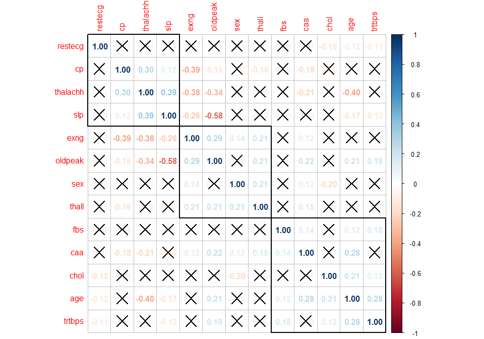
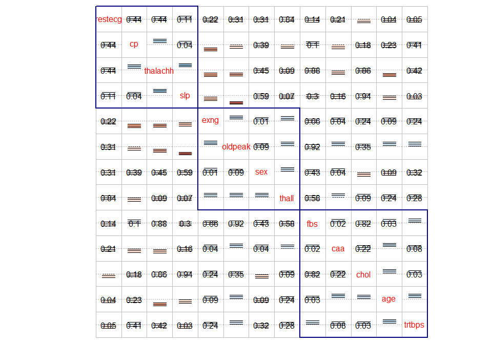
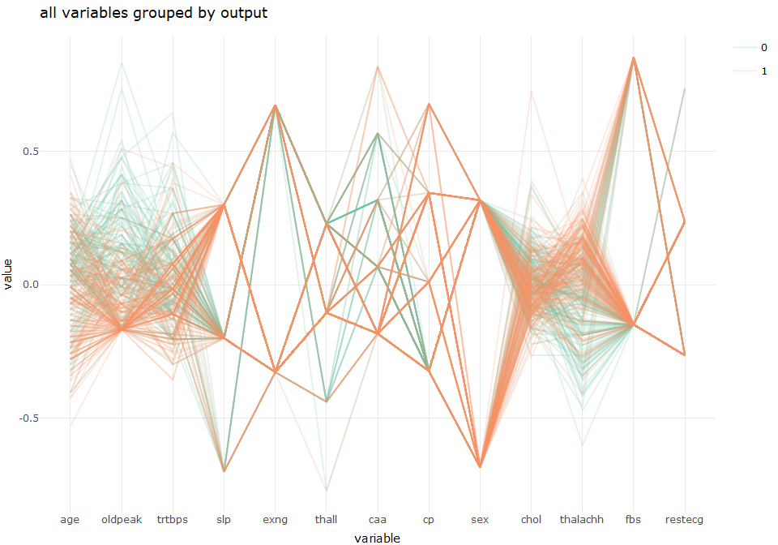

discover correlation for template data
================
Sascha Siegmund
2022-02-10

## purpose of notebook

-   \[ \]

## insights

-   

## load packages

``` r
library(tidyverse) # tidy data frame
library(plotly) # make ggplots interactive
library(corrplot) # correlation matrix plots

# individual libraries are in the according cell
```

## import data

``` r
df <- read_csv('../data/heart_attack_classification/heart.csv')
```

## overview

``` r
head(df)
```

    ## # A tibble: 6 x 14
    ##     age   sex    cp trtbps  chol   fbs restecg thalachh  exng oldpeak   slp
    ##   <dbl> <dbl> <dbl>  <dbl> <dbl> <dbl>   <dbl>    <dbl> <dbl>   <dbl> <dbl>
    ## 1    63     1     3    145   233     1       0      150     0     2.3     0
    ## 2    37     1     2    130   250     0       1      187     0     3.5     0
    ## 3    41     0     1    130   204     0       0      172     0     1.4     2
    ## 4    56     1     1    120   236     0       1      178     0     0.8     2
    ## 5    57     0     0    120   354     0       1      163     1     0.6     2
    ## 6    57     1     0    140   192     0       1      148     0     0.4     1
    ## # ... with 3 more variables: caa <dbl>, thall <dbl>, output <dbl>

``` r
summary(df)
```

    ##       age             sex               cp            trtbps     
    ##  Min.   :29.00   Min.   :0.0000   Min.   :0.000   Min.   : 94.0  
    ##  1st Qu.:47.50   1st Qu.:0.0000   1st Qu.:0.000   1st Qu.:120.0  
    ##  Median :55.00   Median :1.0000   Median :1.000   Median :130.0  
    ##  Mean   :54.37   Mean   :0.6832   Mean   :0.967   Mean   :131.6  
    ##  3rd Qu.:61.00   3rd Qu.:1.0000   3rd Qu.:2.000   3rd Qu.:140.0  
    ##  Max.   :77.00   Max.   :1.0000   Max.   :3.000   Max.   :200.0  
    ##       chol            fbs            restecg          thalachh    
    ##  Min.   :126.0   Min.   :0.0000   Min.   :0.0000   Min.   : 71.0  
    ##  1st Qu.:211.0   1st Qu.:0.0000   1st Qu.:0.0000   1st Qu.:133.5  
    ##  Median :240.0   Median :0.0000   Median :1.0000   Median :153.0  
    ##  Mean   :246.3   Mean   :0.1485   Mean   :0.5281   Mean   :149.6  
    ##  3rd Qu.:274.5   3rd Qu.:0.0000   3rd Qu.:1.0000   3rd Qu.:166.0  
    ##  Max.   :564.0   Max.   :1.0000   Max.   :2.0000   Max.   :202.0  
    ##       exng           oldpeak          slp             caa        
    ##  Min.   :0.0000   Min.   :0.00   Min.   :0.000   Min.   :0.0000  
    ##  1st Qu.:0.0000   1st Qu.:0.00   1st Qu.:1.000   1st Qu.:0.0000  
    ##  Median :0.0000   Median :0.80   Median :1.000   Median :0.0000  
    ##  Mean   :0.3267   Mean   :1.04   Mean   :1.399   Mean   :0.7294  
    ##  3rd Qu.:1.0000   3rd Qu.:1.60   3rd Qu.:2.000   3rd Qu.:1.0000  
    ##  Max.   :1.0000   Max.   :6.20   Max.   :2.000   Max.   :4.0000  
    ##      thall           output      
    ##  Min.   :0.000   Min.   :0.0000  
    ##  1st Qu.:2.000   1st Qu.:0.0000  
    ##  Median :2.000   Median :1.0000  
    ##  Mean   :2.314   Mean   :0.5446  
    ##  3rd Qu.:3.000   3rd Qu.:1.0000  
    ##  Max.   :3.000   Max.   :1.0000

## correlation matrix

-   

``` r
name = c('')
tmp_df <- df %>% select(-output) %>% 
  na.omit()

cor <- cor(tmp_df)
cor_mtest <- cor.mtest(tmp_df, conf.level = 0.99) # combining correlogram with significance test
corrplot(cor, method = "number", order = 'hclust', addrect = 3, p.mat = cor_mtest$p, insig = "pch") 
```

<!-- -->

``` r
corrplot(cor, p.mat = cor_mtest$p, low = cor_mtest$lowCI, upp = cor_mtest$uppCI, 
                   order = 'hclust', sig.level = 0.01, tl.pos = 'd', addrect = 3, rect.col = 'navy', 
                   plotC = 'rect', cl.pos = 'n', insig = "p-value")
```

<!-- -->

## parallel coordinate plot

-   there are more parallel coordinate plots in describe_two (bivariate)
    and describe_group (facet)

``` r
name = c('output')
tmp_df <- df %>% rename(g = name[1]) %>% select(g, everything()) %>% 
  mutate(g = factor(g)) %>% na.omit()

# https://r-charts.com/ranking/parallel-coordinates-ggplot2/
p1 <- GGally::ggparcoord(tmp_df,
           columns = 2:ncol(tmp_df), groupColumn = 1,
           scale='center', # scaling: standardize and center variables
           showPoints = FALSE,
           order = 'allClass', # order by their F-statistic from an ANOVA
           alphaLines = 0.2) +
      scale_color_brewer(guide = "none", palette = "Set2") +
      theme_minimal() +
      ggtitle(paste("all variables grouped by", name[1], sep=" "))
fig <- ggplotly(p1) %>% layout(autosize=T) # drop if too many lines

fig
```

<!-- -->
