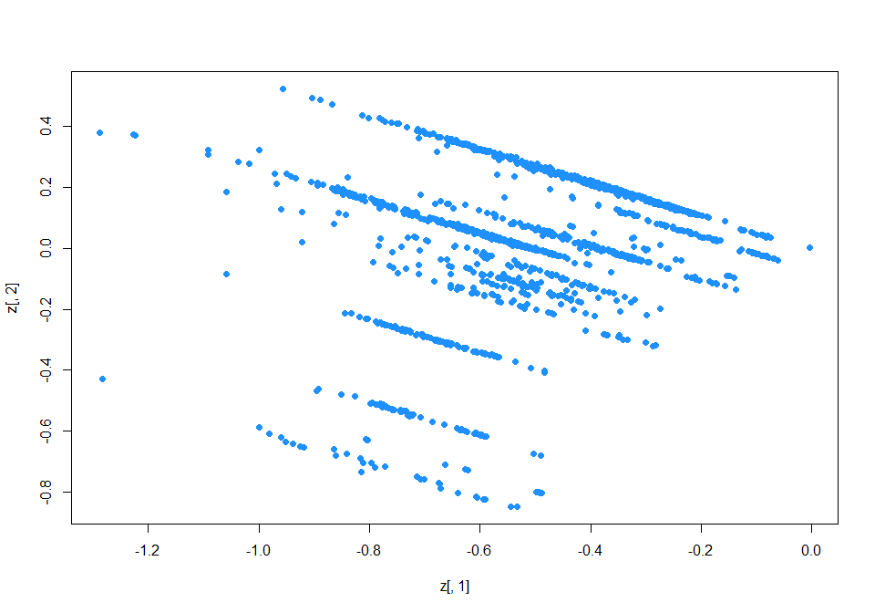
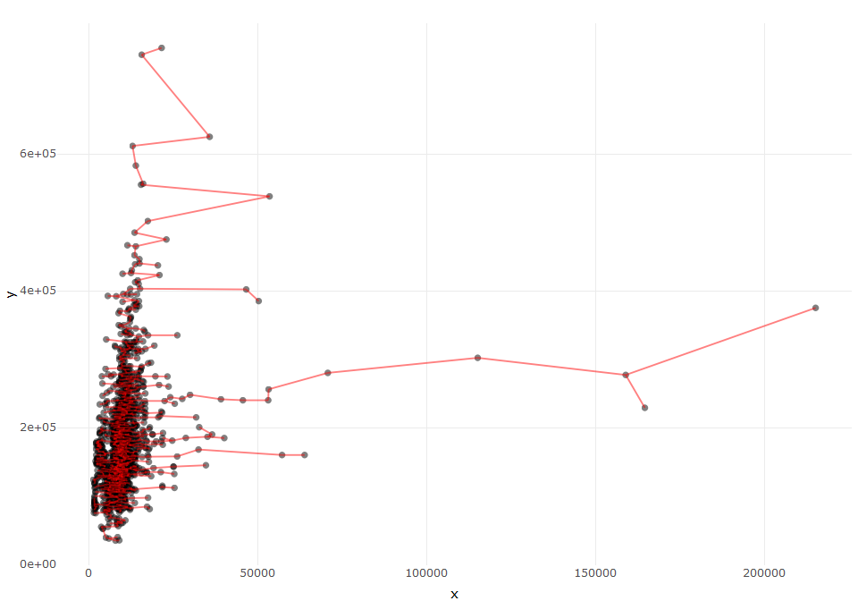

discover outliers for New York City Restaurant Inspection Results
================
Sascha Siegmund
2022-01-15

## purpose of notebook

-   \[ \]

## insights

-   

## load packages

``` r
library(tidyverse) # tidy data frame
library(plotly) # make ggplots interactive
```

## import data

``` r
df <- read_csv('../data/house_prices_regression/train.csv')
```

## overview

``` r
head(df)
```

    ## # A tibble: 6 x 81
    ##      Id MSSubClass MSZoning LotFrontage LotArea Street Alley LotShape
    ##   <dbl>      <dbl> <chr>          <dbl>   <dbl> <chr>  <chr> <chr>   
    ## 1     1         60 RL                65    8450 Pave   <NA>  Reg     
    ## 2     2         20 RL                80    9600 Pave   <NA>  Reg     
    ## 3     3         60 RL                68   11250 Pave   <NA>  IR1     
    ## 4     4         70 RL                60    9550 Pave   <NA>  IR1     
    ## 5     5         60 RL                84   14260 Pave   <NA>  IR1     
    ## 6     6         50 RL                85   14115 Pave   <NA>  IR1     
    ## # ... with 73 more variables: LandContour <chr>, Utilities <chr>,
    ## #   LotConfig <chr>, LandSlope <chr>, Neighborhood <chr>, Condition1 <chr>,
    ## #   Condition2 <chr>, BldgType <chr>, HouseStyle <chr>, OverallQual <dbl>,
    ## #   OverallCond <dbl>, YearBuilt <dbl>, YearRemodAdd <dbl>, RoofStyle <chr>,
    ## #   RoofMatl <chr>, Exterior1st <chr>, Exterior2nd <chr>, MasVnrType <chr>,
    ## #   MasVnrArea <dbl>, ExterQual <chr>, ExterCond <chr>, Foundation <chr>,
    ## #   BsmtQual <chr>, BsmtCond <chr>, BsmtExposure <chr>, BsmtFinType1 <chr>, ...

``` r
summary(df)
```

    ##        Id           MSSubClass      MSZoning          LotFrontage    
    ##  Min.   :   1.0   Min.   : 20.0   Length:1460        Min.   : 21.00  
    ##  1st Qu.: 365.8   1st Qu.: 20.0   Class :character   1st Qu.: 59.00  
    ##  Median : 730.5   Median : 50.0   Mode  :character   Median : 69.00  
    ##  Mean   : 730.5   Mean   : 56.9                      Mean   : 70.05  
    ##  3rd Qu.:1095.2   3rd Qu.: 70.0                      3rd Qu.: 80.00  
    ##  Max.   :1460.0   Max.   :190.0                      Max.   :313.00  
    ##                                                      NA's   :259     
    ##     LotArea          Street             Alley             LotShape        
    ##  Min.   :  1300   Length:1460        Length:1460        Length:1460       
    ##  1st Qu.:  7554   Class :character   Class :character   Class :character  
    ##  Median :  9478   Mode  :character   Mode  :character   Mode  :character  
    ##  Mean   : 10517                                                           
    ##  3rd Qu.: 11602                                                           
    ##  Max.   :215245                                                           
    ##                                                                           
    ##  LandContour         Utilities          LotConfig          LandSlope        
    ##  Length:1460        Length:1460        Length:1460        Length:1460       
    ##  Class :character   Class :character   Class :character   Class :character  
    ##  Mode  :character   Mode  :character   Mode  :character   Mode  :character  
    ##                                                                             
    ##                                                                             
    ##                                                                             
    ##                                                                             
    ##  Neighborhood        Condition1         Condition2          BldgType        
    ##  Length:1460        Length:1460        Length:1460        Length:1460       
    ##  Class :character   Class :character   Class :character   Class :character  
    ##  Mode  :character   Mode  :character   Mode  :character   Mode  :character  
    ##                                                                             
    ##                                                                             
    ##                                                                             
    ##                                                                             
    ##   HouseStyle         OverallQual      OverallCond      YearBuilt   
    ##  Length:1460        Min.   : 1.000   Min.   :1.000   Min.   :1872  
    ##  Class :character   1st Qu.: 5.000   1st Qu.:5.000   1st Qu.:1954  
    ##  Mode  :character   Median : 6.000   Median :5.000   Median :1973  
    ##                     Mean   : 6.099   Mean   :5.575   Mean   :1971  
    ##                     3rd Qu.: 7.000   3rd Qu.:6.000   3rd Qu.:2000  
    ##                     Max.   :10.000   Max.   :9.000   Max.   :2010  
    ##                                                                    
    ##   YearRemodAdd   RoofStyle           RoofMatl         Exterior1st       
    ##  Min.   :1950   Length:1460        Length:1460        Length:1460       
    ##  1st Qu.:1967   Class :character   Class :character   Class :character  
    ##  Median :1994   Mode  :character   Mode  :character   Mode  :character  
    ##  Mean   :1985                                                           
    ##  3rd Qu.:2004                                                           
    ##  Max.   :2010                                                           
    ##                                                                         
    ##  Exterior2nd         MasVnrType          MasVnrArea      ExterQual        
    ##  Length:1460        Length:1460        Min.   :   0.0   Length:1460       
    ##  Class :character   Class :character   1st Qu.:   0.0   Class :character  
    ##  Mode  :character   Mode  :character   Median :   0.0   Mode  :character  
    ##                                        Mean   : 103.7                     
    ##                                        3rd Qu.: 166.0                     
    ##                                        Max.   :1600.0                     
    ##                                        NA's   :8                          
    ##   ExterCond          Foundation          BsmtQual           BsmtCond        
    ##  Length:1460        Length:1460        Length:1460        Length:1460       
    ##  Class :character   Class :character   Class :character   Class :character  
    ##  Mode  :character   Mode  :character   Mode  :character   Mode  :character  
    ##                                                                             
    ##                                                                             
    ##                                                                             
    ##                                                                             
    ##  BsmtExposure       BsmtFinType1         BsmtFinSF1     BsmtFinType2      
    ##  Length:1460        Length:1460        Min.   :   0.0   Length:1460       
    ##  Class :character   Class :character   1st Qu.:   0.0   Class :character  
    ##  Mode  :character   Mode  :character   Median : 383.5   Mode  :character  
    ##                                        Mean   : 443.6                     
    ##                                        3rd Qu.: 712.2                     
    ##                                        Max.   :5644.0                     
    ##                                                                           
    ##    BsmtFinSF2        BsmtUnfSF       TotalBsmtSF       Heating         
    ##  Min.   :   0.00   Min.   :   0.0   Min.   :   0.0   Length:1460       
    ##  1st Qu.:   0.00   1st Qu.: 223.0   1st Qu.: 795.8   Class :character  
    ##  Median :   0.00   Median : 477.5   Median : 991.5   Mode  :character  
    ##  Mean   :  46.55   Mean   : 567.2   Mean   :1057.4                     
    ##  3rd Qu.:   0.00   3rd Qu.: 808.0   3rd Qu.:1298.2                     
    ##  Max.   :1474.00   Max.   :2336.0   Max.   :6110.0                     
    ##                                                                        
    ##   HeatingQC          CentralAir         Electrical           1stFlrSF   
    ##  Length:1460        Length:1460        Length:1460        Min.   : 334  
    ##  Class :character   Class :character   Class :character   1st Qu.: 882  
    ##  Mode  :character   Mode  :character   Mode  :character   Median :1087  
    ##                                                           Mean   :1163  
    ##                                                           3rd Qu.:1391  
    ##                                                           Max.   :4692  
    ##                                                                         
    ##     2ndFlrSF     LowQualFinSF       GrLivArea     BsmtFullBath   
    ##  Min.   :   0   Min.   :  0.000   Min.   : 334   Min.   :0.0000  
    ##  1st Qu.:   0   1st Qu.:  0.000   1st Qu.:1130   1st Qu.:0.0000  
    ##  Median :   0   Median :  0.000   Median :1464   Median :0.0000  
    ##  Mean   : 347   Mean   :  5.845   Mean   :1515   Mean   :0.4253  
    ##  3rd Qu.: 728   3rd Qu.:  0.000   3rd Qu.:1777   3rd Qu.:1.0000  
    ##  Max.   :2065   Max.   :572.000   Max.   :5642   Max.   :3.0000  
    ##                                                                  
    ##   BsmtHalfBath        FullBath        HalfBath       BedroomAbvGr  
    ##  Min.   :0.00000   Min.   :0.000   Min.   :0.0000   Min.   :0.000  
    ##  1st Qu.:0.00000   1st Qu.:1.000   1st Qu.:0.0000   1st Qu.:2.000  
    ##  Median :0.00000   Median :2.000   Median :0.0000   Median :3.000  
    ##  Mean   :0.05753   Mean   :1.565   Mean   :0.3829   Mean   :2.866  
    ##  3rd Qu.:0.00000   3rd Qu.:2.000   3rd Qu.:1.0000   3rd Qu.:3.000  
    ##  Max.   :2.00000   Max.   :3.000   Max.   :2.0000   Max.   :8.000  
    ##                                                                    
    ##   KitchenAbvGr   KitchenQual         TotRmsAbvGrd     Functional       
    ##  Min.   :0.000   Length:1460        Min.   : 2.000   Length:1460       
    ##  1st Qu.:1.000   Class :character   1st Qu.: 5.000   Class :character  
    ##  Median :1.000   Mode  :character   Median : 6.000   Mode  :character  
    ##  Mean   :1.047                      Mean   : 6.518                     
    ##  3rd Qu.:1.000                      3rd Qu.: 7.000                     
    ##  Max.   :3.000                      Max.   :14.000                     
    ##                                                                        
    ##    Fireplaces    FireplaceQu         GarageType         GarageYrBlt  
    ##  Min.   :0.000   Length:1460        Length:1460        Min.   :1900  
    ##  1st Qu.:0.000   Class :character   Class :character   1st Qu.:1961  
    ##  Median :1.000   Mode  :character   Mode  :character   Median :1980  
    ##  Mean   :0.613                                         Mean   :1979  
    ##  3rd Qu.:1.000                                         3rd Qu.:2002  
    ##  Max.   :3.000                                         Max.   :2010  
    ##                                                        NA's   :81    
    ##  GarageFinish         GarageCars      GarageArea      GarageQual       
    ##  Length:1460        Min.   :0.000   Min.   :   0.0   Length:1460       
    ##  Class :character   1st Qu.:1.000   1st Qu.: 334.5   Class :character  
    ##  Mode  :character   Median :2.000   Median : 480.0   Mode  :character  
    ##                     Mean   :1.767   Mean   : 473.0                     
    ##                     3rd Qu.:2.000   3rd Qu.: 576.0                     
    ##                     Max.   :4.000   Max.   :1418.0                     
    ##                                                                        
    ##   GarageCond         PavedDrive          WoodDeckSF      OpenPorchSF    
    ##  Length:1460        Length:1460        Min.   :  0.00   Min.   :  0.00  
    ##  Class :character   Class :character   1st Qu.:  0.00   1st Qu.:  0.00  
    ##  Mode  :character   Mode  :character   Median :  0.00   Median : 25.00  
    ##                                        Mean   : 94.24   Mean   : 46.66  
    ##                                        3rd Qu.:168.00   3rd Qu.: 68.00  
    ##                                        Max.   :857.00   Max.   :547.00  
    ##                                                                         
    ##  EnclosedPorch      3SsnPorch       ScreenPorch        PoolArea      
    ##  Min.   :  0.00   Min.   :  0.00   Min.   :  0.00   Min.   :  0.000  
    ##  1st Qu.:  0.00   1st Qu.:  0.00   1st Qu.:  0.00   1st Qu.:  0.000  
    ##  Median :  0.00   Median :  0.00   Median :  0.00   Median :  0.000  
    ##  Mean   : 21.95   Mean   :  3.41   Mean   : 15.06   Mean   :  2.759  
    ##  3rd Qu.:  0.00   3rd Qu.:  0.00   3rd Qu.:  0.00   3rd Qu.:  0.000  
    ##  Max.   :552.00   Max.   :508.00   Max.   :480.00   Max.   :738.000  
    ##                                                                      
    ##     PoolQC             Fence           MiscFeature           MiscVal        
    ##  Length:1460        Length:1460        Length:1460        Min.   :    0.00  
    ##  Class :character   Class :character   Class :character   1st Qu.:    0.00  
    ##  Mode  :character   Mode  :character   Mode  :character   Median :    0.00  
    ##                                                           Mean   :   43.49  
    ##                                                           3rd Qu.:    0.00  
    ##                                                           Max.   :15500.00  
    ##                                                                             
    ##      MoSold           YrSold       SaleType         SaleCondition     
    ##  Min.   : 1.000   Min.   :2006   Length:1460        Length:1460       
    ##  1st Qu.: 5.000   1st Qu.:2007   Class :character   Class :character  
    ##  Median : 6.000   Median :2008   Mode  :character   Mode  :character  
    ##  Mean   : 6.322   Mean   :2008                                        
    ##  3rd Qu.: 8.000   3rd Qu.:2009                                        
    ##  Max.   :12.000   Max.   :2010                                        
    ##                                                                       
    ##    SalePrice     
    ##  Min.   : 34900  
    ##  1st Qu.:129975  
    ##  Median :163000  
    ##  Mean   :180921  
    ##  3rd Qu.:214000  
    ##  Max.   :755000  
    ## 

## HDoutliers

``` r
name = c('')
tmp_df <- df %>% select(MSSubClass, GarageArea, LotArea, SalePrice, GrLivArea) %>% na.omit()

library(HDoutliers)

outliers <- HDoutliers(tmp_df) # value = the indexes of the observations determined to be outliers
head(outliers)
```

    ## NULL

``` r
plotHDoutliers(tmp_df, outliers) # If the data has more than two dimensions, it is plotted onto the principal components of the data that remains after removing outliers
```

<!-- -->

## emstreeR

``` r
name = c('')
tmp_df <- df %>% rename(x = LotArea, y = SalePrice) %>% select(x, y)

library(emstreeR)

emst <- ComputeMST(tmp_df, scale = FALSE)
```

    ## 933 edges found so far.
    ## 24246 cumulative base cases.
    ## 2586 cumulative node combinations scored.
    ## 1281 edges found so far.
    ## 49576 cumulative base cases.
    ## 5101 cumulative node combinations scored.
    ## 1401 edges found so far.
    ## 71340 cumulative base cases.
    ## 7395 cumulative node combinations scored.
    ## 1437 edges found so far.
    ## 85154 cumulative base cases.
    ## 9538 cumulative node combinations scored.
    ## 1453 edges found so far.
    ## 93325 cumulative base cases.
    ## 11439 cumulative node combinations scored.
    ## 1458 edges found so far.
    ## 96475 cumulative base cases.
    ## 12626 cumulative node combinations scored.
    ## 1459 edges found so far.
    ## 97382 cumulative base cases.
    ## 13272 cumulative node combinations scored.
    ## Total spanning tree length: 2.47512e+06

``` r
head(emst)
```

    ##       x      y from   to distance
    ## 1  8450 208500  736 1394        0
    ## 2  9600 181500 1250 1429        0
    ## 3 11250 223500  364 1030        0
    ## 4  9550 140000  313  952        0
    ## 5 14260 250000  638  822        0
    ## 6 14115 143000   94  953        0

``` r
fig <- emst %>% 
  ggplot(aes(x = x, y = y, from = from, to = to)) +
    geom_point(alpha = 0.5) +
    stat_MST(color = 'red', linetype = 1, alpha = 0.5) +
    theme_minimal()
              
ggplotly(fig)
```

<!-- -->
