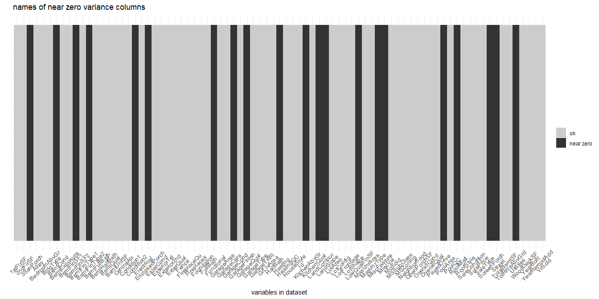
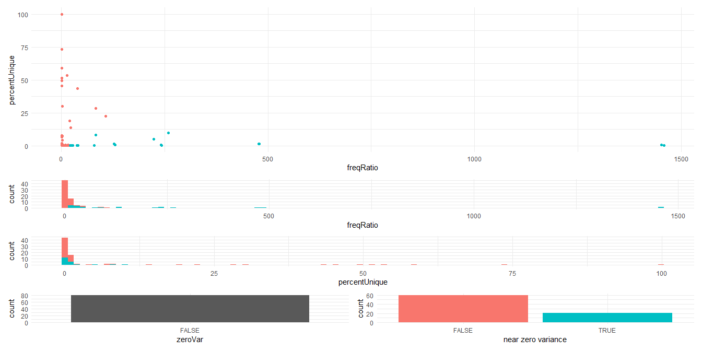

cleaning for template data
================
Sascha Siegmund
2022-02-13

## purpose of notebook

-   [ ] initial look at data to get a basic understanding and gather
    todos -> df_raw
-   [ ] tidy up and cleaning of data set -> df
-   [ ] all processing of the data set happens here and is saved to
    pre-/processed csv-> df

## observations

-   

## load packages

``` r
library(tidyverse) # tidy data frame
library(lubridate) # functions to work with date-times and time-spans
library(janitor) # expedite the initial data exploration and cleaning that comes with any new data set
library(patchwork) # separate ggplots into the same graphic
library(readxl) # read_excel to read xslx dataset
```

## import data

``` r
df_raw <- read_csv('../data/house_prices_regression/train.csv')
df <- df_raw
```

## first look at data

``` r
head(df_raw, 25)
```

    ## # A tibble: 25 x 81
    ##       Id MSSubClass MSZoning LotFrontage LotArea Street Alley LotShape
    ##    <dbl>      <dbl> <chr>          <dbl>   <dbl> <chr>  <chr> <chr>   
    ##  1     1         60 RL                65    8450 Pave   <NA>  Reg     
    ##  2     2         20 RL                80    9600 Pave   <NA>  Reg     
    ##  3     3         60 RL                68   11250 Pave   <NA>  IR1     
    ##  4     4         70 RL                60    9550 Pave   <NA>  IR1     
    ##  5     5         60 RL                84   14260 Pave   <NA>  IR1     
    ##  6     6         50 RL                85   14115 Pave   <NA>  IR1     
    ##  7     7         20 RL                75   10084 Pave   <NA>  Reg     
    ##  8     8         60 RL                NA   10382 Pave   <NA>  IR1     
    ##  9     9         50 RM                51    6120 Pave   <NA>  Reg     
    ## 10    10        190 RL                50    7420 Pave   <NA>  Reg     
    ## # ... with 15 more rows, and 73 more variables: LandContour <chr>,
    ## #   Utilities <chr>, LotConfig <chr>, LandSlope <chr>, Neighborhood <chr>,
    ## #   Condition1 <chr>, Condition2 <chr>, BldgType <chr>, HouseStyle <chr>,
    ## #   OverallQual <dbl>, OverallCond <dbl>, YearBuilt <dbl>, YearRemodAdd <dbl>,
    ## #   RoofStyle <chr>, RoofMatl <chr>, Exterior1st <chr>, Exterior2nd <chr>,
    ## #   MasVnrType <chr>, MasVnrArea <dbl>, ExterQual <chr>, ExterCond <chr>,
    ## #   Foundation <chr>, BsmtQual <chr>, BsmtCond <chr>, BsmtExposure <chr>, ...

``` r
tail(df_raw)
```

    ## # A tibble: 6 x 81
    ##      Id MSSubClass MSZoning LotFrontage LotArea Street Alley LotShape
    ##   <dbl>      <dbl> <chr>          <dbl>   <dbl> <chr>  <chr> <chr>   
    ## 1  1455         20 FV                62    7500 Pave   Pave  Reg     
    ## 2  1456         60 RL                62    7917 Pave   <NA>  Reg     
    ## 3  1457         20 RL                85   13175 Pave   <NA>  Reg     
    ## 4  1458         70 RL                66    9042 Pave   <NA>  Reg     
    ## 5  1459         20 RL                68    9717 Pave   <NA>  Reg     
    ## 6  1460         20 RL                75    9937 Pave   <NA>  Reg     
    ## # ... with 73 more variables: LandContour <chr>, Utilities <chr>,
    ## #   LotConfig <chr>, LandSlope <chr>, Neighborhood <chr>, Condition1 <chr>,
    ## #   Condition2 <chr>, BldgType <chr>, HouseStyle <chr>, OverallQual <dbl>,
    ## #   OverallCond <dbl>, YearBuilt <dbl>, YearRemodAdd <dbl>, RoofStyle <chr>,
    ## #   RoofMatl <chr>, Exterior1st <chr>, Exterior2nd <chr>, MasVnrType <chr>,
    ## #   MasVnrArea <dbl>, ExterQual <chr>, ExterCond <chr>, Foundation <chr>,
    ## #   BsmtQual <chr>, BsmtCond <chr>, BsmtExposure <chr>, BsmtFinType1 <chr>, ...

``` r
summary(df_raw)
```

    ##        Id           MSSubClass      MSZoning          LotFrontage    
    ##  Min.   :   1.0   Min.   : 20.0   Length:1460        Min.   : 21.00  
    ##  1st Qu.: 365.8   1st Qu.: 20.0   Class :character   1st Qu.: 59.00  
    ##  Median : 730.5   Median : 50.0   Mode  :character   Median : 69.00  
    ##  Mean   : 730.5   Mean   : 56.9                      Mean   : 70.05  
    ##  3rd Qu.:1095.2   3rd Qu.: 70.0                      3rd Qu.: 80.00  
    ##  Max.   :1460.0   Max.   :190.0                      Max.   :313.00  
    ##                                                      NA's   :259     
    ##     LotArea          Street             Alley             LotShape        
    ##  Min.   :  1300   Length:1460        Length:1460        Length:1460       
    ##  1st Qu.:  7554   Class :character   Class :character   Class :character  
    ##  Median :  9478   Mode  :character   Mode  :character   Mode  :character  
    ##  Mean   : 10517                                                           
    ##  3rd Qu.: 11602                                                           
    ##  Max.   :215245                                                           
    ##                                                                           
    ##  LandContour         Utilities          LotConfig          LandSlope        
    ##  Length:1460        Length:1460        Length:1460        Length:1460       
    ##  Class :character   Class :character   Class :character   Class :character  
    ##  Mode  :character   Mode  :character   Mode  :character   Mode  :character  
    ##                                                                             
    ##                                                                             
    ##                                                                             
    ##                                                                             
    ##  Neighborhood        Condition1         Condition2          BldgType        
    ##  Length:1460        Length:1460        Length:1460        Length:1460       
    ##  Class :character   Class :character   Class :character   Class :character  
    ##  Mode  :character   Mode  :character   Mode  :character   Mode  :character  
    ##                                                                             
    ##                                                                             
    ##                                                                             
    ##                                                                             
    ##   HouseStyle         OverallQual      OverallCond      YearBuilt   
    ##  Length:1460        Min.   : 1.000   Min.   :1.000   Min.   :1872  
    ##  Class :character   1st Qu.: 5.000   1st Qu.:5.000   1st Qu.:1954  
    ##  Mode  :character   Median : 6.000   Median :5.000   Median :1973  
    ##                     Mean   : 6.099   Mean   :5.575   Mean   :1971  
    ##                     3rd Qu.: 7.000   3rd Qu.:6.000   3rd Qu.:2000  
    ##                     Max.   :10.000   Max.   :9.000   Max.   :2010  
    ##                                                                    
    ##   YearRemodAdd   RoofStyle           RoofMatl         Exterior1st       
    ##  Min.   :1950   Length:1460        Length:1460        Length:1460       
    ##  1st Qu.:1967   Class :character   Class :character   Class :character  
    ##  Median :1994   Mode  :character   Mode  :character   Mode  :character  
    ##  Mean   :1985                                                           
    ##  3rd Qu.:2004                                                           
    ##  Max.   :2010                                                           
    ##                                                                         
    ##  Exterior2nd         MasVnrType          MasVnrArea      ExterQual        
    ##  Length:1460        Length:1460        Min.   :   0.0   Length:1460       
    ##  Class :character   Class :character   1st Qu.:   0.0   Class :character  
    ##  Mode  :character   Mode  :character   Median :   0.0   Mode  :character  
    ##                                        Mean   : 103.7                     
    ##                                        3rd Qu.: 166.0                     
    ##                                        Max.   :1600.0                     
    ##                                        NA's   :8                          
    ##   ExterCond          Foundation          BsmtQual           BsmtCond        
    ##  Length:1460        Length:1460        Length:1460        Length:1460       
    ##  Class :character   Class :character   Class :character   Class :character  
    ##  Mode  :character   Mode  :character   Mode  :character   Mode  :character  
    ##                                                                             
    ##                                                                             
    ##                                                                             
    ##                                                                             
    ##  BsmtExposure       BsmtFinType1         BsmtFinSF1     BsmtFinType2      
    ##  Length:1460        Length:1460        Min.   :   0.0   Length:1460       
    ##  Class :character   Class :character   1st Qu.:   0.0   Class :character  
    ##  Mode  :character   Mode  :character   Median : 383.5   Mode  :character  
    ##                                        Mean   : 443.6                     
    ##                                        3rd Qu.: 712.2                     
    ##                                        Max.   :5644.0                     
    ##                                                                           
    ##    BsmtFinSF2        BsmtUnfSF       TotalBsmtSF       Heating         
    ##  Min.   :   0.00   Min.   :   0.0   Min.   :   0.0   Length:1460       
    ##  1st Qu.:   0.00   1st Qu.: 223.0   1st Qu.: 795.8   Class :character  
    ##  Median :   0.00   Median : 477.5   Median : 991.5   Mode  :character  
    ##  Mean   :  46.55   Mean   : 567.2   Mean   :1057.4                     
    ##  3rd Qu.:   0.00   3rd Qu.: 808.0   3rd Qu.:1298.2                     
    ##  Max.   :1474.00   Max.   :2336.0   Max.   :6110.0                     
    ##                                                                        
    ##   HeatingQC          CentralAir         Electrical           1stFlrSF   
    ##  Length:1460        Length:1460        Length:1460        Min.   : 334  
    ##  Class :character   Class :character   Class :character   1st Qu.: 882  
    ##  Mode  :character   Mode  :character   Mode  :character   Median :1087  
    ##                                                           Mean   :1163  
    ##                                                           3rd Qu.:1391  
    ##                                                           Max.   :4692  
    ##                                                                         
    ##     2ndFlrSF     LowQualFinSF       GrLivArea     BsmtFullBath   
    ##  Min.   :   0   Min.   :  0.000   Min.   : 334   Min.   :0.0000  
    ##  1st Qu.:   0   1st Qu.:  0.000   1st Qu.:1130   1st Qu.:0.0000  
    ##  Median :   0   Median :  0.000   Median :1464   Median :0.0000  
    ##  Mean   : 347   Mean   :  5.845   Mean   :1515   Mean   :0.4253  
    ##  3rd Qu.: 728   3rd Qu.:  0.000   3rd Qu.:1777   3rd Qu.:1.0000  
    ##  Max.   :2065   Max.   :572.000   Max.   :5642   Max.   :3.0000  
    ##                                                                  
    ##   BsmtHalfBath        FullBath        HalfBath       BedroomAbvGr  
    ##  Min.   :0.00000   Min.   :0.000   Min.   :0.0000   Min.   :0.000  
    ##  1st Qu.:0.00000   1st Qu.:1.000   1st Qu.:0.0000   1st Qu.:2.000  
    ##  Median :0.00000   Median :2.000   Median :0.0000   Median :3.000  
    ##  Mean   :0.05753   Mean   :1.565   Mean   :0.3829   Mean   :2.866  
    ##  3rd Qu.:0.00000   3rd Qu.:2.000   3rd Qu.:1.0000   3rd Qu.:3.000  
    ##  Max.   :2.00000   Max.   :3.000   Max.   :2.0000   Max.   :8.000  
    ##                                                                    
    ##   KitchenAbvGr   KitchenQual         TotRmsAbvGrd     Functional       
    ##  Min.   :0.000   Length:1460        Min.   : 2.000   Length:1460       
    ##  1st Qu.:1.000   Class :character   1st Qu.: 5.000   Class :character  
    ##  Median :1.000   Mode  :character   Median : 6.000   Mode  :character  
    ##  Mean   :1.047                      Mean   : 6.518                     
    ##  3rd Qu.:1.000                      3rd Qu.: 7.000                     
    ##  Max.   :3.000                      Max.   :14.000                     
    ##                                                                        
    ##    Fireplaces    FireplaceQu         GarageType         GarageYrBlt  
    ##  Min.   :0.000   Length:1460        Length:1460        Min.   :1900  
    ##  1st Qu.:0.000   Class :character   Class :character   1st Qu.:1961  
    ##  Median :1.000   Mode  :character   Mode  :character   Median :1980  
    ##  Mean   :0.613                                         Mean   :1979  
    ##  3rd Qu.:1.000                                         3rd Qu.:2002  
    ##  Max.   :3.000                                         Max.   :2010  
    ##                                                        NA's   :81    
    ##  GarageFinish         GarageCars      GarageArea      GarageQual       
    ##  Length:1460        Min.   :0.000   Min.   :   0.0   Length:1460       
    ##  Class :character   1st Qu.:1.000   1st Qu.: 334.5   Class :character  
    ##  Mode  :character   Median :2.000   Median : 480.0   Mode  :character  
    ##                     Mean   :1.767   Mean   : 473.0                     
    ##                     3rd Qu.:2.000   3rd Qu.: 576.0                     
    ##                     Max.   :4.000   Max.   :1418.0                     
    ##                                                                        
    ##   GarageCond         PavedDrive          WoodDeckSF      OpenPorchSF    
    ##  Length:1460        Length:1460        Min.   :  0.00   Min.   :  0.00  
    ##  Class :character   Class :character   1st Qu.:  0.00   1st Qu.:  0.00  
    ##  Mode  :character   Mode  :character   Median :  0.00   Median : 25.00  
    ##                                        Mean   : 94.24   Mean   : 46.66  
    ##                                        3rd Qu.:168.00   3rd Qu.: 68.00  
    ##                                        Max.   :857.00   Max.   :547.00  
    ##                                                                         
    ##  EnclosedPorch      3SsnPorch       ScreenPorch        PoolArea      
    ##  Min.   :  0.00   Min.   :  0.00   Min.   :  0.00   Min.   :  0.000  
    ##  1st Qu.:  0.00   1st Qu.:  0.00   1st Qu.:  0.00   1st Qu.:  0.000  
    ##  Median :  0.00   Median :  0.00   Median :  0.00   Median :  0.000  
    ##  Mean   : 21.95   Mean   :  3.41   Mean   : 15.06   Mean   :  2.759  
    ##  3rd Qu.:  0.00   3rd Qu.:  0.00   3rd Qu.:  0.00   3rd Qu.:  0.000  
    ##  Max.   :552.00   Max.   :508.00   Max.   :480.00   Max.   :738.000  
    ##                                                                      
    ##     PoolQC             Fence           MiscFeature           MiscVal        
    ##  Length:1460        Length:1460        Length:1460        Min.   :    0.00  
    ##  Class :character   Class :character   Class :character   1st Qu.:    0.00  
    ##  Mode  :character   Mode  :character   Mode  :character   Median :    0.00  
    ##                                                           Mean   :   43.49  
    ##                                                           3rd Qu.:    0.00  
    ##                                                           Max.   :15500.00  
    ##                                                                             
    ##      MoSold           YrSold       SaleType         SaleCondition     
    ##  Min.   : 1.000   Min.   :2006   Length:1460        Length:1460       
    ##  1st Qu.: 5.000   1st Qu.:2007   Class :character   Class :character  
    ##  Median : 6.000   Median :2008   Mode  :character   Mode  :character  
    ##  Mean   : 6.322   Mean   :2008                                        
    ##  3rd Qu.: 8.000   3rd Qu.:2009                                        
    ##  Max.   :12.000   Max.   :2010                                        
    ##                                                                       
    ##    SalePrice     
    ##  Min.   : 34900  
    ##  1st Qu.:129975  
    ##  Median :163000  
    ##  Mean   :180921  
    ##  3rd Qu.:214000  
    ##  Max.   :755000  
    ## 

## missing values

-   

``` r
#create data frame with information on whether the value in each cell is zero
tmp_df <- df_raw == 0
missing_by_column <- tmp_df %>%
  as_tibble %>% # convert to data frame
  mutate(row_number = 1:nrow(.)) %>% # add a column with the row number
  gather(variable, is_missing, -row_number) # turn wide data into narrow data

# plot the missing values in our data frame
ggplot(missing_by_column, aes(x = variable, y = row_number, fill =  is_missing)) +
  geom_tile() +
  theme_minimal() +
  scale_fill_grey(name = "",
                  labels = c("present", "is zero", "is NA")) +
  theme(axis.text.x = element_text(angle=45, vjust=0.7, size=10)) +
  scale_y_reverse() +
  labs(x = "variables in dataset",
       y = "rows / observations")
```

<!-- -->

## duplicated rows

-   

``` r
df_raw %>% get_dupes() # examine duplicate rows
```

    ## # A tibble: 0 x 82
    ## # ... with 82 variables: Id <dbl>, MSSubClass <dbl>, MSZoning <chr>,
    ## #   LotFrontage <dbl>, LotArea <dbl>, Street <chr>, Alley <chr>,
    ## #   LotShape <chr>, LandContour <chr>, Utilities <chr>, LotConfig <chr>,
    ## #   LandSlope <chr>, Neighborhood <chr>, Condition1 <chr>, Condition2 <chr>,
    ## #   BldgType <chr>, HouseStyle <chr>, OverallQual <dbl>, OverallCond <dbl>,
    ## #   YearBuilt <dbl>, YearRemodAdd <dbl>, RoofStyle <chr>, RoofMatl <chr>,
    ## #   Exterior1st <chr>, Exterior2nd <chr>, MasVnrType <chr>, ...

``` r
# get row number of duplicated rows
tmp_df <- distinct(df_raw)
duplicated_rows <- as_tibble(rownames(df_raw)) %>% 
  mutate(duplicated = value %in% setdiff(rownames(df_raw), rownames(tmp_df))) %>% 
  mutate(value = as.numeric(value))

# plot duplicated rows as black lines
ggplot(duplicated_rows, aes(y = value, x = 1, fill = duplicated)) +
  geom_tile() + # plot a black line for each duplicated row
  ggtitle("row index of duplicated rows") + # add title
  theme_minimal() +
  scale_fill_grey(start=0.8, end=0.2,
                  name = "",
                  labels = c("ok", "duplicated")) +
  scale_y_reverse() +
  theme(axis.ticks.x = element_blank(),
        axis.text.x = element_blank()) +
  labs(y = "row index",
       x = "")
```

<!-- -->

## constant columns

-   

``` r
# get column name of constant columns
tmp_df <- remove_constant(df_raw, na.rm = TRUE)
constant_columns <- as_tibble(names(df_raw)) %>% 
  mutate(constant = value %in% setdiff(names(df_raw), names(tmp_df)))

# plot constant columns as black lines
ggplot(constant_columns, aes(y = value, x = 1, fill = constant)) +
  geom_tile() + # plot a black line for each constant column
  ggtitle("names of constant columns") + # add title
  coord_flip() + # flip x and y axis
  scale_x_reverse() + # reverse x axis
  theme_minimal() +
  scale_fill_grey(start=0.8, end=0.2,
                  name = "",
                  labels = c("ok", "constant")) +
  theme(axis.text.x = element_text(angle=45, vjust=0.7, size=10),
        axis.ticks.y = element_blank(),
        axis.text.y = element_blank()) +
  labs(y = "variables in dataset",
       x = "")
```

<!-- -->

## near zero variance columns

-   

``` r
# get column name and info of near zero variance column
nearZero_info <- caret::nearZeroVar(df_raw, freqCut = 95/5, uniqueCut = 10, saveMetrics = TRUE) %>%
  rownames_to_column(var = "name")
nearZero_info
```

    ##             name   freqRatio percentUnique zeroVar   nzv
    ## 1             Id    1.000000   100.0000000   FALSE FALSE
    ## 2     MSSubClass    1.792642     1.0273973   FALSE FALSE
    ## 3       MSZoning    5.279817     0.3424658   FALSE FALSE
    ## 4    LotFrontage    2.042857     7.5342466   FALSE FALSE
    ## 5        LotArea    1.041667    73.4931507   FALSE FALSE
    ## 6         Street  242.333333     0.1369863   FALSE  TRUE
    ## 7          Alley    1.219512     0.1369863   FALSE FALSE
    ## 8       LotShape    1.911157     0.2739726   FALSE FALSE
    ## 9    LandContour   20.809524     0.2739726   FALSE  TRUE
    ## 10     Utilities 1459.000000     0.1369863   FALSE  TRUE
    ## 11     LotConfig    4.000000     0.3424658   FALSE FALSE
    ## 12     LandSlope   21.261538     0.2054795   FALSE  TRUE
    ## 13  Neighborhood    1.500000     1.7123288   FALSE FALSE
    ## 14    Condition1   15.555556     0.6164384   FALSE FALSE
    ## 15    Condition2  240.833333     0.5479452   FALSE  TRUE
    ## 16      BldgType   10.701754     0.3424658   FALSE FALSE
    ## 17    HouseStyle    1.631461     0.5479452   FALSE FALSE
    ## 18   OverallQual    1.061497     0.6849315   FALSE FALSE
    ## 19   OverallCond    3.257937     0.6164384   FALSE FALSE
    ## 20     YearBuilt    1.046875     7.6712329   FALSE FALSE
    ## 21  YearRemodAdd    1.835052     4.1780822   FALSE FALSE
    ## 22     RoofStyle    3.989510     0.4109589   FALSE FALSE
    ## 23      RoofMatl  130.363636     0.5479452   FALSE  TRUE
    ## 24   Exterior1st    2.319820     1.0273973   FALSE FALSE
    ## 25   Exterior2nd    2.355140     1.0958904   FALSE FALSE
    ## 26    MasVnrType    1.941573     0.2739726   FALSE FALSE
    ## 27    MasVnrArea  107.625000    22.3972603   FALSE FALSE
    ## 28     ExterQual    1.856557     0.2739726   FALSE FALSE
    ## 29     ExterCond    8.780822     0.3424658   FALSE FALSE
    ## 30    Foundation    1.020505     0.4109589   FALSE FALSE
    ## 31      BsmtQual    1.050162     0.2739726   FALSE FALSE
    ## 32      BsmtCond   20.169231     0.2739726   FALSE  TRUE
    ## 33  BsmtExposure    4.312217     0.2739726   FALSE FALSE
    ## 34  BsmtFinType1    1.028708     0.4109589   FALSE FALSE
    ## 35    BsmtFinSF1   38.916667    43.6301370   FALSE FALSE
    ## 36  BsmtFinType2   23.259259     0.4109589   FALSE  TRUE
    ## 37    BsmtFinSF2  258.600000     9.8630137   FALSE  TRUE
    ## 38     BsmtUnfSF   13.111111    53.4246575   FALSE FALSE
    ## 39   TotalBsmtSF    1.057143    49.3835616   FALSE FALSE
    ## 40       Heating   79.333333     0.4109589   FALSE  TRUE
    ## 41     HeatingQC    1.731308     0.3424658   FALSE FALSE
    ## 42    CentralAir   14.368421     0.1369863   FALSE FALSE
    ## 43    Electrical   14.191489     0.3424658   FALSE FALSE
    ## 44      1stFlrSF    1.562500    51.5753425   FALSE FALSE
    ## 45      2ndFlrSF   82.900000    28.5616438   FALSE FALSE
    ## 46  LowQualFinSF  478.000000     1.6438356   FALSE  TRUE
    ## 47     GrLivArea    1.571429    58.9726027   FALSE FALSE
    ## 48  BsmtFullBath    1.455782     0.2739726   FALSE FALSE
    ## 49  BsmtHalfBath   17.225000     0.2054795   FALSE FALSE
    ## 50      FullBath    1.181538     0.2739726   FALSE FALSE
    ## 51      HalfBath    1.706542     0.2054795   FALSE FALSE
    ## 52  BedroomAbvGr    2.245810     0.5479452   FALSE FALSE
    ## 53  KitchenAbvGr   21.415385     0.2739726   FALSE  TRUE
    ## 54   KitchenQual    1.254266     0.2739726   FALSE FALSE
    ## 55  TotRmsAbvGrd    1.221884     0.8219178   FALSE FALSE
    ## 56    Functional   40.000000     0.4794521   FALSE  TRUE
    ## 57    Fireplaces    1.061538     0.2739726   FALSE FALSE
    ## 58   FireplaceQu    1.214058     0.3424658   FALSE FALSE
    ## 59    GarageType    2.248062     0.4109589   FALSE FALSE
    ## 60   GarageYrBlt    1.101695     6.6438356   FALSE FALSE
    ## 61  GarageFinish    1.433649     0.2054795   FALSE FALSE
    ## 62    GarageCars    2.233062     0.3424658   FALSE FALSE
    ## 63    GarageArea    1.653061    30.2054795   FALSE FALSE
    ## 64    GarageQual   27.312500     0.3424658   FALSE  TRUE
    ## 65    GarageCond   37.885714     0.3424658   FALSE  TRUE
    ## 66    PavedDrive   14.888889     0.2054795   FALSE FALSE
    ## 67    WoodDeckSF   20.026316    18.7671233   FALSE FALSE
    ## 68   OpenPorchSF   22.620690    13.8356164   FALSE FALSE
    ## 69 EnclosedPorch   83.466667     8.2191781   FALSE  TRUE
    ## 70     3SsnPorch  478.666667     1.3698630   FALSE  TRUE
    ## 71   ScreenPorch  224.000000     5.2054795   FALSE  TRUE
    ## 72      PoolArea 1453.000000     0.5479452   FALSE  TRUE
    ## 73        PoolQC    1.500000     0.2054795   FALSE FALSE
    ## 74         Fence    2.661017     0.2739726   FALSE FALSE
    ## 75   MiscFeature   24.500000     0.2739726   FALSE  TRUE
    ## 76       MiscVal  128.000000     1.4383562   FALSE  TRUE
    ## 77        MoSold    1.081197     0.8219178   FALSE FALSE
    ## 78        YrSold    1.027356     0.3424658   FALSE FALSE
    ## 79      SaleType   10.385246     0.6164384   FALSE FALSE
    ## 80 SaleCondition    9.584000     0.4109589   FALSE FALSE
    ## 81     SalePrice    1.176471    45.4109589   FALSE FALSE

``` r
# plot near zero variance columns as black lines
ggplot(nearZero_info, aes(y = name, x = 1, fill = nzv)) +
  geom_tile() + # plot a black line for each near zero var column
  ggtitle("names of near zero variance columns") + # add title
  coord_flip() + # flip x and y axis
  scale_x_reverse() + # reverse x axis
  theme_minimal() +
  scale_fill_grey(start=0.8, end=0.2,
                  name = "",
                  labels = c("ok", "near zero")) +
  theme(axis.text.x = element_text(angle=45, vjust=0.7, size=10),
        axis.ticks.y = element_blank(),
        axis.text.y = element_blank()) +
  labs(y = "variables in dataset",
       x = "")
```

<!-- -->

``` r
# plot infos from nearZeroVar
p1 <- nearZero_info %>% ggplot(aes(x = freqRatio, fill = nzv)) +   geom_histogram(bins = 100) + 
  theme_minimal() + theme(legend.position="none")
p2 <- nearZero_info %>% ggplot(aes(x = percentUnique, fill = nzv)) + geom_histogram(bins = 100) + 
  theme_minimal() + theme(legend.position="none")
p3 <- nearZero_info %>% ggplot(aes(x = zeroVar)) + geom_bar() + 
  theme_minimal() + theme(legend.position="none")
p4 <- nearZero_info %>% ggplot(aes(x = nzv, fill = nzv)) + geom_bar() + 
  theme_minimal() + theme(legend.position="none") + labs(x = "near zero variance")
p5 <- nearZero_info %>% ggplot(aes(x = freqRatio, y = percentUnique, color = nzv)) + geom_point() + 
  theme_minimal() + theme(legend.position="none")

p5 / (p1 / p2 / (p3 | p4))
```

<!-- -->

## cleaning

-   

``` r
# df <- df %>%
#   clean_names() %>%  # clean column names
#   distinct() %>%  # remove duplicated rows
#   select(-which(nearZero_info$nzv)) %>% # remove near zero variance variables
#   remove_empty() %>%  # removes empty rows and columns
#   remove_constant(na.rm = TRUE) %>%  # removes constsant columns
#   mutate(VarFactor = factor(VarFactor)) %>%  # categorical col as factor
#   mutate(VarDate = as.Date(VarDate, "%d-%m-%Y")) %>%  # convert chr to date 
```

## remove anomalies

-   

``` r
# df <- df %>% 
#   filter(!((VarCategorical == 'Cat1')|
#            (VarCategorical == 'Cat2')|
#            (VarCategorical == 'Cat3'))) %>%  # remove specific categories
#   filter(!(VarNumerical > 120000)) %>%  # remove outlying values
#   select(-which(nearZero_info$nzv)) %>% # remove near zero variance variables
```

## additional variables

-   

``` r
# new variable: sum of all VarWithPattern*
# df <- df %>%
#   rowwise %>%
#   mutate(AcceptedCmpAll = sum(c_across(contains("VarWithPattern"))))
```

``` r
# check results from cleaning and added variables
head(df)
```

    ## # A tibble: 6 x 81
    ##      Id MSSubClass MSZoning LotFrontage LotArea Street Alley LotShape
    ##   <dbl>      <dbl> <chr>          <dbl>   <dbl> <chr>  <chr> <chr>   
    ## 1     1         60 RL                65    8450 Pave   <NA>  Reg     
    ## 2     2         20 RL                80    9600 Pave   <NA>  Reg     
    ## 3     3         60 RL                68   11250 Pave   <NA>  IR1     
    ## 4     4         70 RL                60    9550 Pave   <NA>  IR1     
    ## 5     5         60 RL                84   14260 Pave   <NA>  IR1     
    ## 6     6         50 RL                85   14115 Pave   <NA>  IR1     
    ## # ... with 73 more variables: LandContour <chr>, Utilities <chr>,
    ## #   LotConfig <chr>, LandSlope <chr>, Neighborhood <chr>, Condition1 <chr>,
    ## #   Condition2 <chr>, BldgType <chr>, HouseStyle <chr>, OverallQual <dbl>,
    ## #   OverallCond <dbl>, YearBuilt <dbl>, YearRemodAdd <dbl>, RoofStyle <chr>,
    ## #   RoofMatl <chr>, Exterior1st <chr>, Exterior2nd <chr>, MasVnrType <chr>,
    ## #   MasVnrArea <dbl>, ExterQual <chr>, ExterCond <chr>, Foundation <chr>,
    ## #   BsmtQual <chr>, BsmtCond <chr>, BsmtExposure <chr>, BsmtFinType1 <chr>, ...

``` r
summary(df)
```

    ##        Id           MSSubClass      MSZoning          LotFrontage    
    ##  Min.   :   1.0   Min.   : 20.0   Length:1460        Min.   : 21.00  
    ##  1st Qu.: 365.8   1st Qu.: 20.0   Class :character   1st Qu.: 59.00  
    ##  Median : 730.5   Median : 50.0   Mode  :character   Median : 69.00  
    ##  Mean   : 730.5   Mean   : 56.9                      Mean   : 70.05  
    ##  3rd Qu.:1095.2   3rd Qu.: 70.0                      3rd Qu.: 80.00  
    ##  Max.   :1460.0   Max.   :190.0                      Max.   :313.00  
    ##                                                      NA's   :259     
    ##     LotArea          Street             Alley             LotShape        
    ##  Min.   :  1300   Length:1460        Length:1460        Length:1460       
    ##  1st Qu.:  7554   Class :character   Class :character   Class :character  
    ##  Median :  9478   Mode  :character   Mode  :character   Mode  :character  
    ##  Mean   : 10517                                                           
    ##  3rd Qu.: 11602                                                           
    ##  Max.   :215245                                                           
    ##                                                                           
    ##  LandContour         Utilities          LotConfig          LandSlope        
    ##  Length:1460        Length:1460        Length:1460        Length:1460       
    ##  Class :character   Class :character   Class :character   Class :character  
    ##  Mode  :character   Mode  :character   Mode  :character   Mode  :character  
    ##                                                                             
    ##                                                                             
    ##                                                                             
    ##                                                                             
    ##  Neighborhood        Condition1         Condition2          BldgType        
    ##  Length:1460        Length:1460        Length:1460        Length:1460       
    ##  Class :character   Class :character   Class :character   Class :character  
    ##  Mode  :character   Mode  :character   Mode  :character   Mode  :character  
    ##                                                                             
    ##                                                                             
    ##                                                                             
    ##                                                                             
    ##   HouseStyle         OverallQual      OverallCond      YearBuilt   
    ##  Length:1460        Min.   : 1.000   Min.   :1.000   Min.   :1872  
    ##  Class :character   1st Qu.: 5.000   1st Qu.:5.000   1st Qu.:1954  
    ##  Mode  :character   Median : 6.000   Median :5.000   Median :1973  
    ##                     Mean   : 6.099   Mean   :5.575   Mean   :1971  
    ##                     3rd Qu.: 7.000   3rd Qu.:6.000   3rd Qu.:2000  
    ##                     Max.   :10.000   Max.   :9.000   Max.   :2010  
    ##                                                                    
    ##   YearRemodAdd   RoofStyle           RoofMatl         Exterior1st       
    ##  Min.   :1950   Length:1460        Length:1460        Length:1460       
    ##  1st Qu.:1967   Class :character   Class :character   Class :character  
    ##  Median :1994   Mode  :character   Mode  :character   Mode  :character  
    ##  Mean   :1985                                                           
    ##  3rd Qu.:2004                                                           
    ##  Max.   :2010                                                           
    ##                                                                         
    ##  Exterior2nd         MasVnrType          MasVnrArea      ExterQual        
    ##  Length:1460        Length:1460        Min.   :   0.0   Length:1460       
    ##  Class :character   Class :character   1st Qu.:   0.0   Class :character  
    ##  Mode  :character   Mode  :character   Median :   0.0   Mode  :character  
    ##                                        Mean   : 103.7                     
    ##                                        3rd Qu.: 166.0                     
    ##                                        Max.   :1600.0                     
    ##                                        NA's   :8                          
    ##   ExterCond          Foundation          BsmtQual           BsmtCond        
    ##  Length:1460        Length:1460        Length:1460        Length:1460       
    ##  Class :character   Class :character   Class :character   Class :character  
    ##  Mode  :character   Mode  :character   Mode  :character   Mode  :character  
    ##                                                                             
    ##                                                                             
    ##                                                                             
    ##                                                                             
    ##  BsmtExposure       BsmtFinType1         BsmtFinSF1     BsmtFinType2      
    ##  Length:1460        Length:1460        Min.   :   0.0   Length:1460       
    ##  Class :character   Class :character   1st Qu.:   0.0   Class :character  
    ##  Mode  :character   Mode  :character   Median : 383.5   Mode  :character  
    ##                                        Mean   : 443.6                     
    ##                                        3rd Qu.: 712.2                     
    ##                                        Max.   :5644.0                     
    ##                                                                           
    ##    BsmtFinSF2        BsmtUnfSF       TotalBsmtSF       Heating         
    ##  Min.   :   0.00   Min.   :   0.0   Min.   :   0.0   Length:1460       
    ##  1st Qu.:   0.00   1st Qu.: 223.0   1st Qu.: 795.8   Class :character  
    ##  Median :   0.00   Median : 477.5   Median : 991.5   Mode  :character  
    ##  Mean   :  46.55   Mean   : 567.2   Mean   :1057.4                     
    ##  3rd Qu.:   0.00   3rd Qu.: 808.0   3rd Qu.:1298.2                     
    ##  Max.   :1474.00   Max.   :2336.0   Max.   :6110.0                     
    ##                                                                        
    ##   HeatingQC          CentralAir         Electrical           1stFlrSF   
    ##  Length:1460        Length:1460        Length:1460        Min.   : 334  
    ##  Class :character   Class :character   Class :character   1st Qu.: 882  
    ##  Mode  :character   Mode  :character   Mode  :character   Median :1087  
    ##                                                           Mean   :1163  
    ##                                                           3rd Qu.:1391  
    ##                                                           Max.   :4692  
    ##                                                                         
    ##     2ndFlrSF     LowQualFinSF       GrLivArea     BsmtFullBath   
    ##  Min.   :   0   Min.   :  0.000   Min.   : 334   Min.   :0.0000  
    ##  1st Qu.:   0   1st Qu.:  0.000   1st Qu.:1130   1st Qu.:0.0000  
    ##  Median :   0   Median :  0.000   Median :1464   Median :0.0000  
    ##  Mean   : 347   Mean   :  5.845   Mean   :1515   Mean   :0.4253  
    ##  3rd Qu.: 728   3rd Qu.:  0.000   3rd Qu.:1777   3rd Qu.:1.0000  
    ##  Max.   :2065   Max.   :572.000   Max.   :5642   Max.   :3.0000  
    ##                                                                  
    ##   BsmtHalfBath        FullBath        HalfBath       BedroomAbvGr  
    ##  Min.   :0.00000   Min.   :0.000   Min.   :0.0000   Min.   :0.000  
    ##  1st Qu.:0.00000   1st Qu.:1.000   1st Qu.:0.0000   1st Qu.:2.000  
    ##  Median :0.00000   Median :2.000   Median :0.0000   Median :3.000  
    ##  Mean   :0.05753   Mean   :1.565   Mean   :0.3829   Mean   :2.866  
    ##  3rd Qu.:0.00000   3rd Qu.:2.000   3rd Qu.:1.0000   3rd Qu.:3.000  
    ##  Max.   :2.00000   Max.   :3.000   Max.   :2.0000   Max.   :8.000  
    ##                                                                    
    ##   KitchenAbvGr   KitchenQual         TotRmsAbvGrd     Functional       
    ##  Min.   :0.000   Length:1460        Min.   : 2.000   Length:1460       
    ##  1st Qu.:1.000   Class :character   1st Qu.: 5.000   Class :character  
    ##  Median :1.000   Mode  :character   Median : 6.000   Mode  :character  
    ##  Mean   :1.047                      Mean   : 6.518                     
    ##  3rd Qu.:1.000                      3rd Qu.: 7.000                     
    ##  Max.   :3.000                      Max.   :14.000                     
    ##                                                                        
    ##    Fireplaces    FireplaceQu         GarageType         GarageYrBlt  
    ##  Min.   :0.000   Length:1460        Length:1460        Min.   :1900  
    ##  1st Qu.:0.000   Class :character   Class :character   1st Qu.:1961  
    ##  Median :1.000   Mode  :character   Mode  :character   Median :1980  
    ##  Mean   :0.613                                         Mean   :1979  
    ##  3rd Qu.:1.000                                         3rd Qu.:2002  
    ##  Max.   :3.000                                         Max.   :2010  
    ##                                                        NA's   :81    
    ##  GarageFinish         GarageCars      GarageArea      GarageQual       
    ##  Length:1460        Min.   :0.000   Min.   :   0.0   Length:1460       
    ##  Class :character   1st Qu.:1.000   1st Qu.: 334.5   Class :character  
    ##  Mode  :character   Median :2.000   Median : 480.0   Mode  :character  
    ##                     Mean   :1.767   Mean   : 473.0                     
    ##                     3rd Qu.:2.000   3rd Qu.: 576.0                     
    ##                     Max.   :4.000   Max.   :1418.0                     
    ##                                                                        
    ##   GarageCond         PavedDrive          WoodDeckSF      OpenPorchSF    
    ##  Length:1460        Length:1460        Min.   :  0.00   Min.   :  0.00  
    ##  Class :character   Class :character   1st Qu.:  0.00   1st Qu.:  0.00  
    ##  Mode  :character   Mode  :character   Median :  0.00   Median : 25.00  
    ##                                        Mean   : 94.24   Mean   : 46.66  
    ##                                        3rd Qu.:168.00   3rd Qu.: 68.00  
    ##                                        Max.   :857.00   Max.   :547.00  
    ##                                                                         
    ##  EnclosedPorch      3SsnPorch       ScreenPorch        PoolArea      
    ##  Min.   :  0.00   Min.   :  0.00   Min.   :  0.00   Min.   :  0.000  
    ##  1st Qu.:  0.00   1st Qu.:  0.00   1st Qu.:  0.00   1st Qu.:  0.000  
    ##  Median :  0.00   Median :  0.00   Median :  0.00   Median :  0.000  
    ##  Mean   : 21.95   Mean   :  3.41   Mean   : 15.06   Mean   :  2.759  
    ##  3rd Qu.:  0.00   3rd Qu.:  0.00   3rd Qu.:  0.00   3rd Qu.:  0.000  
    ##  Max.   :552.00   Max.   :508.00   Max.   :480.00   Max.   :738.000  
    ##                                                                      
    ##     PoolQC             Fence           MiscFeature           MiscVal        
    ##  Length:1460        Length:1460        Length:1460        Min.   :    0.00  
    ##  Class :character   Class :character   Class :character   1st Qu.:    0.00  
    ##  Mode  :character   Mode  :character   Mode  :character   Median :    0.00  
    ##                                                           Mean   :   43.49  
    ##                                                           3rd Qu.:    0.00  
    ##                                                           Max.   :15500.00  
    ##                                                                             
    ##      MoSold           YrSold       SaleType         SaleCondition     
    ##  Min.   : 1.000   Min.   :2006   Length:1460        Length:1460       
    ##  1st Qu.: 5.000   1st Qu.:2007   Class :character   Class :character  
    ##  Median : 6.000   Median :2008   Mode  :character   Mode  :character  
    ##  Mean   : 6.322   Mean   :2008                                        
    ##  3rd Qu.: 8.000   3rd Qu.:2009                                        
    ##  Max.   :12.000   Max.   :2010                                        
    ##                                                                       
    ##    SalePrice     
    ##  Min.   : 34900  
    ##  1st Qu.:129975  
    ##  Median :163000  
    ##  Mean   :180921  
    ##  3rd Qu.:214000  
    ##  Max.   :755000  
    ## 

## save processed data

``` r
# df %>% write_csv(file = '../data/marketing_campaign_clean.csv')
```
